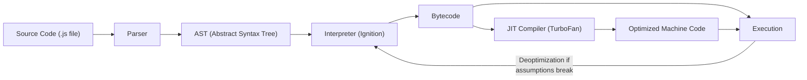
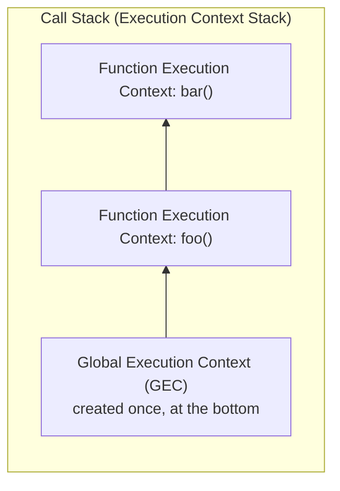
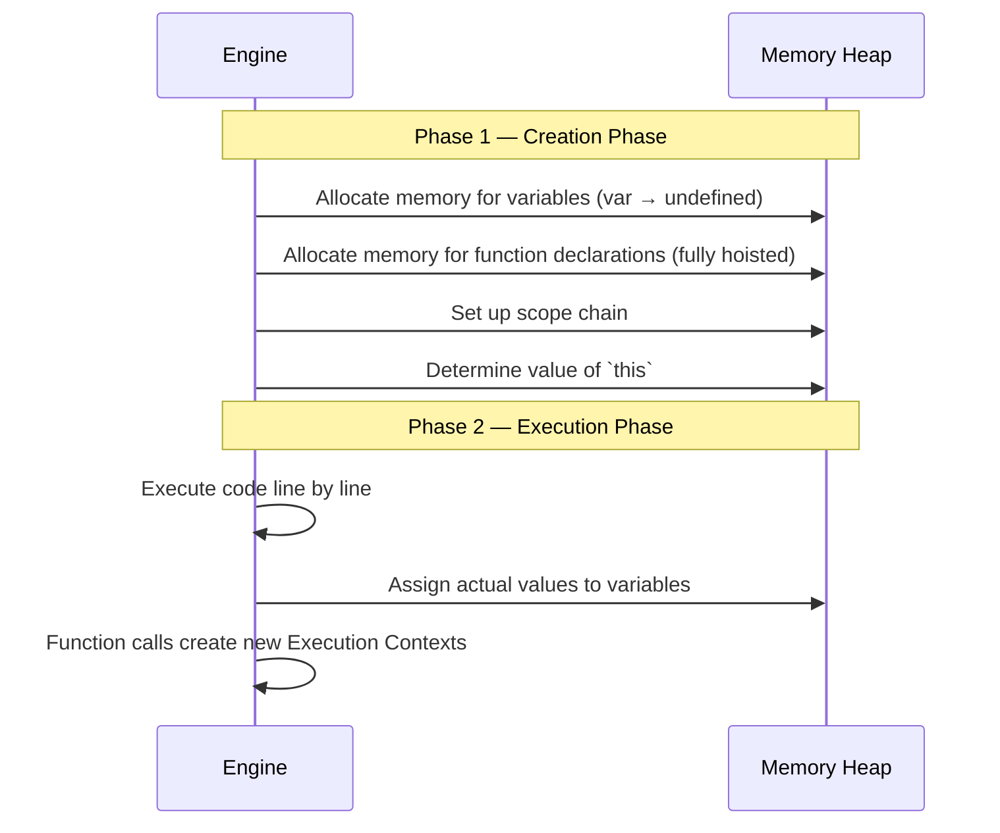
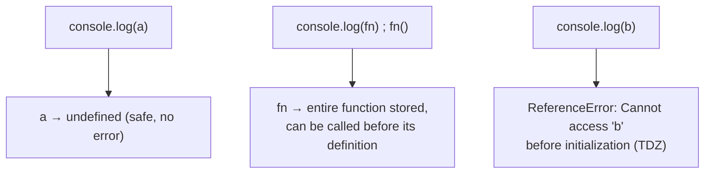
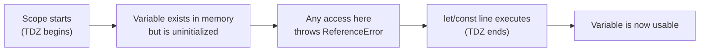
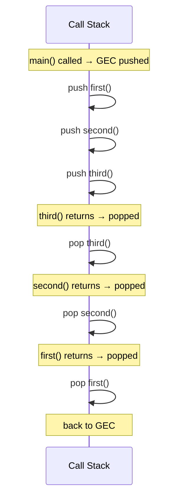
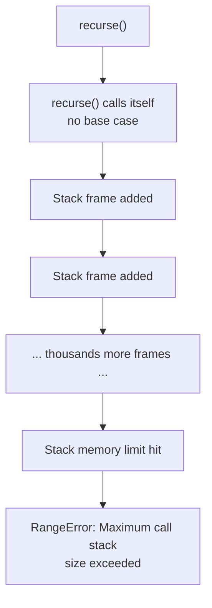

import { Callout } from 'fumadocs-ui/components/callout';
import { Tab, Tabs } from 'fumadocs-ui/components/tabs';

## Why This Module Comes First

Every bug you'll ever debug involving `undefined`, hoisting surprises, `this` confusion, or stack overflows traces back to **one thing**: what the engine does to your code before and while it runs. If you memorize this module, the rest of JavaScript stops feeling like magic and starts feeling like a system you can predict.

---

## 1. The JavaScript Engine Architecture

A JS engine (V8 in Chrome/Node, SpiderMonkey in Firefox) doesn't run your source code directly. It transforms it through several stages before a single line executes.



**Breakdown of each stage:**

- **Parser** — reads your source text character by character, checks syntax validity, and tokenizes it (breaking code into keywords, identifiers, operators, literals).
- **AST (Abstract Syntax Tree)** — a tree representation of your code's structure. Every `if`, function, variable declaration, and expression becomes a node. This is the same concept tools like Babel and ESLint operate on.
- **Ignition (Interpreter)** — walks the AST and produces **bytecode**, then starts executing it immediately. This is why JS can start running fast — it doesn't wait for full compilation.
- **TurboFan (JIT Compiler)** — watches code as it runs. If a function is called repeatedly with the same shape of data ("hot code"), TurboFan compiles it into highly optimized machine code.
- **Deoptimization** — if your "hot" function suddenly receives different data shapes (e.g., you pass an object with different properties than before), V8 throws away the optimized code and falls back to the interpreter. This is why keeping consistent object shapes matters for performance.

<Callout title="Practical takeaway" type="info">
  This is why **monomorphic functions** (always called with the same argument shape/type) are faster than **polymorphic** ones — TurboFan can specialize and optimize monomorphic code aggressively.
</Callout>

---

## 2. Execution Contexts

An **Execution Context** is the environment in which JS code is evaluated and run. Every time code runs, it runs inside one.



There are two main types:

| Type | Created When | Notes |
|---|---|---|
| **Global Execution Context** | Once, when the script first loads | Creates the global object (`window` in browsers, `global` in Node) and binds `this` |
| **Function Execution Context** | Every time a function is invoked | A brand new context is created per call — even for the same function called twice |

Each execution context is created in **two phases**, covered next.

---

## 3. The Two-Phase Execution Lifecycle

This is the single most important mental model in this module. Every execution context goes through:



### Phase 1 — Creation Phase (a.k.a. Memory Allocation)

Before a single line runs, the engine scans the code and:

1. Allocates memory for every `var` variable and initializes it to `undefined`.
2. Allocates memory for function declarations and stores the **entire function body** in memory (not just a reference).
3. For `let`/`const`, memory is reserved but **left uninitialized** — this reserved-but-unusable state is the TDZ (see below).
4. Sets up the scope chain and determines what `this` refers to.

### Phase 2 — Execution Phase

The engine now runs your code top to bottom, assigning real values to variables and invoking functions (each function call spins up its own new Execution Context, pushed onto the Call Stack).

---

## 4. Hoisting Mechanics

"Hoisting" is just the observable effect of the Creation Phase — it's not that your code physically moves; it's that memory is already allocated before execution starts.



| Declaration Type | Creation Phase Behavior | Accessing Before Declaration |
|---|---|---|
| `function foo() {}` | Entire function body hoisted | Fully callable |
| `var x` | Hoisted, initialized to `undefined` | Returns `undefined`, no error |
| `let x` / `const x` | Hoisted but **not initialized** | Throws `ReferenceError` (TDZ) |

<Tabs items={['var behavior', 'let/const behavior']}>
<Tab value="var behavior">
```js
console.log(x); // undefined — not an error
var x = 5;
console.log(x); // 5
```
</Tab>
<Tab value="let/const behavior">
```js
console.log(y); // ReferenceError: Cannot access 'y' before initialization
let y = 5;
```
</Tab>
</Tabs>

---

## 5. The Temporal Dead Zone (TDZ)

The TDZ is the span of code **between entering scope and the actual line where a `let`/`const` variable is declared**. During this window, the variable exists in memory but touching it throws an error.



**Why does the TDZ exist?** It's a deliberate design decision to catch bugs early. With `var`, silently getting `undefined` before a "real" assignment often masked logic errors. `let`/`const` fail loudly instead, forcing you to declare before use.

```js
{
  // TDZ for `count` starts here
  console.log(count); // ReferenceError
  let count = 10;      // TDZ ends here
  console.log(count);  // 10, safe to use
}
```

---

## 6. The Call Stack

The Call Stack tracks *which execution context is currently running* using a **LIFO (Last In, First Out)** structure — the last function pushed is the first one popped.



```js
function first() {
  second();
  console.log("first done");
}
function second() {
  third();
  console.log("second done");
}
function third() {
  console.log("third done");
}
first();
// Output order: "third done" → "second done" → "first done"
```

### Stack Overflows

Each function call adds a **stack frame**. If frames pile up faster than they're popped — typically from uncontrolled recursion without a base case — you exceed the stack's fixed memory size and get:

```
RangeError: Maximum call stack size exceeded
```



<Callout title="Debugging tip" type="warn">
  When you see a stack overflow, check your recursive functions first for a missing or unreachable base case — this is the #1 cause.
</Callout>

---

## Module 1 Summary

| Concept | One-Line Takeaway |
|---|---|
| Engine Architecture | Source → AST → Bytecode (interpreted) → optionally JIT-compiled to machine code |
| Execution Context | The environment code runs in; Global (once) + Function (per call) |
| Two-Phase Lifecycle | Creation Phase allocates memory first; Execution Phase runs the code |
| Hoisting | `var`/functions are usable before declaration; `let`/`const` are not |
| TDZ | The gap where a `let`/`const` variable exists but can't be touched yet |
| Call Stack | LIFO tracker of active execution contexts; overflow = runaway recursion |