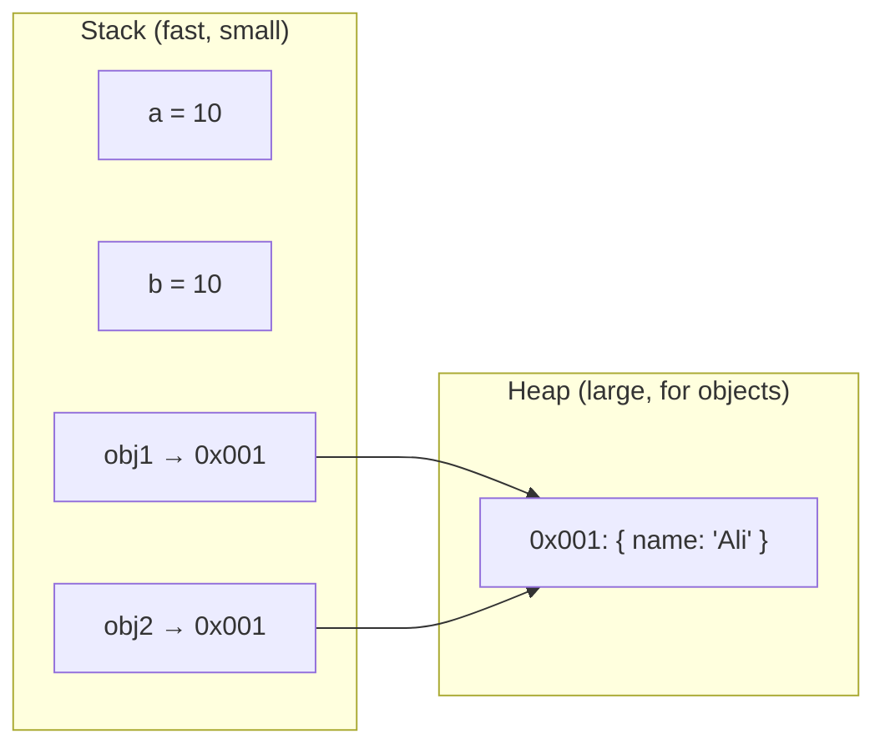
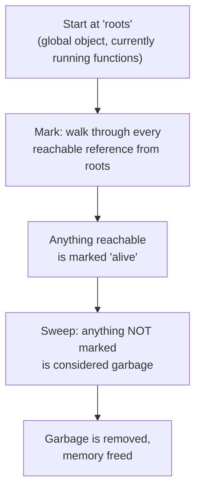
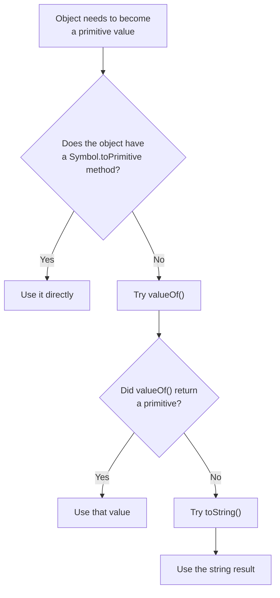
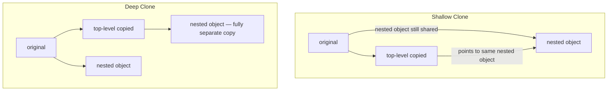

import { Callout } from 'fumadocs-ui/components/callout';
import { Tab, Tabs } from 'fumadocs-ui/components/tabs';

## Why This Module Matters

Module 1 taught you *when* code runs. Module 2 teaches you *where your data actually lives* while it runs — and why some bugs (like "I copied the object but changing the copy changed the original too!") happen. Once you understand stack vs. heap, most of these "weird" bugs become predictable.

---

## 1. Primitive vs. Reference Values

JavaScript stores values in memory in two different places depending on their type.

- **Primitives** (`number`, `string`, `boolean`, `null`, `undefined`, `symbol`, `bigint`) are stored directly in the **Stack** — a small, fast memory area.
- **Reference types** (`object`, `array`, `function`) are stored in the **Heap** — a much larger memory area for complex data. The Stack only holds a **pointer (address)** to where the actual data lives in the Heap.



**Easy way to think about it:** Primitives are like writing a number on a sticky note — copying the sticky note gives you a totally separate number. Objects are like a house address written on a sticky note — copying the address doesn't copy the house; both notes still point to the same house.

```js
// Primitives — copied by value
let a = 10;
let b = a;
b = 20;
console.log(a); // 10 (unaffected)
console.log(b); // 20

// Objects — copied by reference
let obj1 = { name: "Ali" };
let obj2 = obj1;
obj2.name = "Ahmed";
console.log(obj1.name); // "Ahmed" — obj1 changed too!
```

<Callout title="Why this matters" type="info">
  This is the #1 source of "mystery bugs" in real apps — someone updates what they think is a copy of an object/array, and the original changes too, because both variables were pointing at the same heap address.
</Callout>

---

## 2. Garbage Collection

JavaScript automatically frees up memory that's no longer needed, so you (mostly) never have to manually delete things. The main algorithm modern engines use is **Mark-and-Sweep**.



**In plain words:** the engine starts from things it knows are definitely being used (like global variables and currently running functions) and follows every reference outward, like following a trail. Anything it *can't* reach by following the trail is garbage — nobody can use it anymore, so it gets deleted.

```js
let user = { name: "Sara" };
user = null; // the { name: "Sara" } object is now unreachable → garbage collected
```

### Common Memory Leak Sources

Even with automatic garbage collection, you can accidentally keep things "reachable" forever, which stops them from ever being cleaned up:

- **Detached DOM nodes** — you remove an element from the page but still keep a JS variable pointing to it. The DOM node is gone visually, but it's still "reachable" in memory, so it never gets swept.
- **Forgotten intervals/timers** — a `setInterval` that's never cleared keeps running and keeps referencing whatever variables it uses, so those variables can never be garbage collected.

```js
// Leak example: forgotten interval
function startTimer() {
  const bigData = new Array(1000000).fill("leak");
  setInterval(() => {
    console.log(bigData.length); // bigData is kept alive forever
  }, 1000);
}

// Fix: clear it when done
const id = setInterval(() => console.log("tick"), 1000);
clearInterval(id); // now it can be garbage collected
```

<Callout title="Practical rule" type="warn">
  Always `clearInterval()`/`clearTimeout()` when a component unmounts or a task finishes, and remove event listeners you no longer need. If you don't, they'll keep referenced data alive indefinitely.
</Callout>

---

## 3. Deep Type Coercion

Coercion means JavaScript converts one type into another — sometimes because you told it to (**explicit**), sometimes because it decided to on its own (**implicit**).

```js
// Explicit — you ask for the conversion
String(123);     // "123"
Number("456");   // 456
Boolean(0);      // false

// Implicit — JS does it automatically
"5" + 1;   // "51"  (number → string, because + sees a string)
"5" - 1;   // 4     (string → number, because - only makes sense for numbers)
```

### `==` vs `===`

- `===` (strict equality) — compares value **and** type. No conversion happens.
- `==` (loose equality) — converts types first, *then* compares.

```js
5 == "5";   // true  — "5" is coerced to 5 first
5 === "5";  // false — different types, no coercion

null == undefined;  // true  (special case)
null === undefined; // false
```

<Callout title="Best practice" type="info">
  Default to `===` always. Only reach for `==` if you have a specific, well-understood reason — it prevents an entire category of subtle bugs.
</Callout>

### `ToPrimitive` — what happens under the hood

When JS needs to coerce an object to a primitive (like in `"" + myObject`), it internally calls a hidden operation called `ToPrimitive`, which tries, in order:



```js
const obj = {
  valueOf() { return 42; },
  toString() { return "hello"; }
};

console.log(obj + 1);        // 43 — valueOf() used
console.log(`${obj}`);       // "hello" — toString() used in template literals
```

---

## 4. Accurate Type Checking

`typeof` and `instanceof` are useful but have real gaps you need to know about.

```js
typeof "hello";     // "string"
typeof 42;          // "number"
typeof true;        // "boolean"
typeof undefined;   // "undefined"
typeof null;        // "object"  ⚠️ this is a famous, decades-old JS bug
typeof [];          // "object"  ⚠️ can't tell arrays from plain objects
typeof {};          // "object"
typeof function(){};// "function"
```

`instanceof` checks the prototype chain, but it fails across different execution contexts (like an array created in an iframe) and doesn't work on primitives.

```js
[] instanceof Array;   // true
[] instanceof Object;  // true (arrays are also objects)
"hi" instanceof String; // false — primitives aren't instances of anything
```

### The reliable fix: `Object.prototype.toString.call()`

This gives you the engine's actual internal type tag, and it's accurate for everything.

```js
Object.prototype.toString.call([]);          // "[object Array]"
Object.prototype.toString.call({});          // "[object Object]"
Object.prototype.toString.call(null);        // "[object Null]"
Object.prototype.toString.call(undefined);   // "[object Undefined]"
Object.prototype.toString.call("hi");        // "[object String]"
Object.prototype.toString.call(42);          // "[object Number]"
```

<Callout title="Rule of thumb" type="info">
  Use `typeof` for primitives, `Array.isArray()` for arrays, and `Object.prototype.toString.call()` whenever you genuinely need bulletproof type detection.
</Callout>

---

## 5. Immutability Patterns

### Shallow vs. Deep Cloning

A **shallow clone** copies only the first level — nested objects/arrays inside are still shared references. A **deep clone** copies everything, all the way down, so nothing is shared.



```js
const original = { name: "Ali", address: { city: "Lahore" } };

// Shallow clone — two common ways
const clone1 = Object.assign({}, original);
const clone2 = { ...original };

clone1.address.city = "Karachi";
console.log(original.address.city); // "Karachi" — nested object was shared!

// Deep clone
const deepClone = structuredClone(original);
deepClone.address.city = "Islamabad";
console.log(original.address.city); // still "Karachi" — fully independent
```

<Callout title="Modern tip" type="info">
  `structuredClone()` is built into modern browsers and Node.js — you no longer need `JSON.parse(JSON.stringify(obj))` as a deep-clone hack (which also breaks on functions, `undefined`, and dates).
</Callout>

### `Object.freeze()` vs. `Object.seal()`

| Method | Add new props? | Remove props? | Modify existing values? |
|---|---|---|---|
| `Object.freeze()` | No | No | No |
| `Object.seal()` | No | No | **Yes** |

```js
const frozen = Object.freeze({ score: 100 });
frozen.score = 200; // silently fails (or throws in strict mode)
console.log(frozen.score); // still 100

const sealed = Object.seal({ score: 100 });
sealed.score = 200; // this works!
sealed.newProp = "x"; // this does NOT work
console.log(sealed.score); // 200
```

<Callout title="Gotcha" type="warn">
  `Object.freeze()` is **shallow** too! If a frozen object contains a nested object, that nested object is still fully mutable. You'd need to recursively freeze every nested level for true deep immutability.
</Callout>

---

## Module 2 Summary

| Concept | One-Line Takeaway |
|---|---|
| Primitive vs. Reference | Primitives copy by value (Stack); objects copy by reference (Heap) |
| Garbage Collection | Mark-and-Sweep frees anything unreachable from root references |
| Memory Leaks | Detached DOM nodes and uncleared intervals keep memory alive forever |
| Type Coercion | Implicit happens automatically; always prefer `===` over `==` |
| `ToPrimitive` | Tries `Symbol.toPrimitive` → `valueOf()` → `toString()` in order |
| Type Checking | `typeof null` lies ("object"); `Object.prototype.toString.call()` never does |
| Cloning | Shallow clones share nested objects; `structuredClone()` deep-clones safely |
| Freeze vs. Seal | Freeze blocks everything; Seal still allows editing existing values |