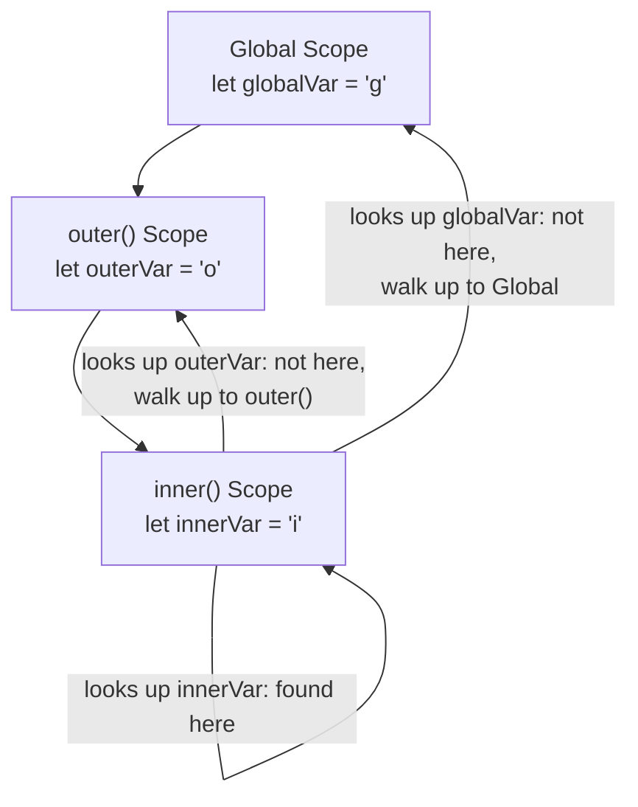
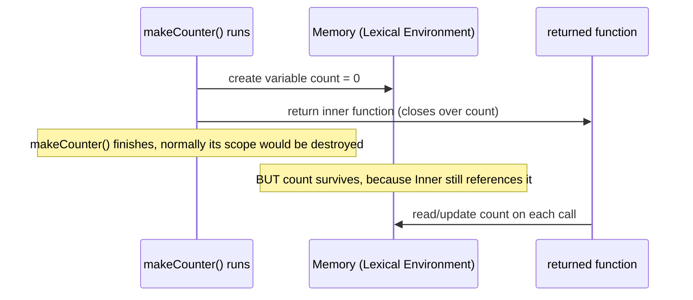
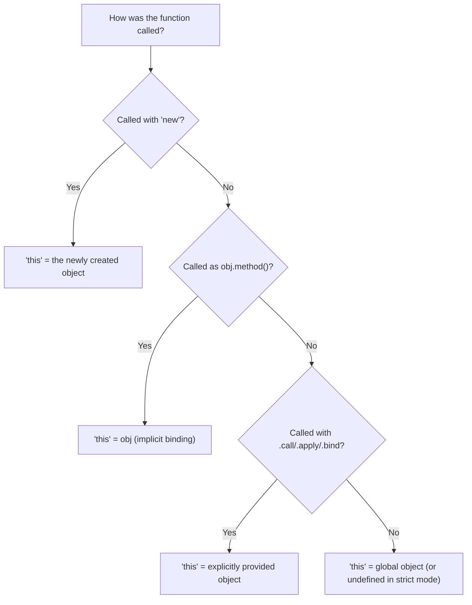
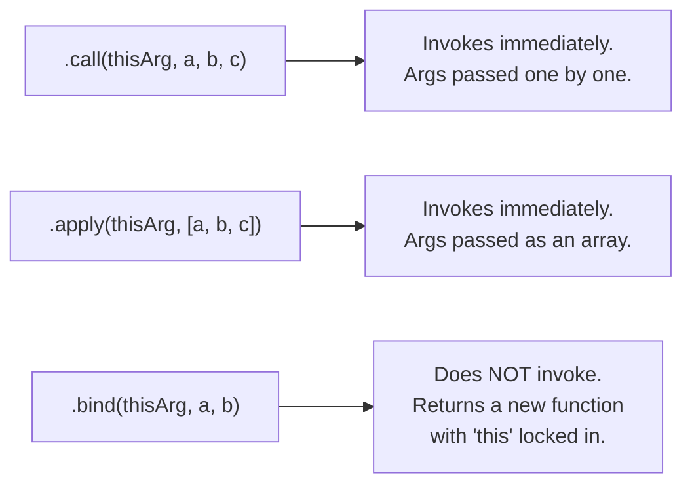
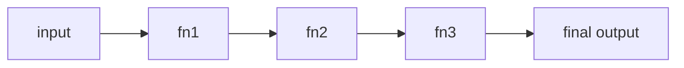

import { Callout } from 'fumadocs-ui/components/callout';
import { Tab, Tabs } from 'fumadocs-ui/components/tabs';

## Why This Module Matters

Modules 1 and 2 explained *when* code runs and *where* data lives. Module 3 explains something even more fundamental: **how JavaScript decides which variable you actually mean** when you use a name, and how functions can "remember" things. This is the foundation for closures, `this`, and every functional pattern (HOFs, currying, composition) used in real production code — including React hooks, which are built entirely on closures.

---

## 1. Lexical Scoping Chains

"Lexical" just means **based on where you physically wrote the code**, not where it's called from. JavaScript decides variable access using **static scoping** — the scope structure is fixed at write-time by nesting, not decided while the program runs.



**In plain words:** when the engine can't find a variable in the current function, it doesn't guess — it walks *outward*, following exactly how the functions were nested in your source code, until it finds the variable or runs out of scopes (then throws a `ReferenceError`).

```js
let globalVar = "I'm global";

function outer() {
  let outerVar = "I'm in outer";

  function inner() {
    let innerVar = "I'm in inner";
    console.log(innerVar);   // found in inner's own scope
    console.log(outerVar);   // not found here, walk up → found in outer
    console.log(globalVar);  // not found here or in outer → found in global
  }

  inner();
}

outer();
```

<Callout title="Static vs. runtime — the key distinction" type="info">
  This chain is decided by **where the function is defined in your code**, not by where or how it's called. Even if `inner()` were passed around and called from somewhere completely different, its scope chain would still be exactly what's shown above — because that's how it was written.
</Callout>

---

## 2. Closures Deep Dive

A **closure** is what happens when a function "remembers" the variables from the scope it was created in — even after that outer function has already finished running.



**In plain words:** normally, when a function finishes, its local variables are cleaned up (garbage collected, from Module 2). But if you return a function from inside it, and that inner function *uses* one of those variables, the engine keeps that variable alive in memory — just for that inner function — instead of throwing it away.

```js
function makeCounter() {
  let count = 0; // this variable would normally disappear after makeCounter() runs

  return function () {
    count++; // but this inner function "closes over" count, keeping it alive
    return count;
  };
}

const counter = makeCounter();
console.log(counter()); // 1
console.log(counter()); // 2
console.log(counter()); // 3 — count persisted across calls!
```

### Persisting State Safely & Data Privacy

Because `count` only exists inside the closure, there's no way to reach it directly from outside — no `counter.count`, no global variable to accidentally overwrite. This gives you real **private state** in plain JavaScript, without needing classes.

```js
function createBankAccount(initialBalance) {
  let balance = initialBalance; // private — no external access

  return {
    deposit(amount) {
      balance += amount;
      return balance;
    },
    withdraw(amount) {
      if (amount > balance) throw new Error("Insufficient funds");
      balance -= amount;
      return balance;
    },
    getBalance() {
      return balance;
    }
  };
}

const account = createBankAccount(100);
console.log(account.deposit(50));  // 150
console.log(account.balance);      // undefined — can't touch it directly!
```

<Callout title="Where you'll see this again" type="info">
  React's `useState` works on exactly this principle — the state variable is a closed-over variable that persists across re-renders without being globally accessible.
</Callout>

---

## 3. The `this` Keyword

Unlike closures (fixed at write-time), `this` is decided at **call-time** — its value depends entirely on *how* a function was called, not where it was defined.



### The four binding rules, with examples

```js
// 1. Global / default binding — 'this' is the global object (or undefined in strict mode)
function showThis() {
  console.log(this);
}
showThis(); // globalThis (non-strict) or undefined (strict mode)

// 2. Implicit binding — 'this' is whatever object called the method
const user = {
  name: "Ali",
  greet() {
    console.log(this.name); // 'this' = user, because user.greet() was called
  }
};
user.greet(); // "Ali"

// 3. Explicit binding — you decide 'this' yourself
function greet() {
  console.log(this.name);
}
greet.call({ name: "Sara" }); // "Sara" — forced 'this'

// 4. 'new' binding — 'this' is the brand-new object being constructed
function Person(name) {
  this.name = name;
}
const p = new Person("Ahmed");
console.log(p.name); // "Ahmed"
```

<Callout title="Common trap: losing `this`" type="warn">
  If you pass `user.greet` as a callback (e.g. `setTimeout(user.greet, 1000)`), it's no longer called as `user.greet()` — it's called as a plain function, so `this` becomes `undefined`/global. Arrow functions avoid this entirely because they don't have their own `this` — they inherit it lexically from where they were written (like closures do for variables).
</Callout>

```js
const user2 = {
  name: "Bilal",
  greetArrow: () => {
    console.log(this.name); // arrow function — 'this' comes from surrounding scope, NOT user2
  },
  greetRegular() {
    setTimeout(() => {
      console.log(this.name); // arrow inherits 'this' from greetRegular → "Bilal"
    }, 100);
  }
};
```

---

## 4. Explicit Binding — `.call()`, `.apply()`, `.bind()`

All three let you manually control what `this` refers to. The difference is *how* they pass arguments and *when* they execute.



```js
const person1 = { name: "Ali" };
const person2 = { name: "Sara" };

function introduce(greeting, punctuation) {
  console.log(`${greeting}, I'm ${this.name}${punctuation}`);
}

// .call() — arguments passed individually, runs immediately
introduce.call(person1, "Hi", "!"); // "Hi, I'm Ali!"

// .apply() — arguments passed as an array, runs immediately
introduce.apply(person2, ["Hello", "."]); // "Hello, I'm Sara."

// .bind() — returns a NEW function, doesn't run yet
const boundIntro = introduce.bind(person1, "Hey");
boundIntro("?"); // "Hey, I'm Ali?" — runs later, 'this' is locked to person1
```

<Callout title="When to use which" type="info">
  Use `.call()`/`.apply()` when you want to run a function *right now* with a specific `this`. Use `.bind()` when you want to create a reusable function for later — like binding an event handler's `this` before passing it as a callback.
</Callout>

---

## 5. Advanced Functional Patterns

### Higher-Order Functions (HOFs)

A function that either **takes a function as an argument**, **returns a function**, or both.

```js
function withLogging(fn) {
  return function (...args) {
    console.log(`Calling with args: ${args}`);
    return fn(...args);
  };
}

const add = (a, b) => a + b;
const loggedAdd = withLogging(add);
loggedAdd(2, 3); // logs "Calling with args: 2,3", returns 5
```

### Pure Functions & Side-Effect Elimination

A **pure function** always returns the same output for the same input, and doesn't change anything outside itself (no mutating external variables, no API calls, no logging).

```js
// Impure — depends on and mutates external state
let total = 0;
function addToTotalImpure(n) {
  total += n; // side effect: changes external variable
  return total;
}

// Pure — same input always gives same output, nothing external touched
function add2(a, b) {
  return a + b;
}
```

### Currying & Partial Application

**Currying** transforms a function that takes multiple arguments into a chain of functions that each take one argument.

```js
// Normal function
function addThree(a, b, c) {
  return a + b + c;
}

// Curried version
function curriedAdd(a) {
  return function (b) {
    return function (c) {
      return a + b + c;
    };
  };
}

console.log(curriedAdd(1)(2)(3)); // 6
```

**Partial application** is related but slightly different — you fix *some* arguments now and supply the rest later (this is exactly what `.bind()` does above with `boundIntro`).

```js
function multiply(a, b, c) {
  return a * b * c;
}

function partial(fn, ...presetArgs) {
  return (...remainingArgs) => fn(...presetArgs, ...remainingArgs);
}

const double = partial(multiply, 2); // fix a = 2
console.log(double(3, 4)); // 2 * 3 * 4 = 24
```

### Function Composition

Combining small, simple functions into one bigger function, where the output of one becomes the input of the next.



```js
const compose = (...fns) => (input) =>
  fns.reduceRight((acc, fn) => fn(acc), input);

const double2 = (x) => x * 2;
const addOne = (x) => x + 1;
const square = (x) => x * x;

const transform = compose(square, addOne, double2);
// runs right-to-left: double2 → addOne → square
console.log(transform(3)); // double2(3)=6 → addOne(6)=7 → square(7)=49
```

<Callout title="Why this matters for AI/full-stack work" type="info">
  Composition and pure functions are the backbone of predictable, testable code — and they're exactly the mental model used in things like Redux reducers, React state updates, and data transformation pipelines.
</Callout>

---

## Module 3 Summary

| Concept | One-Line Takeaway |
|---|---|
| Lexical Scoping | Variable lookup follows how code is *nested in the source*, not how it's called |
| Closures | A function keeps access to its birth scope's variables even after that scope ends |
| Data Privacy via Closures | Variables inside a closure can't be accessed from outside — true private state |
| `this` | Decided at call-time: global, implicit (`obj.method()`), explicit (`.call`/`.apply`), or `new` |
| Arrow Functions | Don't have their own `this` — they inherit it lexically, just like closures do for variables |
| `.call()` / `.apply()` | Run immediately with a manually chosen `this`; differ only in argument format |
| `.bind()` | Returns a new function with `this` locked in, to be called later |
| HOFs | Functions that take and/or return other functions |
| Pure Functions | Same input → same output, no external side effects |
| Currying | Breaks a multi-argument function into a chain of single-argument functions |
| Composition | Chains small functions together, output of one feeding into the next |