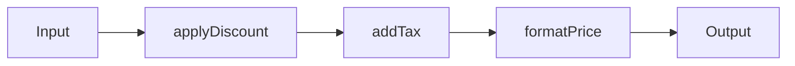
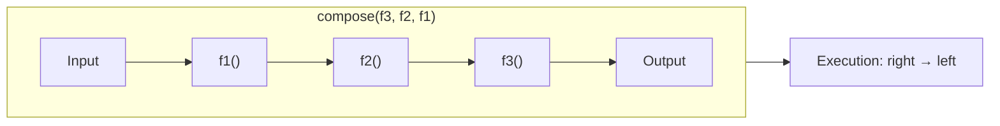
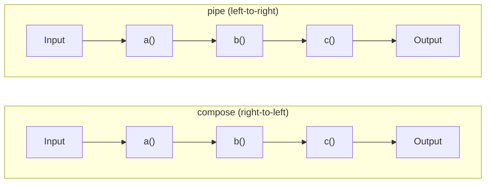

# Function Composition

## What is Function Composition?

Function Composition means

> **Combining multiple small functions together so that the output of one function becomes the input of the next function.**

Instead of writing one large function that does many things, we create several small functions where each has **only one responsibility**, and then connect them together.

Think of it like an assembly line in a factory.

```
Raw Material
      ↓
Cutting
      ↓
Painting
      ↓
Packaging
      ↓
Finished Product
```

Each worker performs only one task.  
The output of one worker becomes the input for the next worker.  
Function Composition works exactly the same way.

---

### Visual Pipeline



---

# Why do we need Function Composition?

Imagine you're building an E-Commerce website.

Whenever a customer places an order, you need to:

1. Apply discount
2. Calculate tax
3. Format the final price

A beginner may write everything inside one function.

```js
function processPrice(price){
    let discounted = price - 100;
    let taxed = discounted * 1.18;
    return `Rs. ${taxed}`;
}

console.log(processPrice(1000));
```

### Output

```
Rs. 1062
```

It works.

But there's a problem.

---

## Problem

Everything is mixed together.

```
Discount Logic
    ↓
Tax Logic
    ↓
Formatting Logic
```

Suppose later you want to use only the tax calculation somewhere else.

You can't.

Or suppose GST changes from **18% to 20%**.

Now you have to edit this large function.

As projects grow, these large functions become difficult to maintain.

---

# Solution

Break the work into small reusable functions.

```js
function applyDiscount(price){
    return price - 100;
}

function addTax(price){
    return price * 1.18;
}

function formatPrice(price){
    return `Rs. ${price}`;
}
```

Each function performs **one job only**.

Now we can connect them together.

---

## Without Composition

```js
const discounted = applyDiscount(1000);
const taxed = addTax(discounted);
const result = formatPrice(taxed);
console.log(result);
```

Output

```
Rs. 1062
```

Works perfectly.

But writing these temporary variables repeatedly becomes tedious.

Function Composition solves this.

---

# Function Composition

Let's write a helper.

```js
function compose(f, g){
    return function(value){
        return f(g(value));
    }
}
```

### A Modern Example (with spread for multiple arguments)

```js
const add = (...args) => args.reduce((sum, acc) => acc + sum, 0);

const square = (x) => x * x;

const compose = (fn1, fn2) => {
    return (...args) => fn2(fn1(...args));
};

const result = compose(add, square);
console.log(result(2, 3)); // add(2,3) = 5 → square(5) = 25
```

---

## How it works

Suppose

```js
const calculatePrice = compose(formatPrice, addTax);
```

This creates a new function.

Internally it behaves like

```js
function(value){
    return formatPrice(
        addTax(value)
    );
}
```

Notice

```
Input
  ↓
addTax()
  ↓
formatPrice()
  ↓
Output
```

The output of one function becomes the input of the next function.

---

## Example

```js
function addTax(price){
    return price * 1.18;
}

function formatPrice(price){
    return `Rs. ${price}`;
}

const calculatePrice = compose(formatPrice, addTax);
console.log(calculatePrice(1000));
```

Output

```
Rs. 1180
```

---

# Composing Multiple Functions

Usually we want more than two functions.

Suppose

```
applyDiscount()
    ↓
addTax()
    ↓
formatPrice()
```

We can write a generic compose function.

```js
function compose(...functions){
    return function(value){
        return functions.reduceRight(
            (result, fn) => fn(result),
            value
        );
    }
}
```

---

## Example

```js
function applyDiscount(price){
    return price - 100;
}

function addTax(price){
    return price * 1.18;
}

function formatPrice(price){
    return `Rs. ${price}`;
}

const processPrice = compose(
    formatPrice,
    addTax,
    applyDiscount
);

console.log(processPrice(1000));
```

Output

```
Rs. 1062
```

---

# Dry Run

Suppose

```js
processPrice(1000)
```

First,

```
value = 1000
```

Since `compose()` works **right to left**, execution starts from the last function.

### Step 1

```js
applyDiscount(1000)
```

returns

```
900
```

---

### Step 2

```js
addTax(900)
```

returns

```
1062
```

---

### Step 3

```js
formatPrice(1062)
```

returns

```
"Rs. 1062"
```

Final output

```
Rs. 1062
```

Execution Flow

```
1000
  ↓
applyDiscount()
  ↓
900
  ↓
addTax()
  ↓
1062
  ↓
formatPrice()
  ↓
Rs. 1062
```

---

# Why does compose() use `reduceRight()`?

Notice the order.

```js
compose(
    formatPrice,
    addTax,
    applyDiscount
)
```

We want

```
applyDiscount()
    ↓
addTax()
    ↓
formatPrice()
```

The last function should execute first.

That's exactly what `reduceRight()` does.

It starts from the rightmost function.

---

# What if we use `reduce()`?

```js
function compose(...functions){
    return function(value){
        return functions.reduce(
            (result, fn) => fn(result),
            value
        );
    }
}
```

Now execution becomes

```
formatPrice()
    ↓
addTax()
    ↓
applyDiscount()
```

Which is incorrect.

Let's see why.

Input

```
1000
```

Step 1

```js
formatPrice(1000)
```

returns

```
"Rs.1000"
```

Step 2

```js
addTax("Rs.1000")
```

Now JavaScript tries

```js
"Rs.1000" * 1.18
```

Result

```
NaN
```

Everything breaks.

This is why **composition runs from right to left**.

---

### Visual: Compose Order



---

# Real-Life Example (Image Upload)

Imagine Instagram uploads an image.

Before saving it,

it performs several operations.

```
Original Image
    ↓
Resize Image
    ↓
Compress Image
    ↓
Add Watermark
    ↓
Upload
```

Each function does only one task.

```js
resize(image)
    ↓
compress(image)
    ↓
watermark(image)
    ↓
upload(image)
```

This is Function Composition.

Instead of writing one huge upload function, we compose many small functions.

---

# Another Example (Text Processing)

Suppose a user enters

```
"     hello world     "
```

We want to

* Remove spaces
* Convert to uppercase
* Add an exclamation mark

Functions

```js
function trim(text){
    return text.trim();
}

function upper(text){
    return text.toUpperCase();
}

function exclaim(text){
    return text + "!";
}
```

Compose them

```js
const process = compose(
    exclaim,
    upper,
    trim
);

console.log(
    process("    hello world    ")
);
```

Output

```
HELLO WORLD!
```

Flow

```
"   hello world   "
    ↓
trim()
    ↓
"hello world"
    ↓
upper()
    ↓
"HELLO WORLD"
    ↓
exclaim()
    ↓
"HELLO WORLD!"
```

---

# Function Composition vs Higher-Order Functions

Many beginners think they're the same, but they are different.

| Higher-Order Function                                     | Function Composition                                                      |
| --------------------------------------------------------- | ------------------------------------------------------------------------- |
| A function that accepts another function or returns one.  | A technique of combining multiple functions into one pipeline.            |
| Focuses on functions working with functions.              | Focuses on connecting the output of one function to the input of another. |
| Example: `map()`, `filter()`, `setTimeout()`, `compose()` | Example: `compose(format, tax, discount)`                                 |

Notice that **`compose()` itself is a Higher-Order Function**, because:

* it accepts functions as arguments, and
* it returns another function.

So, **Function Composition is built using Higher-Order Functions.**

---

# compose() vs pipe()

These are almost identical.

### compose()

Runs **Right → Left**

```js
compose(c, b, a)
   ↓
a()
   ↓
b()
   ↓
c()
```

Implementation

```js
functions.reduceRight(...)
```

---

### pipe()

Runs **Left → Right**

```js
pipe(a, b, c)
   ↓
a()
   ↓
b()
   ↓
c()
```

Implementation

```js
functions.reduce(...)
```

Many developers find `pipe()` easier to read because it follows the natural left-to-right flow of execution.

---

### Mermaid: compose vs pipe



---

# Practical Uses

Function Composition is used extensively in:

* React component transformations
* Redux middleware
* Express middleware chains
* Data validation pipelines
* Image processing
* Text processing
* API response formatting
* Logging and analytics
* Functional programming libraries like **Ramda**, **Lodash FP**, and **RxJS**

---

# Summary

| Concept                  | Explanation                                                                                                        |
| ------------------------ | ------------------------------------------------------------------------------------------------------------------ |
| **Function Composition** | Combining small functions into one larger function where each function's output becomes the next function's input. |
| **Purpose**              | Break complex logic into small, reusable functions and connect them together.                                      |
| **Execution Order**      | `compose()` executes **right → left** using `reduceRight()`.                                                       |
| **Benefits**             | Cleaner code, reusable functions, easier testing, easier maintenance, and better readability.                      |

## Easy way to remember

Think of **Function Composition** like a **water pipeline**:

```
Input
  ↓
Function A
  ↓
Function B
  ↓
Function C
  ↓
Final Output
```

Each function has **one responsibility**, and together they solve a larger problem. This makes your code modular, reusable, and much easier to extend as your application grows.