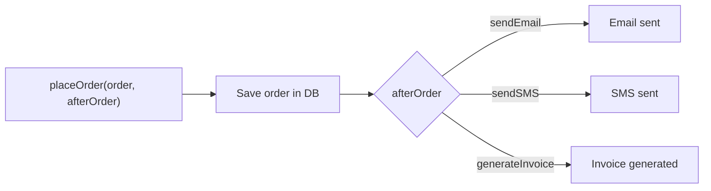
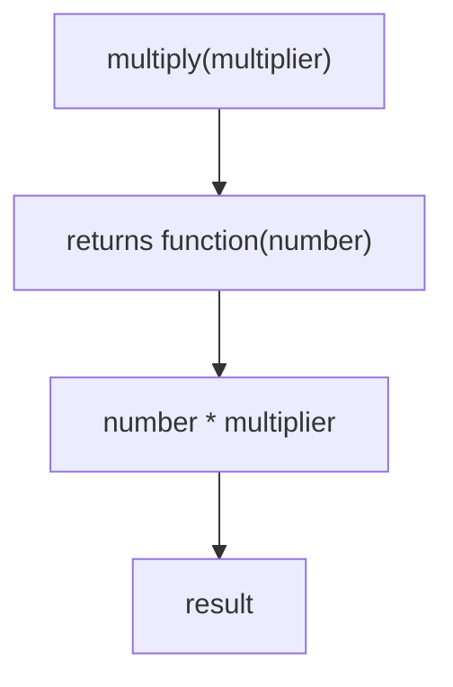

## What is a Higher-Order Function (HOF)?

A **Higher-Order Function** is a function that does **at least one** of these:

1. **Accepts another function as an argument** (callback), or
2. **Returns another function**.

In other words, a HOF works with functions as data. Because JavaScript treats functions as **first‑class citizens**, they can be stored, passed, and returned like any other value.

---

## Why Do Higher-Order Functions Exist?

They help us **reuse common logic** while allowing **customizable behavior**. Without HOFs, we would copy‑paste similar code, violating the **DRY** (Don’t Repeat Yourself) principle.

Benefits:
- **Reusable** – write once, use many times
- **Cleaner** – reduce clutter and duplication
- **Easier maintenance** – change core logic in one place
- **Flexible** – inject different behaviors on the fly

---

## Real‑Life Problem: Order Processing

Imagine an e‑commerce site. For every order you need to:
- Save the order
- Then do **something else** (email, SMS, invoice, etc.)

A beginner might write separate functions:

```js
function placeOrder1(order) {
  console.log("Saving order...");
  console.log("Sending Email...");
}
function placeOrder2(order) {
  console.log("Saving order...");
  console.log("Sending SMS...");
}
function placeOrder3(order) {
  console.log("Saving order...");
  console.log("Generating Invoice...");
}
```

**Problem:** The saving logic is duplicated. If you change “Saving order...” to “Saving order in Database...”, you must update every function.

---

## Solution – Higher-Order Function

Write the common part once and let the caller decide the rest:

```js
function placeOrder(order, afterOrder) {
  console.log("Saving order in Database...");
  afterOrder(order);
}
```

Now define separate actions:

```js
function sendEmail(order) {
  console.log(`Email sent for ${order}`);
}
function sendSMS(order) {
  console.log(`SMS sent for ${order}`);
}
function generateInvoice(order) {
  console.log(`Invoice generated for ${order}`);
}
```

Usage:

```js
placeOrder("Laptop", sendEmail);
placeOrder("Phone", sendSMS);
placeOrder("Headphones", generateInvoice);
```

Output:

```
Saving order in Database...
Email sent for Laptop
Saving order in Database...
SMS sent for Phone
Saving order in Database...
Invoice generated for Headphones
```

---

### Visual Flow with Mermaid



---

## Another Example: Authentication Wrapper

A school website needs authentication before any student action.

Without HOF, you'd repeat the login check in each function.

With HOF:

```js
function authenticate(student, action) {
  console.log("Checking Login...");
  action(student);
}
```

Actions:

```js
function viewMarks(student) {
  console.log(`${student} is viewing marks`);
}
function downloadResult(student) {
  console.log(`${student} downloaded the result`);
}
function viewFee(student) {
  console.log(`${student} is viewing fee details`);
}
```

Use:

```js
authenticate("Ali", viewMarks);
authenticate("Ali", downloadResult);
authenticate("Ali", viewFee);
```

---

## HOFs that Return Functions

A HOF can also **return a new function**. This is often used to **pre‑configure** behaviour.

```js
function multiply(multiplier) {
  return function(number) {
    return number * multiplier;
  };
}

const double = multiply(2);
const triple = multiply(3);

console.log(double(5)); // 10
console.log(triple(5)); // 15
```

### What happens?

- `multiply(2)` returns `function(number) { return number * 2; }`
- That returned function is stored in `double`.
- `double(5)` computes `5 * 2` → `10`.

This also demonstrates **closures** – the returned function remembers the `multiplier` variable from its outer scope.

---

### Mermaid: Returning a Function



---

## Common Built-in HOFs

JavaScript provides many built‑in HOFs:

- `Array.map()`, `filter()`, `reduce()`, `forEach()`, `find()`, `some()`, `every()`
- `setTimeout()`, `setInterval()`
- `addEventListener()`
- `Promise.then()`, `Promise.catch()`

All of them accept callbacks (functions) to customise behaviour.

---

## Summary Table

| Concept               | Explanation                                                                 |
| --------------------- | --------------------------------------------------------------------------- |
| **Higher-Order Function** | A function that takes another function as an argument or returns one.     |
| **Purpose**           | Reuse common logic while allowing custom behaviour.                         |
| **Benefits**          | Cleaner, DRY, easy maintenance, flexibility.                                |
| **Examples**          | `map`, `filter`, `setTimeout`, authentication wrappers, order processing.   |

---

## Easy Way to Remember

- **Normal function** → works with **data**  
  `add(2, 3)`
- **Higher-Order Function** → works with **functions**  
  `placeOrder(order, sendEmail)`

> If a function takes another function as input or returns a function as output, it's a **Higher-Order Function**.