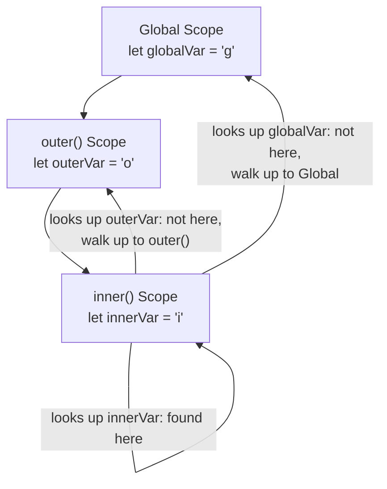
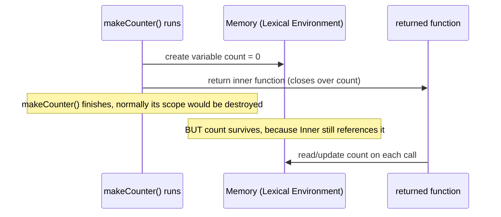

import { Callout } from 'fumadocs-ui/components/callout';
import { Tab, Tabs } from 'fumadocs-ui/components/tabs';

## 1. Lexical Scoping Chains

"Lexical" just means **based on where you physically wrote the code**, not where it's called from. JavaScript decides variable access using **static scoping** — the scope structure is fixed at write-time by nesting, not decided while the program runs.



**In plain words:** when the engine can't find a variable in the current function, it doesn't guess — it walks *outward*, following exactly how the functions were nested in your source code, until it finds the variable or runs out of scopes (then throws a `ReferenceError`).

```js
let globalVar = "I'm global";

function outer() {
  let outerVar = "I'm in outer";

  function inner() {
    let innerVar = "I'm in inner";
    console.log(innerVar);   // found in inner's own scope
    console.log(outerVar);   // not found here, walk up → found in outer
    console.log(globalVar);  // not found here or in outer → found in global
  }

  inner();
}

outer();
```

<Callout title="Static vs. runtime — the key distinction" type="info">
  This chain is decided by **where the function is defined in your code**, not by where or how it's called. Even if `inner()` were passed around and called from somewhere completely different, its scope chain would still be exactly what's shown above — because that's how it was written.
</Callout>

---

## 2. Closures Deep Dive

A **closure** is what happens when a function "remembers" the variables from the scope it was created in — even after that outer function has already finished running.



**In plain words:** normally, when a function finishes, its local variables are cleaned up (garbage collected, from Module 2). But if you return a function from inside it, and that inner function *uses* one of those variables, the engine keeps that variable alive in memory — just for that inner function — instead of throwing it away.

```js
function makeCounter() {
  let count = 0; // this variable would normally disappear after makeCounter() runs

  return function () {
    count++; // but this inner function "closes over" count, keeping it alive
    return count;
  };
}

const counter = makeCounter();
console.log(counter()); // 1
console.log(counter()); // 2
console.log(counter()); // 3 — count persisted across calls!
```

### Persisting State Safely & Data Privacy

Because `count` only exists inside the closure, there's no way to reach it directly from outside — no `counter.count`, no global variable to accidentally overwrite. This gives you real **private state** in plain JavaScript, without needing classes.

```js
function createBankAccount(initialBalance) {
  let balance = initialBalance; // private — no external access

  return {
    deposit(amount) {
      balance += amount;
      return balance;
    },
    withdraw(amount) {
      if (amount > balance) throw new Error("Insufficient funds");
      balance -= amount;
      return balance;
    },
    getBalance() {
      return balance;
    }
  };
}

const account = createBankAccount(100);
console.log(account.deposit(50));  // 150
console.log(account.balance);      // undefined — can't touch it directly!
```

<Callout title="Where you'll see this again" type="info">
  React's `useState` works on exactly this principle — the state variable is a closed-over variable that persists across re-renders without being globally accessible.
</Callout>

---


## Technical Definition

A **closure** is created when an inner function remembers and can access variables from its outer function, even after the outer function has finished executing.

In simple words,

> A closure allows a function to "remember" the environment in which it was created.

---

## Example

```html
<!doctype html>
<html lang="en">

<body>

<button id="Orange">Orange</button>
<button id="Green">Green</button>

<script>

function handleBackground(color){
    return function(){
        document.body.style.backgroundColor = color;
    }
}

document.getElementById("Orange").onclick = handleBackground("orange");
document.getElementById("Green").onclick = handleBackground("green");

</script>

</body>

</html>
```


---

## How does it work?

When JavaScript runs

```js
handleBackground("orange")
```

it creates a local variable:

```js
color = "orange"
```

Then it returns

```js
function(){

    document.body.style.backgroundColor = color;

}
```

Normally, after the outer function finishes, its local variables should disappear.

However, because the returned function still needs `color`, JavaScript keeps that variable alive.

This preserved relationship between the inner function and its outer variables is called a **closure**.

Later, when the Orange button is clicked, the returned function still remembers:

```js
color = "orange"
```

Similarly,

```js
handleBackground("green")
```

creates another independent closure where

```js
color = "green"
```

Each button has its own remembered value.

---

## Why use Closures?

Closures are useful because they allow functions to:

* remember data after the outer function has finished
* create private variables
* preserve state between function calls
* generate customized functions based on different inputs

They are widely used in:

* Event handlers
* Callbacks
* Function factories
* Modules
* Data encapsulation
* React Hooks and many modern JavaScript patterns
