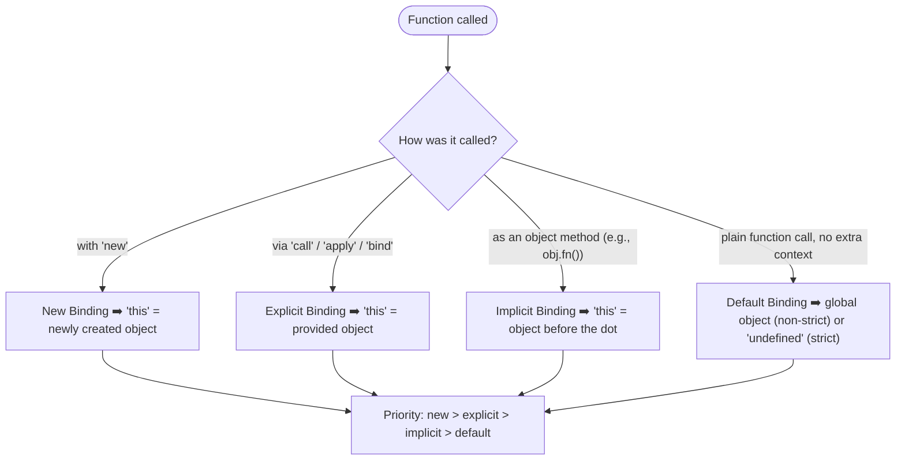

## The Golden Rule

`this` is a special keyword in JavaScript that refers to **some object** — but **which object** depends entirely on **how the function is called**, not where or how it is written.

> **Closures are decided at write‑time; `this` is decided at call‑time.**

---

## Closures vs `this` – A Crucial Difference

```js
function outer() {
  let name = "Ali";
  return function inner() {
    console.log(name);   // inner remembers `name` from its lexical scope
  };
}
const fn = outer();
fn(); // "Ali"  (always, no matter where you call it)
```

Closures are **lexically scoped** — they capture variables from the surrounding scope when the function is created.

`this`, on the other hand, is **dynamically scoped** — it is determined when the function is invoked.

```js
function greet() {
  console.log(this);
}
greet();        // depends on call: global or undefined
```

---

## Think of `this` Like a Delivery Driver

You are the same driver; the destination (the object you deliver to) changes each day based on the manager's instruction. Similarly, the same function body runs, but `this` points to different objects depending on who called it.

---

## The Four Binding Rules

JavaScript asks one question when a function is executed:

> **“How was this function called?”**

The answer leads to one of four binding rules, checked in priority order.

### The Decision Tree



---

### Rule 1 – Default (Global) Binding

When a function is called as a plain function (not as a method, not with `new`, not with `call/apply/bind`), `this` defaults to:

- In non‑strict mode: the global object (`window` in browsers, `global` in Node.js, or `globalThis`).
- In strict mode (`"use strict"`): `undefined`.

```js
function show() {
  console.log(this);
}
show(); // global (or undefined in strict mode)
```

---

### Rule 2 – Implicit Binding

When a function is invoked as a method of an object (with the dot notation), the object before the dot becomes `this`.

```js
const user = {
  name: "Ali",
  greet() {
    console.log(this.name);
  }
};
user.greet(); // "Ali"
```

> **Easy rule:** Look at the left side of the dot — that object is `this`.

---

### Rule 3 – Explicit Binding

We can force `this` to be any object we want using `.call()`, `.apply()`, or `.bind()`.

```js
function greet() {
  console.log(this.name);
}

const person = { name: "Sara" };
greet.call(person); // "Sara"
```

- `.call()` and `.apply()` invoke the function immediately with the specified `this`.
- `.bind()` returns a new function with a permanently fixed `this`.

---

### Rule 4 – New Binding

When a function is called with the `new` keyword, JavaScript creates a brand‑new object, sets its prototype, and makes that object the `this` inside the function.

```js
function Person(name) {
  this.name = name;
}
const p = new Person("Ahmed");
console.log(p.name); // "Ahmed"
```

Internally, this is roughly:

```js
const obj = {};
Object.setPrototypeOf(obj, Person.prototype);
Person.call(obj, "Ahmed");
return obj;
```

---

## Priority of Binding Rules

If multiple rules could apply, JavaScript follows this hierarchy:

1. **New Binding** – highest priority.
2. **Explicit Binding** (call/apply/bind) – next.
3. **Implicit Binding** (method call) – next.
4. **Default Binding** – lowest.

---

## Common Pitfalls

### Copying a Method

```js
const user = { name: "Ali", greet() { console.log(this.name); } };
const hello = user.greet;  // copying the function reference
hello(); // undefined (or global) – lost the implicit binding
```

> **Reason:** `hello()` is a plain call, so default binding applies.

### Callback Traps

```js
setTimeout(user.greet, 1000); // undefined
```

`setTimeout` calls the function as a plain function, losing the object context. Fix with `.bind()`:

```js
setTimeout(user.greet.bind(user), 1000); // "Ali"
```

---

## Arrow Functions and `this`

Arrow functions **do not have their own `this`**. Instead, they inherit `this` from the surrounding (lexical) scope.

```js
const user = {
  name: "Bilal",
  greetArrow: () => {
    console.log(this.name); // `this` comes from outside, not from `user`
  }
};
user.greetArrow(); // undefined (unless outer scope defines `name`)
```

They are useful to preserve the outer `this` inside callbacks:

```js
const user = {
  name: "Bilal",
  greet() {
    setTimeout(() => {
      console.log(this.name); // arrow inherits `this` from `greet` → user
    }, 1000);
  }
};
user.greet(); // "Bilal" after 1s
```

---

## Summary Table

| Call Type                     | `this` value                                                              | Example                           |
| ----------------------------- | ------------------------------------------------------------------------- | --------------------------------- |
| Plain function                | global object (non‑strict) / `undefined` (strict)                         | `fn()`                            |
| Method call (`obj.fn()`)      | The object before the dot                                                 | `user.greet()` → `this = user`    |
| Explicit (`call`/`apply`/`bind`) | The object you provide                                                   | `greet.call(obj)` → `this = obj`  |
| `new`                         | The newly created instance                                                | `new Person()` → `this = new obj` |
| Arrow function                | Inherited from the enclosing lexical scope (no own `this`)               | `() => this.name`                 |

---

## The Single Question to Remember

Whenever you see `this`, do not ask:

> **“Where was this function written?”**

Instead, always ask:

> **“How is this function being called?”**

This one question explains almost every `this` behaviour in JavaScript.