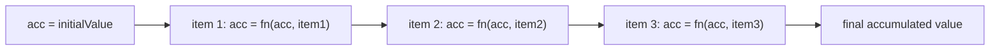
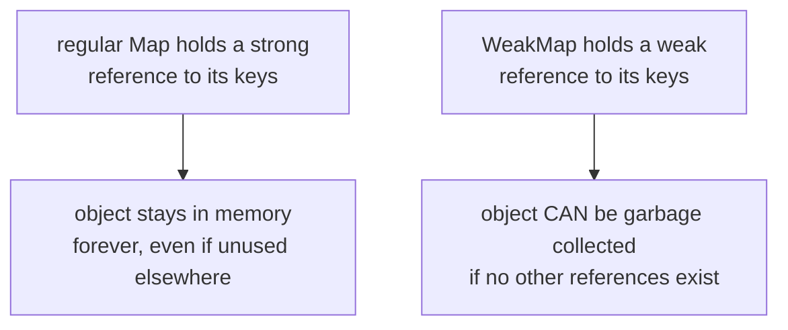

import { Callout } from 'fumadocs-ui/components/callout';
import { Tab, Tabs } from 'fumadocs-ui/components/tabs';

## Why This Module Matters

Modules 1–3 gave you the engine's internal model. Module 4 is where that model turns into **daily-driver syntax** — the array methods, destructuring patterns, and collection types you'll write in almost every file you touch. It's also the module interviewers love to probe, because "write your own `.reduce()`" tells them whether you actually understand arrays or just memorized the method names.

---

## 1. Declarative Arrays — Custom Implementations

Knowing *how* these methods work internally means you'll never misuse them.

### `.map()` — transform each item, same length out

```js
Array.prototype.myMap = function (callback) {
  const result = [];
  for (let i = 0; i < this.length; i++) {
    result.push(callback(this[i], i, this));
  }
  return result;
};

console.log([1, 2, 3].myMap(x => x * 2)); // [2, 4, 6]
```

### `.filter()` — keep items that pass a test

```js
Array.prototype.myFilter = function (callback) {
  const result = [];
  for (let i = 0; i < this.length; i++) {
    if (callback(this[i], i, this)) {
      result.push(this[i]);
    }
  }
  return result;
};

console.log([1, 2, 3, 4].myFilter(x => x % 2 === 0)); // [2, 4]
```

### `.reduce()` — collapse an array into a single value



```js
Array.prototype.myReduce = function (callback, initialValue) {
  let acc = initialValue;
  let startIndex = 0;

  if (acc === undefined) {
    acc = this[0];
    startIndex = 1;
  }

  for (let i = startIndex; i < this.length; i++) {
    acc = callback(acc, this[i], i, this);
  }
  return acc;
};

console.log([1, 2, 3, 4].myReduce((acc, x) => acc + x, 0)); // 10
```

<Callout title="Why reduce is the 'parent' method" type="info">
  You can actually build `.map()` and `.filter()` using only `.reduce()` — it's the most fundamental array operation. If an interviewer asks "implement map using reduce," this is why it's possible.
</Callout>

### `.some()` and `.every()` — short-circuiting boolean checks

```js
Array.prototype.mySome = function (callback) {
  for (let i = 0; i < this.length; i++) {
    if (callback(this[i], i, this)) return true; // stops immediately on first match
  }
  return false;
};

Array.prototype.myEvery = function (callback) {
  for (let i = 0; i < this.length; i++) {
    if (!callback(this[i], i, this)) return false; // stops immediately on first failure
  }
  return true;
};

console.log([1, 2, 3].mySome(x => x > 2));  // true
console.log([1, 2, 3].myEvery(x => x > 0)); // true
```

### `.flatMap()` — map, then flatten one level

```js
Array.prototype.myFlatMap = function (callback) {
  const result = [];
  for (let i = 0; i < this.length; i++) {
    const mapped = callback(this[i], i, this);
    if (Array.isArray(mapped)) {
      result.push(...mapped); // flatten one level only
    } else {
      result.push(mapped);
    }
  }
  return result;
};

console.log([1, 2, 3].myFlatMap(x => [x, x * 2])); // [1, 2, 2, 4, 3, 6]
```

---

## 2. Destructuring & Rest/Spread

### Nested Destructuring

```js
const user = {
  name: "Ali",
  address: { city: "Lahore", zip: "54000" }
};

const { name, address: { city, zip } } = user;
console.log(name, city, zip); // "Ali" "Lahore" "54000"
```

### Rest/Spread — Shallow Cloning & Parameter Bundling

```js
// Spread — cloning (shallow, same rule as Module 2!)
const original = { a: 1, b: 2 };
const clone = { ...original, c: 3 };
console.log(clone); // { a: 1, b: 2, c: 3 }

// Rest — bundling remaining args into an array
function sum(first, ...rest) {
  return first + rest.reduce((a, b) => a + b, 0);
}
console.log(sum(1, 2, 3, 4)); // 10

// Destructuring with defaults
function greet({ name = "Guest", age = 18 } = {}) {
  console.log(`${name} is ${age}`);
}
greet(); // "Guest is 18"
greet({ name: "Sara" }); // "Sara is 18"
```

<Callout title="Gotcha" type="warn">
  Spread only clones **one level deep** — exactly the shallow-clone trap from Module 2. Nested objects inside a spread copy are still shared references.
</Callout>

---

## 3. Keyed Collections — `Map` vs. Plain Objects, `Set`, `WeakMap`/`WeakSet`

### `Map` vs. Plain Objects

| Feature | `Map` | Plain Object |
|---|---|---|
| Key types | Any value (object, function, NaN, etc.) | String or Symbol only |
| Key order | Guaranteed insertion order | Mostly insertion order, but integer-like keys sort first |
| Size | `.size` property | Manual (`Object.keys(obj).length`) |
| Iteration | Directly iterable (`for...of`) | Needs `Object.keys()`/`entries()` first |
| Performance | Optimized for frequent additions/removals | Optimized for fixed-shape records |

```js
const map = new Map();
const objKey = { id: 1 };

map.set(objKey, "value for object key");
map.set("stringKey", "value for string key");

console.log(map.get(objKey)); // "value for object key"
console.log(map.size); // 2

for (const [key, value] of map) {
  console.log(key, value);
}
```

### `Set` — unique values only

```js
const set = new Set([1, 2, 2, 3, 3, 3]);
console.log(set); // Set(3) {1, 2, 3} — duplicates automatically removed
console.log(set.has(2)); // true

// Common real-world use: dedupe an array
const arr = [1, 1, 2, 2, 3];
const unique = [...new Set(arr)];
console.log(unique); // [1, 2, 3]
```

### `WeakMap` / `WeakSet` — memory-safe references

Unlike `Map`/`Set`, `WeakMap`/`WeakSet` only accept **objects** as keys, and those keys are **weakly held** — meaning they don't stop the garbage collector (from Module 2!) from cleaning them up if nothing else references them.



```js
let obj = { id: 1 };
const weakMap = new WeakMap();
weakMap.set(obj, "some metadata");

obj = null; // no other reference to the original object exists now
// the object AND its WeakMap entry become eligible for garbage collection
// (a regular Map would have kept it alive forever)
```

<Callout title="Real use case" type="info">
  `WeakMap` is perfect for attaching private/extra data to objects (like DOM nodes) without causing the memory leaks discussed in Module 2 — when the DOM node is removed, its `WeakMap` entry disappears too.
</Callout>

---

## 4. Strings & Regex

### Template Literals & Tagged Templates

```js
const name = "Ali";
const age = 25;
console.log(`${name} is ${age} years old`); // "Ali is 25 years old"

// Tagged template — the tag function gets full control over interpolation
function highlight(strings, ...values) {
  return strings.reduce((result, str, i) =>
    `${result}${str}${values[i] ? `**${values[i]}**` : ""}`, "");
}

console.log(highlight`${name} scored ${90} marks`);
// "**Ali** scored **90** marks"
```

### Regex — Lookaheads & Capture Groups

```js
// Capture groups — extract specific parts of a match
const dateStr = "2026-07-05";
const match = dateStr.match(/(\d{4})-(\d{2})-(\d{2})/);
console.log(match[1], match[2], match[3]); // "2026" "07" "05"

// Named capture groups — more readable
const namedMatch = dateStr.match(/(?<year>\d{4})-(?<month>\d{2})-(?<day>\d{2})/);
console.log(namedMatch.groups.year); // "2026"

// Positive lookahead — match "price" only if followed by a number
console.log(/price(?=\d)/.test("price100")); // true
console.log(/price(?=\d)/.test("priceTag")); // false

// Negative lookahead — match "price" only if NOT followed by "Tag"
console.log(/price(?!Tag)/.test("price100")); // true
console.log(/price(?!Tag)/.test("priceTag"));  // false
```

---

## 5. Modern Operators

### Optional Chaining (`?.`)

```js
const user2 = { profile: { name: "Sara" } };

console.log(user2?.profile?.name);      // "Sara"
console.log(user2?.address?.city);      // undefined — no error, even though address doesn't exist
console.log(user2?.getPhone?.());       // undefined — safely skips calling a method that doesn't exist
```

### Nullish Coalescing (`??`)

`??` only falls back when the value is `null` or `undefined` — unlike `||`, which falls back on **any** falsy value (`0`, `""`, `false`).

```js
const count = 0;
console.log(count || 10); // 10 — WRONG if 0 is a valid value!
console.log(count ?? 10); // 0  — correct, 0 is not null/undefined

const username = "";
console.log(username || "Guest"); // "Guest" — WRONG if empty string is valid input
console.log(username ?? "Guest"); // ""      — correct
```

### Short-Circuiting

```js
// && short-circuits: stops at the first falsy value
const isLoggedIn = true;
isLoggedIn && console.log("Welcome!"); // runs, because isLoggedIn is true

// || short-circuits: stops at the first truthy value
const config = null;
const finalConfig = config || { theme: "dark" };
console.log(finalConfig); // { theme: "dark" }
```

<Callout title="Interview one-liner" type="info">
  `??` vs `||` is one of the most common trick questions — always mention that `??` only checks for `null`/`undefined`, while `||` checks for *any* falsy value.
</Callout>

---

## Module 4 Summary

| Concept | One-Line Takeaway |
|---|---|
| `.reduce()` | The "parent" method — `.map()` and `.filter()` can both be built from it |
| `.some()` / `.every()` | Short-circuit as soon as the answer is determined |
| `.flatMap()` | Map, then flatten exactly one level |
| Destructuring | Nested patterns pull values out; defaults prevent `undefined` crashes |
| Spread cloning | Still shallow — nested objects remain shared references |
| `Map` vs Object | Use `Map` for non-string keys, guaranteed order, and frequent mutation |
| `Set` | Automatic uniqueness — the standard way to dedupe an array |
| `WeakMap`/`WeakSet` | Object-only keys, weakly held — won't block garbage collection |
| Lookaheads | `(?=...)` positive, `(?!...)` negative — match based on what follows, without consuming it |
| `??` vs `||` | `??` only triggers on `null`/`undefined`; `||` triggers on any falsy value |

---

## Practice Questions (Interview Level)

Try solving each one yourself first, then check the solution.

### Q1. Implement `.flat(Infinity)` from scratch (fully flatten any nested array)

<Callout title="Solution" type="info">
```js
function deepFlatten(arr) {
  return arr.reduce((flat, item) => {
    return flat.concat(Array.isArray(item) ? deepFlatten(item) : item);
  }, []);
}

console.log(deepFlatten([1, [2, [3, [4, 5]], 6]])); // [1, 2, 3, 4, 5, 6]
```
**Why it works:** each level recursively flattens itself before being concatenated, so nesting depth doesn't matter.
</Callout>

### Q2. What does this log, and why?

```js
console.log(0 ?? "fallback" || "second fallback");
```

<Callout title="Solution" type="warn">
This actually **throws a `SyntaxError`** — you cannot mix `??` and `||` directly without parentheses, because JS refuses to guess your intended precedence. The fix:
```js
console.log((0 ?? "fallback") || "second fallback"); // "second fallback"
```
`0 ?? "fallback"` evaluates to `0` (since `0` isn't null/undefined), and then `0 || "second fallback"` falls back because `0` is falsy.
</Callout>

### Q3. Why does `[...new Set([1, "1", 1])]` return `[1, "1"]` and not `[1]`?

<Callout title="Solution" type="info">
`Set` uses **SameValueZero** equality, which is essentially `===` (with one exception: it treats `NaN` as equal to `NaN`). Since `1` (number) and `"1"` (string) are different types, `===` says they're not equal, so both are kept as unique values.
</Callout>

### Q4. Given `const obj = { a: 1, b: { c: 2 } }; const clone = { ...obj }; clone.b.c = 99;` — what is `obj.b.c` now, and why?

<Callout title="Solution" type="info">
`obj.b.c` is now `99`. Spread only performs a **shallow clone** — the top-level keys (`a`, `b`) get new slots, but `b`'s value is an object, so both `obj.b` and `clone.b` still point to the exact same object in the heap (see Module 2's Primitive vs. Reference model).
</Callout>

### Q5. Implement `.map()` using only `.reduce()`

<Callout title="Solution" type="info">
```js
function mapWithReduce(arr, callback) {
  return arr.reduce((acc, item, i) => {
    acc.push(callback(item, i, arr));
    return acc;
  }, []);
}

console.log(mapWithReduce([1, 2, 3], x => x * 10)); // [10, 20, 30]
```
</Callout>

### Q6. Write a regex that validates a basic email and extracts the domain using a named capture group

<Callout title="Solution" type="info">
```js
const emailRegex = /^[\w.+-]+@(?<domain>[\w-]+\.[a-zA-Z]{2,})$/;
const match = "user@example.com".match(emailRegex);
console.log(match.groups.domain); // "example.com"
```
</Callout>

### Q7. What's the output, and why?

```js
function greet({ name, greeting = "Hello" } = {}) {
  console.log(`${greeting}, ${name}`);
}
greet();
```

<Callout title="Solution" type="info">
Output: `"Hello, undefined"` — **no error is thrown**.

Here's why: the `= {}` default only kicks in when the **entire argument is missing/`undefined`**. Since `greet()` was called with zero arguments, that default `{}` is used as the object to destructure. Destructuring `{ name, greeting = "Hello" }` from `{}` gives `name = undefined` (no default was defined for `name` itself) and `greeting = "Hello"` (its own default fires). So the log prints `"Hello, undefined"`.

If the outer `= {}` were removed entirely, calling `greet()` with no arguments *would* throw a `TypeError`, since you'd be trying to destructure properties off of `undefined`.
</Callout>

### Q8. Why is `WeakMap` not iterable (no `.forEach()`, no `for...of`)?

<Callout title="Solution" type="info">
Because its keys are weakly held, an entry could be garbage collected **at any moment** — even mid-iteration. If you could loop over it, the list of entries would be unpredictable and could change between one line of code and the next. To keep behavior deterministic, the spec simply disallows enumeration entirely.
</Callout>

### Q9. Convert this imperative loop into a declarative one-liner using array methods

```js
const nums = [1, 2, 3, 4, 5, 6];
const result = [];
for (let i = 0; i < nums.length; i++) {
  if (nums[i] % 2 === 0) {
    result.push(nums[i] * nums[i]);
  }
}
```

<Callout title="Solution" type="info">
```js
const result = nums.filter(n => n % 2 === 0).map(n => n * n);
console.log(result); // [4, 16, 36]
```
</Callout>

### Q10. What does `structuredClone` do differently from `{ ...obj }` that makes it relevant here, and give one case where `structuredClone` would fail

<Callout title="Solution" type="info">
`structuredClone()` deep clones — nested objects get fully independent copies, unlike spread's shallow clone. However, `structuredClone()` **fails on functions** (throws `DataCloneError`) since functions can't be structurally cloned — so an object containing methods can't be cloned this way; you'd need a manual deep clone or a library for that case.
</Callout>