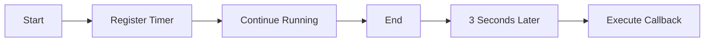

## Why This Module Matters

Imagine you ask a waiter for your food.

Does the waiter stand beside the kitchen doing nothing until your food is ready?

No.

Instead, the waiter:

* takes your order,
* gives it to the kitchen,
* serves other customers,
* returns when your food is ready.

JavaScript behaves in a very similar way.

It starts a long-running task, continues doing other work, and comes back when the task finishes.

This behavior is called **Asynchronous Programming**.


## Learning Objectives

After completing this chapter, you will be able to:

* Explain synchronous and asynchronous execution.
* Understand why JavaScript uses asynchronous programming.
* Explain blocking and non-blocking code.
* Understand concurrency in JavaScript.
* Relate asynchronous programming to browsers, Node.js, React, and AI applications.


## Table of Contents

1. What is Synchronous Programming?
2. Problems with Synchronous Programming
3. What is Asynchronous Programming?
4. Blocking vs Non-Blocking
5. Why JavaScript Needs Async
6. Real-Life Analogies
7. Browser Examples
8. Node.js Examples
9. AI Examples
10. Summary


## 1. What is Synchronous Programming?

Synchronous means:

> Execute one task completely before starting the next one.

Think of it as standing in a single queue.

```text
Person A
↓

Person B
↓

Person C
↓

Person D
```

Nobody moves until the previous person finishes.


## JavaScript Example

```javascript
console.log("Start");

console.log("Learning JavaScript");

console.log("End");
```

Output

```
Start
Learning JavaScript
End
```

Execution:

```text
Line 1

↓

Completed

↓

Line 2

↓

Completed

↓

Line 3
```

Every statement waits for the previous one.


## Restaurant Analogy

One chef.

One customer.

The chef refuses to cook another meal until the current meal is fully prepared.

```text
Cook Pizza

↓

Serve Pizza

↓

Cook Burger

↓

Serve Burger

↓

Cook Pasta
```

This is synchronous execution.


## Problem

What if making the pizza takes **30 minutes**?

Everyone else waits.

This is inefficient.


## 2. The Problem with Synchronous Programming

Suppose downloading a file takes 10 seconds.

```javascript
downloadMovie();

playMusic();
```

If `downloadMovie()` blocks the thread:

```text
Download movie...

10 seconds...

Play Music
```

The music starts only after the download finishes.

Not a good user experience.


### Real Browser Example

Imagine clicking a button.

```javascript
downloadLargeFile();
```

If JavaScript blocked the browser:

* Button cannot be clicked.
* Animations freeze.
* Videos stop.
* Page cannot scroll.
* Typing stops.

The browser appears frozen.

Everyone has experienced this at least once.


## Traffic Signal Analogy

Imagine a city with only one road.

```
🚚 Truck

↓

🚗 Car

↓

🚙 Bus

↓

🚕 Taxi
```

If the truck stops for five minutes:

Everything behind it stops.

This is called **blocking**.


## 3. What is Asynchronous Programming?

Asynchronous programming allows JavaScript to start a task without waiting for it to finish.

Instead of stopping everything, JavaScript says:

> "I'll continue with other work and come back when you're done."


## Example

```javascript
console.log("Start");

setTimeout(() => {
    console.log("Downloaded");
}, 3000);

console.log("End");
```

Output

```
Start
End
Downloaded
```

Notice:

JavaScript did **not** wait for three seconds.

It continued executing immediately.


## Timeline




## Everyday Analogy

Imagine washing clothes.

Instead of standing in front of the washing machine for an hour, you:

* start the washing machine,
* clean your room,
* study,
* cook food,
* return when washing finishes.

That is asynchronous programming.


## 4. Blocking vs Non-Blocking

### Blocking

```javascript
waitFiveSeconds();

console.log("Hello");
```

Execution

```
Wait...

Wait...

Wait...

Hello
```


### Non-Blocking

```javascript
setTimeout(() => {
    console.log("Done");
}, 5000);

console.log("Hello");
```

Output

```
Hello

5 seconds later...

Done
```


### Comparison

| Blocking                | Non-Blocking           |
| ----------------------- | ---------------------- |
| Waits                   | Doesn't wait           |
| Freezes execution       | Keeps working          |
| Poor responsiveness     | Smooth experience      |
| User waits              | User can interact      |
| Rarely used in browsers | Used almost everywhere |


## 5. Why JavaScript Needs Asynchronous Programming

JavaScript is **single-threaded**.

That means it has **one call stack** and executes one piece of JavaScript code at a time.

If long-running operations blocked that single thread, the application would become unresponsive. To avoid this, browsers and Node.js handle many slow operations outside the JavaScript engine and notify JavaScript when they are complete.

Typical operations include:

* Network requests (`fetch`)
* Timers (`setTimeout`, `setInterval`)
* File system access (Node.js)
* Database queries
* Reading streams
* User events (clicks, keyboard input)


## Example: Loading a Web Page

When you open a website, many things happen:

* HTML is parsed.
* CSS is loaded.
* JavaScript is executed.
* Images are downloaded.
* Fonts are fetched.
* API requests are sent.

If each resource had to finish before the next one started, websites would feel extremely slow. Instead, many of these tasks happen concurrently, and JavaScript reacts as results become available.


## 6. Industry Example (AI Chat)

Consider an AI chat application.

```
You type a prompt
        │
        ▼
Frontend sends request
        │
        ▼
AI model starts generating tokens
        │
        ▼
Browser remains responsive
        │
        ▼
Tokens stream back gradually
        │
        ▼
UI updates in real time
```

If the browser waited synchronously for the entire response, you would see nothing until generation finished. Modern AI interfaces use asynchronous programming and streaming to display tokens as they arrive.


## Concept Check

**Q1.** Why doesn't JavaScript simply wait for a network request to finish?

**Answer:** Waiting would block its single execution thread, making the page or application unresponsive.

**Q2.** Does asynchronous programming mean JavaScript runs multiple JavaScript functions at the exact same time?

**Answer:** Not on a single thread. JavaScript still executes one piece of JavaScript code at a time. Asynchronous behavior comes from the runtime environment (browser or Node.js), which performs certain operations outside the JavaScript engine and later schedules callbacks or promise reactions.


## Common Misconceptions

❌ **"Async means parallel JavaScript execution."**

Not necessarily. JavaScript remains single-threaded for executing JavaScript code.


❌ **"`setTimeout(fn, 0)` runs immediately."**

It runs **after** the current call stack is empty and after higher-priority work (such as microtasks) has completed.


❌ **"Promises create new threads."**

Promises are a way to represent future values. They do not create threads.


## Key Takeaways

* JavaScript executes JavaScript code on a single thread.
* Synchronous code runs one statement after another.
* Asynchronous programming prevents long operations from blocking the application.
* Browsers and Node.js perform many slow operations outside the JavaScript engine.
* JavaScript continues working and processes results when they become available.
* This model enables responsive web apps, scalable Node.js servers, and real-time AI experiences.


<Callout title="What's Next?" type='success'>
In next i.e, JavaScript Runtime Architecture, we'll answer a question that many developers have:

If JavaScript is single-threaded, then who actually waits for timers, network requests, file reads, and user events?

We'll explore the complete runtime architecture—JavaScript Engine, Call Stack, Browser Web APIs, Node.js APIs, Event Loop, and Task Queues—using detailed diagrams and execution traces. This chapter provides the foundation for understanding everything else in asynchronous JavaScript.
</Callout>


