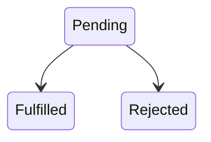
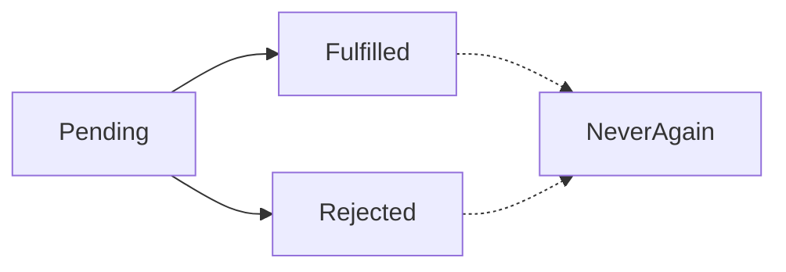
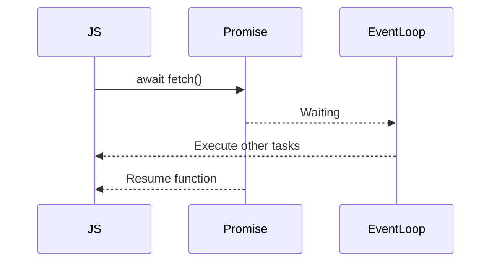
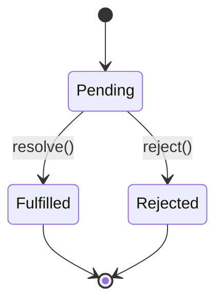

<Callout title="Attention" type="success">
Please Refer these websites for practical demo :
- https://www.jsv9000.app/
- http://latentflip.com/loupe/
</Callout>


## What is a Promise?

> A Promise is an object representing the eventual completion (or failure) of an asynchronous operation.

A Promise is **not** the data.

It is a **container** for future data.

Think:

```
Future Value
```

instead of

```
Current Value
```


## Promise Lifecycle

Every Promise has exactly one lifecycle.



There are only three states.


## 1. Pending

Initial state.

```javascript
const promise = new Promise(...)
```

Nothing happened yet.

Think:

> Food is still cooking.


## 2. Fulfilled

Everything succeeded.

```javascript
resolve(data)
```

Food delivered.


## 3. Rejected

Something failed.

```javascript
reject(error)
```

Restaurant cancelled your order.


## Very Important

A Promise changes state **only once**.



Once fulfilled

↓

Cannot become rejected.

Once rejected

↓

Cannot become fulfilled.

This is called **immutability of Promise state**.


# Creating a Promise

```javascript
const promise = new Promise((resolve, reject) => {

});
```

Many beginners ask:

Where do `resolve` and `reject` come from?

JavaScript automatically provides them.

Think of them as two buttons.

```
SUCCESS BUTTON

resolve()

FAIL BUTTON

reject()
```


Example

```javascript
const promise = new Promise((resolve,reject)=>{

    resolve("Downloaded");

});
```

Output

```
Pending

↓

Fulfilled

↓

Downloaded
```


Failure

```javascript
const promise = new Promise((resolve,reject)=>{

    reject("Network Error");

});
```

Output

```
Pending

↓

Rejected

↓

Network Error
```


## Consuming a Promise

A Promise is useless unless someone consumes it.

```javascript
promise
.then(...)
.catch(...)
.finally(...)
```

Imagine ordering pizza.

```
Restaurant

↓

Promise

↓

You receive it

↓

then()
```


Example

```javascript
fetch("/users")

.then(users=>{

    console.log(users);

})

.catch(error=>{

    console.log(error);

});
```


## Promise Internals

Internally every Promise roughly stores

```javascript
Promise{

   state,

   result,

   callbacks[]

}
```

Think of it like

```javascript
{
    state:"pending",

    value:undefined,

    handlers:[]
}
```

When resolved

```javascript
{
    state:"fulfilled",

    value:data
}
```


## Simplified Custom Promise

This is **not** the complete ECMAScript implementation, but it captures the core idea.

```javascript
class MyPromise{

    constructor(executor){

        this.state="pending";
        this.value=undefined;
        this.handlers=[];

        const resolve=(value)=>{

            if(this.state!=="pending") return;
            this.state="fulfilled";
            this.value=value;
            this.handlers.forEach(fn=>fn(value));
        }
        executor(resolve);
    }

    then(callback){
        if(this.state==="fulfilled"){
            callback(this.value);
        }else{
            this.handlers.push(callback);
        }
    }
}
```

Usage

```javascript
const p=new MyPromise((resolve)=>{

    setTimeout(()=>{

        resolve("Hello");

    },1000);

});

p.then(console.log);
```

This demonstrates three important concepts:

* the Promise starts in the `pending` state,
* `resolve()` changes the state and stores the value,
* `.then()` either runs immediately (if already fulfilled) or waits until the Promise resolves.


## How `.then()` Really Works

Imagine

```javascript
fetch(...)
.then(A)
.then(B)
.then(C)
```

Many people think

```
A

↓

B

↓

C
```

Actually

Each `.then()` returns **a brand-new Promise**.


That is why chaining works.


Example

```javascript
Promise.resolve(5)

.then(x=>x*2)

.then(x=>x+10)

.then(console.log);
```

Execution

```
5

↓

10

↓

20
```

Each step creates a new Promise containing the transformed value.


## Error Propagation

One of the biggest advantages of Promises.

```javascript
login()

.then(profile)

.then(friends)

.then(messages)

.catch(handleError)
```

If **any** step fails,

execution jumps directly to `.catch()`.

Callbacks required manual error handling at every level.

Promises centralize it.


## Async/Await

People often think Async/Await is new asynchronous technology.

It is not.

It is simply **syntactic sugar over Promises**.

This

```javascript
const user=await fetchUsers();
```

is conceptually similar to

```javascript
fetchUsers()

.then(user=>{

});
```

Under the hood,

Promises are still doing the work.


## Why `async`?

A function containing `await` must be marked as `async`.

```javascript
async function getUsers(){

}
```

An async function **always returns a Promise**, even if you return a plain value.

```javascript
async function hello(){

    return "Hello";

}
```

Actually behaves like

```javascript
Promise.resolve("Hello")
```


## await

`await` means

> Pause this async function until the Promise settles.

Notice the wording carefully.

It **does not pause JavaScript**.

It pauses **only the current async function**.

Example

```javascript
async function load(){

    console.log("Start");

    const user=await fetchUser();

    console.log(user);

}
```

While waiting,

other JavaScript can still execute.


## Visualization




## Multiple Awaits

```javascript
const a=await A();

const b=await B();

const c=await C();
```

Execution

```
A

↓

B

↓

C
```

This is **sequential**.

Sometimes that's exactly what you want—for example, when each step depends on the previous one.


## Faster Version

Independent tasks should start together.

```javascript
const [user,posts]=await Promise.all([

    fetchUser(),

    fetchPosts()

]);
```

Now both requests begin at the same time, and the function waits until **both** complete.


## Real Industry Example

When you open Instagram:

```
Profile

Posts

Stories

Notifications
```

These are usually requested in parallel rather than one after another.

```javascript
await Promise.all([
    fetchProfile(),
    fetchPosts(),
    fetchStories(),
    fetchNotifications()
]);
```

This is much faster than waiting for each request individually.


## Promise vs Async/Await

| Promise                 | Async/Await                  |
| ----------------------- | ---------------------------- |
| `.then()` chaining      | Sequential-looking code      |
| Good for pipelines      | Excellent for business logic |
| Explicit chaining       | Easier to read               |
| Built-in error chaining | `try...catch` syntax         |
| Foundation of async JS  | Built on top of Promises     |


## Promise State Machine




## Complete Mental Model

```
JavaScript

↓

Creates Promise

↓

Promise starts Pending

↓

Runtime performs async work

↓

resolve() / reject()

↓

Promise settles

↓

MicroTask Queue

↓

Event Loop

↓

.then()

↓

await resumes

↓

Next code executes
```


## Interview Questions

### Q1. What is a Promise?

A Promise is an object that represents the eventual success or failure of an asynchronous operation.


### Q2. Can a Promise change from fulfilled to rejected?

No. A Promise can settle only once. After it becomes fulfilled or rejected, its state is immutable.


### Q3. Does `await` block JavaScript?

No. It pauses only the current `async` function. The event loop continues processing other work.


### Q4. Does an async function always return a Promise?

Yes. Even if you return a plain value, it is automatically wrapped in a resolved Promise.


### Q5. Is Async/Await faster than Promises?

No. `async/await` is primarily syntax. It uses Promises internally. Performance differences are usually negligible; choose based on readability and program structure.


## 20% Knowledge That Gives 100% Understanding

If you remember only these eight rules, you can reason about almost every Promise-based program:

1. A **Promise is a future value**, not the value itself.
2. Every Promise starts in the **Pending** state.
3. A Promise settles exactly once—either **Fulfilled** or **Rejected**.
4. `.then()`, `.catch()`, and `.finally()` are scheduled as **MicroTasks**.
5. Every `.then()` returns a **new Promise**, enabling chaining.
6. `async/await` is built entirely on top of Promises.
7. `await` pauses only the current async function, not the entire JavaScript engine.
8. Independent asynchronous operations should often be started together using `Promise.all()` rather than awaited one by one.

---

<Callout title="What's Next?" type="success">

### Next (Final Theory Part)

The remaining chapters naturally merge into one final advanced chapter:

* **Promise Combinators** (`Promise.all`, `allSettled`, `race`, `any`)
* **Streams**
* **Iterators**
* **Generators**
* **Async Iterators**
* **`for await...of`**
* **How AI streaming (ChatGPT), Node.js streams, and modern web applications use these concepts together**

This final chapter connects everything you've learned into one industry-level mental model.
</Callout>
