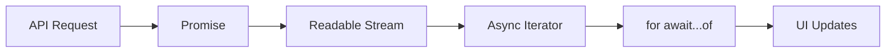
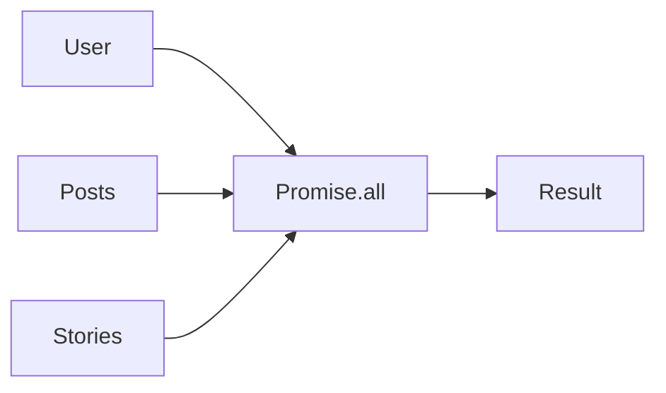
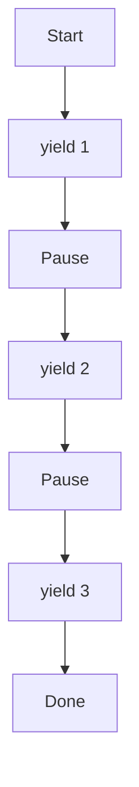
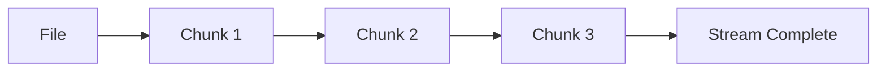
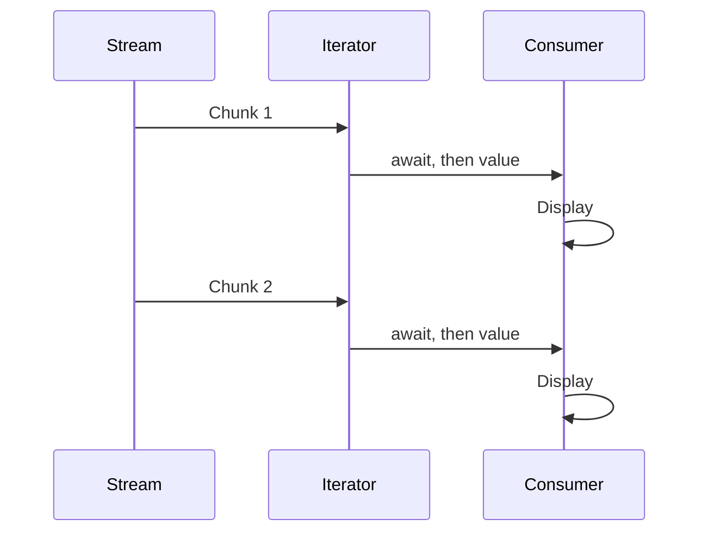
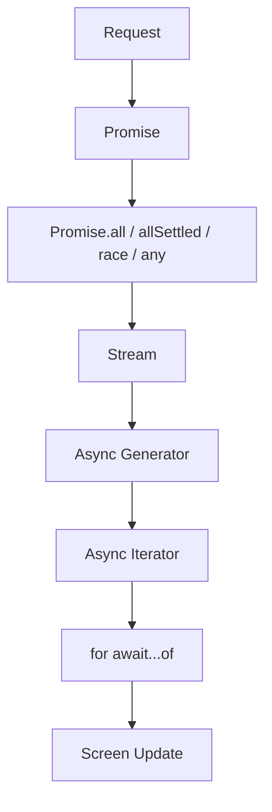

import { Callout } from 'fumadocs-ui/components/callout';
import { Tab, Tabs } from 'fumadocs-ui/components/tabs';

## Why These Topics Belong Together

Most tutorials teach these separately. Industry doesn't.

Think about ChatGPT. When you ask **"Explain JavaScript,"** does it wait until the entire answer is generated? No — it streams words one by one.

<Callout title="The Pipeline">
Promise → Async Function → Stream → Async Iterator → `for await...of` → Screen Updates
</Callout>

These are not different topics. They are **one pipeline**.

## Big Picture



Everything modern — AI chat apps, YouTube, Netflix, Node.js — works like this.

---

## Part 1 — Promise Combinators

Sometimes you don't have one Promise. You have many.

**Example:** an Instagram home page needs User, Posts, Stories, Notifications, and Messages. Should these be fetched one by one? No — JavaScript gives four combinators for this.

### 1. `Promise.all()`

Waits for **everything**. If one fails, everything fails.

```javascript
const result = await Promise.all([
  fetchUser(),
  fetchPosts(),
  fetchStories()
]);
```



<Callout type="info" title="Analogy">
A team project where the teacher only accepts it when **every** member submits. One missing member → the whole project is rejected.
</Callout>

**Output:**

```javascript
[user, posts, stories]
```

**Industry use:** a dashboard that needs User, Profile, Settings, and Permissions all loaded before rendering.

---

### 2. `Promise.allSettled()`

Waits for everyone. Never rejects on its own.

```javascript
await Promise.allSettled([
  fetchUser(),
  fetchPosts(),
  fetchAds()
]);
```

**Output:**

```javascript
[
  { status: "fulfilled", value: user },
  { status: "fulfilled", value: posts },
  { status: "rejected", reason: error }
]
```

<Callout type="info" title="Analogy">
Exam results — even if one subject is failed, the report card still shows every subject's result.
</Callout>

**Industry example:** uploading 100 images. If one upload fails, the rest shouldn't stop — show the result of every upload.

---

### 3. `Promise.race()`

Whichever Promise **settles** first — success or failure — wins.

```javascript
await Promise.race([
  fetchServer1(),
  fetchServer2(),
  fetchServer3()
]);
```

```text
Server A -----------❌
Server B ----🏆
Server C ----------❌
```

<Callout type="warn" title="Correction">
`Promise.race()` settles with whichever promise finishes first, **even if that one rejects**. It does not guarantee a successful result — that's what `Promise.any()` is for.
</Callout>

**Industry example:** querying multiple CDN servers that hold the same file — use whichever responds first.

---

### 4. `Promise.any()`

Similar to `race()`, but ignores failures — it needs the **first successful** result.

```javascript
await Promise.any([
  serverA(),
  serverB(),
  serverC()
]);
```

Suppose:

```text
A ❌
B ❌
C ✅
```

**Result:** `C`

Only when **every** Promise fails does `Promise.any()` reject — with an `AggregateError`.

### Comparison Table

| Method               | Waits For       | Rejects?          | Best Use                          |
|----------------------|-----------------|--------------------|------------------------------------|
| `Promise.all`         | All to succeed  | Yes, on first failure | Dashboards, parallel data loading |
| `Promise.allSettled`  | All to finish   | No                 | Bulk uploads, reports              |
| `Promise.race`        | First to settle | Yes, if the winner rejects | Timeouts, fastest response  |
| `Promise.any`         | First to succeed| Only if all fail   | Backup/failover servers            |

---

## Part 2 — Iterators

How does JavaScript know how `for (const x of arr) {}` moves through an array? Because arrays are **Iterables**.

### Iterator

An Iterator is an object with a `next()` method. Every call returns `{ value, done }`.

```javascript
const arr = [10, 20, 30];
const iterator = arr[Symbol.iterator]();

console.log(iterator.next());
console.log(iterator.next());
console.log(iterator.next());
console.log(iterator.next());
```

**Output:**

```javascript
{ value: 10, done: false }
{ value: 20, done: false }
{ value: 30, done: false }
{ value: undefined, done: true }
```

<Callout title="Analogy">
A TV remote — every press moves to the next channel. An iterator's `next()` moves to the next value.
</Callout>

### Custom Iterator

```javascript
const counter = {
  start: 1,
  end: 3,
  [Symbol.iterator]() {
    let current = this.start;
    const last = this.end;
    return {
      next() {
        if (current <= last) {
          return { value: current++, done: false };
        }
        return { value: undefined, done: true };
      }
    };
  }
};

for (const x of counter) {
  console.log(x);
}
```

**Output:**

```text
1
2
3
```

---

## Part 3 — Generators

Creating iterators manually is tedious. Generators automate it.

<Callout title="Definition">
Generator = Iterator Factory.
</Callout>

**Syntax:**

```javascript
function* numbers() {
  yield 1;
  yield 2;
  yield 3;
}
```

Note the `function*` instead of `function`.

Calling `const gen = numbers();` executes nothing yet — generators are **lazy**. Execution begins only when `.next()` is called.

```javascript
gen.next(); // { value: 1, done: false }
gen.next(); // { value: 2, done: false }
```



A generator **pauses** — a normal function cannot.

<Callout title="Analogy">
Like a Netflix movie: Play → Pause → Resume → Pause → Resume. That's exactly what `yield` does.
</Callout>

### Infinite Generator

```javascript
function* id() {
  let i = 1;
  while (true) {
    yield i++;
  }
}
```

Need unique IDs forever? No problem.

---

## Part 4 — Streams

Suppose a movie file is 5 GB. Should the browser wait until all 5 GB downloads? No — instead:

```text
Chunk 1 → Chunk 2 → Chunk 3 → ...
```

This is a **Stream** — data arriving gradually, piece by piece, instead of as one whole file.

**Industry examples:** Netflix (video streaming), YouTube (buffering), AI chat apps (word-by-word streaming), Node.js (file streaming).



---

## Part 5 — Async Iterators

Suppose values arrive slowly — from an AI response or a network call. You need: wait → receive → wait → receive. A normal iterator can't wait. You need an **Async Iterator**.

**Syntax:**

```javascript
{
  async next() {
    return { value, done };
  }
}
```

Now every `next()` call returns a **Promise**.

### Async Generator

```javascript
async function* stream() {
  yield "Hello";
  yield "World";
}
```

This combines a Generator with Promises.

---

## `for await...of`

The natural partner for async iterables:

```javascript
for await (const chunk of stream()) {
  console.log(chunk);
}
```

JavaScript automatically waits for each Promise to resolve before continuing to the next iteration.



### Example: streaming text word by word

Suppose an AI response arrives in pieces: `"Hel"`, then `"lo"`, then `" How"`, then `" are"`, then `" you"`.

```javascript
for await (const word of stream) {
  screen.append(word);
}
```

The screen builds up progressively:

```text
Hel
Hello
Hello How
Hello How are
Hello How are you
```

This is why AI chat interfaces appear to "type" their responses.

---

## Node.js File Streams

Instead of `readFile()`, which loads the whole file into memory, Node.js offers `createReadStream()`.

**Benefits:**

- Less RAM usage
- Faster time-to-first-byte
- Can handle files larger than available memory

---

## Everything Connected



This is the complete asynchronous pipeline used across modern applications.

---

## Interview Questions

**Q1. Difference between `Promise.all()` and `Promise.allSettled()`?**

`Promise.all()` rejects immediately if any promise rejects. `Promise.allSettled()` waits for every promise and reports each outcome individually, never short-circuiting.

**Q2. Difference between `Promise.race()` and `Promise.any()`?**

`Promise.race()` settles with whichever promise settles first — success or failure. `Promise.any()` settles with the first *fulfilled* promise, ignoring rejections until all promises have failed.

**Q3. What is an Iterator?**

An object with a `next()` method that returns `{ value, done }`, enabling sequential access to a sequence of values.

**Q4. Why use Generators?**

They make it easy to build iterators, and they support pausing and resuming execution via `yield`.

**Q5. What is a Stream?**

A way of processing data incrementally, chunk by chunk, rather than waiting for the entire dataset to arrive.

**Q6. When do we use `for await...of`?**

To iterate over **async iterables**, where each value may arrive asynchronously — such as network streams or async generators.

---

## Industry Use Cases

| Technology                 | Uses                                                    |
|-----------------------------|----------------------------------------------------------|
| AI chat interfaces          | Streaming responses with Streams + Async Iterators       |
| Netflix / YouTube            | Video streaming in chunks                                |
| Node.js                     | File streams (`createReadStream`, `createWriteStream`)   |
| Express                     | Streaming HTTP responses                                 |
| React Server Components      | Progressive streaming of HTML/data                       |
| AWS SDK                     | Streaming uploads/downloads                               |
| Database drivers             | Cursor-based iteration over large result sets            |

---

## 20% Knowledge That Gives 100% Understanding

<Callout type="info" title="10 Rules to Remember">
1. Use `Promise.all()` when every task must succeed.
2. Use `Promise.allSettled()` when you need the result of every task, regardless of failures.
3. Use `Promise.race()` when the first *settled* result — success or failure — matters.
4. Use `Promise.any()` when you need the first *successful* result.
5. An **Iterator** exposes values one at a time through `next()`.
6. A **Generator** (`function*`) automatically creates an iterator and can pause with `yield`.
7. A **Stream** delivers data in chunks instead of all at once.
8. An **Async Iterator** produces values asynchronously — each `next()` returns a Promise.
9. `for await...of` is the cleanest way to consume async iterables.
10. Modern AI apps, cloud services, Node.js, and streaming platforms combine all of these into one asynchronous pipeline.
</Callout>

---

## 🎉 Module Complete

You've now completed **Module 5 – Asynchronous Architecture**, covering:

- ✅ Event Loop
- ✅ Call Stack
- ✅ Browser Web APIs & Node.js APIs
- ✅ Macrotask & Microtask Queues
- ✅ Rendering Phase
- ✅ Promise Priority
- ✅ Callbacks → Promises → Async/Await
- ✅ Promise Architecture
- ✅ Custom Promise Concepts
- ✅ Promise Combinators
- ✅ Iterators
- ✅ Generators
- ✅ Streams
- ✅ Async Iterators
- ✅ `for await...of`

This module forms the foundation for understanding React, Next.js, Express, Node.js internals, WebSockets, AI streaming, and modern asynchronous JavaScript development.