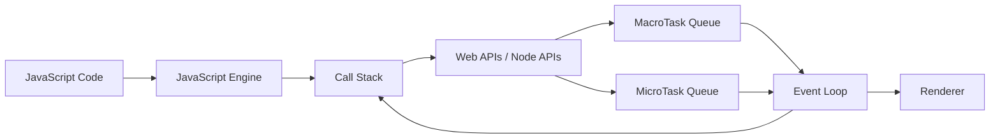
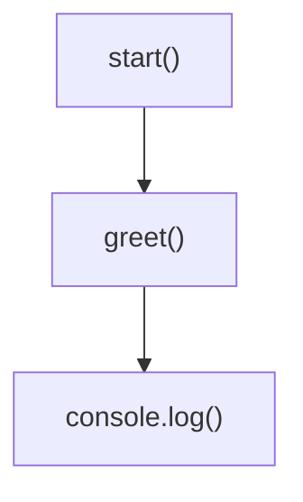
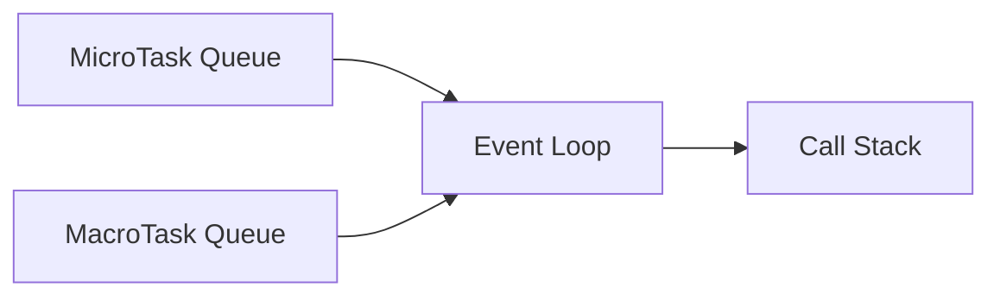
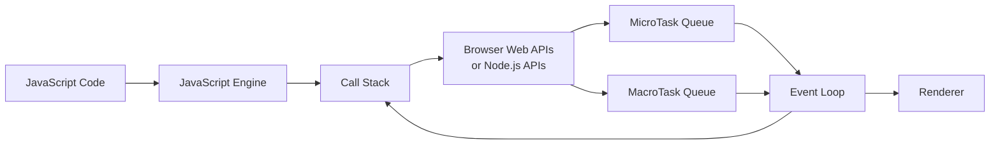

## Why This Chapter is Important

Most developers can write asynchronous JavaScript:

```javascript
fetch("/users")
  .then(res => res.json())
  .then(console.log);
```

But very few can answer:

* **Who actually waits for `fetch()`?**
* **Who counts the seconds in `setTimeout()`?**
* **Where does the callback stay while waiting?**
* **How does JavaScript know when a task is finished?**
* **If JavaScript is single-threaded, how can it download files and respond to clicks at the same time?**

These questions are the heart of JavaScript's runtime architecture.

By the end of this chapter, you'll understand what happens "behind the scenes" every time you write asynchronous code.


## Learning Objectives

After this chapter, you will be able to:

* Explain the JavaScript Runtime.
* Differentiate between the JavaScript Engine and the Runtime Environment.
* Understand the responsibilities of each runtime component.
* Explain how browsers and Node.js extend JavaScript.
* Follow the life cycle of an asynchronous operation.


## Table of Contents

1. What is JavaScript?    
2. JavaScript Engine vs Runtime  
3. Components of the Runtime  
4. JavaScript Engine  
5. Call Stack  
6. Web APIs (Browser)  
7. Node.js C++ APIs  
8. Task Queues  
9. Event Loop  
10. Rendering Engine  
11. Complete Architecture Diagram  
12. Execution Walkthrough  
13. Browser vs Node.js  
14. Common Misconceptions  
15. Summary  


## 1. What is JavaScript?

Many beginners think JavaScript alone can do everything.

It **cannot**.

JavaScript itself only knows how to:

* create variables,
* execute functions,
* perform calculations,
* create objects,
* manipulate arrays,
* call functions.

For example:

```javascript
let a = 5;
let b = 10;

console.log(a + b);
```

Everything here is pure JavaScript.

But what about this?

```javascript
setTimeout(() => {}, 1000);

fetch("/users");

document.querySelector("button");
```

Where do these functions come from?

**Answer:** They are **not** part of the JavaScript language. They are provided by the environment in which JavaScript runs.


## 2. JavaScript Engine vs Runtime

This distinction is one of the most important concepts in JavaScript.

## JavaScript Engine

The **engine** is responsible for understanding and executing JavaScript code.

Examples:

* Google Chrome → **V8**
* Microsoft Edge → **V8**
* Node.js → **V8**
* Firefox → **SpiderMonkey**
* Safari → **JavaScriptCore**

The engine:

* parses code,
* compiles it,
* executes it,
* manages memory,
* performs garbage collection.

The engine does **not** know how to:

* access the internet,
* read files,
* create timers,
* interact with the DOM.


## Runtime Environment

The runtime is the **complete environment** around the engine.

Think of it as a workshop.

The engine is the worker.

The runtime provides all the tools.


### Real-Life Analogy: Chef and Kitchen

Imagine a restaurant.

👨‍🍳 **Chef = JavaScript Engine**

The chef knows how to cook.

But the chef cannot:

* wash dishes,
* answer phone calls,
* take payments,
* deliver food.

The restaurant provides:

* waiters,
* cashier,
* delivery staff,
* kitchen equipment.

These extra facilities are like the runtime environment.

Without them, the chef could only cook.

Similarly, without the runtime, JavaScript could only execute language features—it couldn't interact with the outside world.


## 3. Components of the Runtime

A modern JavaScript runtime contains several cooperating components.



Each component has a specific responsibility.

We'll study each one in depth throughout this module.


## 4. JavaScript Engine

The engine is the "brain" that executes JavaScript.

Its primary responsibilities include:

* Parsing source code into an Abstract Syntax Tree (AST).
* Compiling the code into machine code (modern engines use Just-In-Time compilation).
* Executing JavaScript statements.
* Managing memory allocation.
* Reclaiming unused memory through garbage collection.

At any given moment, the engine executes only one JavaScript task on the call stack.


## 5. Call Stack

The call stack is where currently executing functions live.

Imagine a stack of books.

You always place a new book on the top and remove the top book first.

This is called **LIFO (Last In, First Out)**.

Example:

```javascript
function greet() {
    console.log("Hello");
}

function start() {
    greet();
}

start();
```

Execution:

1. `start()` is pushed onto the stack.
2. `greet()` is called, so it is pushed on top.
3. `greet()` finishes and is removed.
4. `start()` resumes and then finishes.



We'll dedicate the next chapter entirely to the call stack.


## 6. Browser Web APIs

Browsers provide powerful APIs that JavaScript can use.

Common examples:

* `setTimeout()`
* `setInterval()`
* `fetch()`
* DOM APIs
* Geolocation
* Local Storage
* WebSocket
* WebRTC
* Canvas
* Audio APIs

These APIs are implemented by the browser—not by the JavaScript language.

### Example

```javascript
setTimeout(() => {
    console.log("Done");
}, 2000);
```

What happens?

1. JavaScript asks the browser to start a timer.
2. The browser keeps track of the 2 seconds.
3. JavaScript continues executing other code.
4. When the timer expires, the callback is queued for later execution.

Notice that JavaScript is **not** sitting idle counting seconds.


## 7. Node.js C++ APIs

Node.js does not have browser APIs because it runs outside the browser.

Instead, it provides its own capabilities through native components (largely built on **libuv** and C/C++ libraries).

Examples include:

* File System (`fs`)
* Networking (`http`, `https`, `net`)
* DNS
* Timers
* Streams
* Child Processes

Example:

```javascript
fs.readFile("notes.txt", (err, data) => {
    console.log(data.toString());
});
```

JavaScript requests the file.

Node.js performs the file I/O using its runtime.

When the file is ready, the callback is scheduled for execution.


## Browser vs Node.js

| Browser       | Node.js         |
| ------------- | --------------- |
| DOM           | File System     |
| Window        | Process         |
| Document      | Buffer          |
| Local Storage | Streams         |
| Fetch         | HTTP Server     |
| Canvas        | TCP/UDP         |
| User Events   | Child Processes |

The JavaScript language is the same, but the surrounding runtime capabilities differ.


## 8. Task Queues

When asynchronous work completes, it isn't executed immediately.

Instead, it is placed into a queue.

There are two major categories we'll study later:

* **MacroTask Queue**
* **MicroTask Queue**

Think of these as waiting rooms.

Completed tasks wait there until the call stack is empty and the event loop schedules them.


## 9. Event Loop

The event loop coordinates everything.

Its job is to repeatedly check:

1. Is the call stack empty?
2. Are there pending microtasks?
3. Are there pending macrotasks?
4. Is it time for the browser to render?

A simplified view:



The event loop itself doesn't execute your code. It decides **when** queued tasks may be moved back onto the call stack.


## 10. Rendering Engine

Browsers also need to update the screen.

Rendering includes:

* Repainting pixels.
* Updating animations.
* Displaying DOM changes.
* Refreshing the UI.

A responsive application balances JavaScript execution with rendering so the interface remains smooth.

We'll discuss rendering and its interaction with the event loop in a dedicated chapter.


## 11. Complete Runtime Architecture



This diagram represents the complete high-level architecture you'll keep referring to throughout the rest of this module.


## 12. Execution Walkthrough

Consider this code:

```javascript
console.log("Start");

setTimeout(() => {
    console.log("Timer");
}, 1000);

console.log("End");
```

### Step 1

`console.log("Start")`

Output:

```
Start
```


### Step 2

`setTimeout(...)`

* JavaScript asks the browser to create a timer.
* The callback leaves the call stack.
* The browser starts counting one second.


### Step 3

```javascript
console.log("End");
```

Output:

```
End
```


### Step 4

One second later:

* The browser finishes the timer.
* The callback is added to the appropriate task queue.


### Step 5

When the call stack becomes empty and the event loop selects that task, the callback runs.

Output:

```
Timer
```

Final output:

```
Start
End
Timer
```


## 13. Industry Example: AI Chat Application

When you send a prompt to an AI model:

1. JavaScript sends an HTTP request.
2. The runtime handles the network operation.
3. JavaScript continues responding to user interactions.
4. The server streams tokens back.
5. The runtime notifies JavaScript as new data arrives.
6. JavaScript updates the UI incrementally.

This is why you can continue scrolling or clicking while the AI response is still being generated.


## Common Misconceptions

❌ **"`setTimeout` is part of JavaScript."**

No. It is provided by the runtime (browser or Node.js).


❌ **"The event loop executes code."**

Not directly. It schedules when queued tasks can be placed back onto the call stack.


❌ **"The JavaScript engine downloads files."**

No. File access, networking, timers, and many other asynchronous operations are handled by the runtime environment.


## Summary

* The JavaScript engine executes JavaScript code.
* The runtime environment extends JavaScript with capabilities like timers, networking, and file I/O.
* Browsers provide Web APIs; Node.js provides its own native APIs.
* Asynchronous operations are handled outside the call stack and notify JavaScript when they complete.
* Completed work waits in task queues until the event loop schedules it.
* Understanding this architecture is essential before learning the event loop, microtasks, promises, and `async`/`await`.


<Callout title="What's Next?" type="success">

In **Chapter 3 — The Call Stack**, we'll dive deep into the execution model of JavaScript:

* What exactly is an execution context?
* How are function calls managed?
* Why does recursion cause a "Maximum call stack size exceeded" error?
* How does the call stack interact with asynchronous code?

The call stack is the foundation of everything that follows, including the event loop and promise execution.

</Callout>


