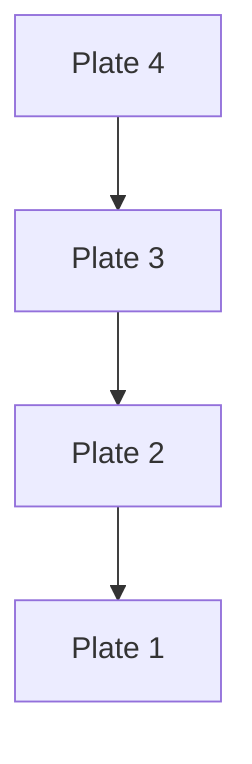
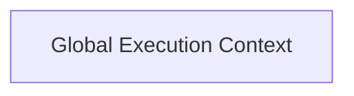
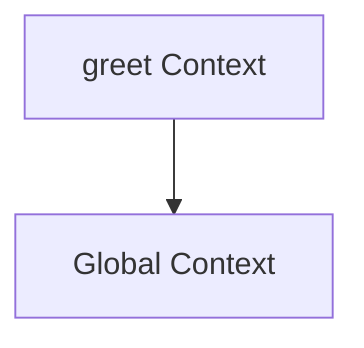
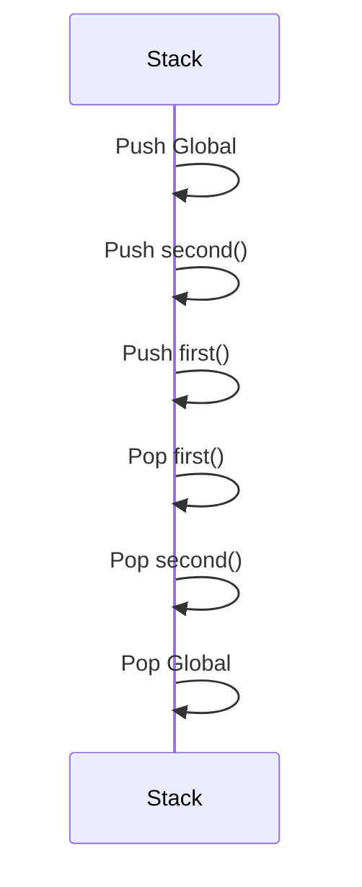
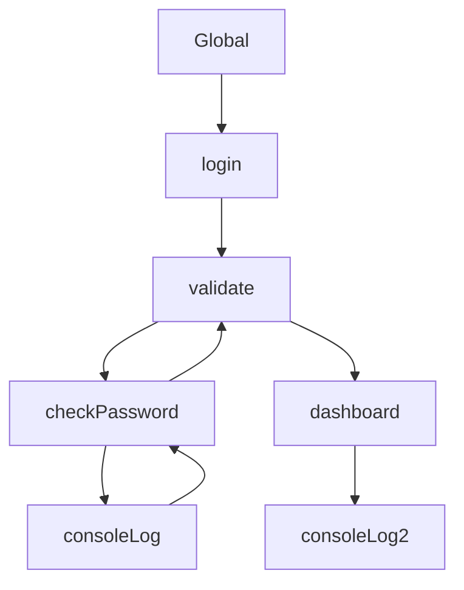
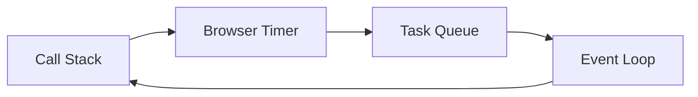

## Why This Chapter Matters

Before understanding **Promises**, **Async/Await**, or the **Event Loop**, you **must** understand the **Call Stack**.

Think of the Call Stack as **JavaScript's working desk**.

No matter what code you write:

* Functions
* Objects
* Classes
* Promises
* Async/Await
* React Components
* Express Routes

Everything eventually executes through **one single Call Stack**.

This is why people say:

> **"JavaScript is Single Threaded."**

But...

> **Single Thread ≠ Single Task**

JavaScript executes **one piece of JavaScript code at a time**, while the runtime handles slow operations outside the engine.


## Learning Objectives

By the end of this chapter, you will be able to:

* Explain what the Call Stack is.
* Understand Execution Context.
* Differentiate Global and Function Execution Contexts.
* Explain LIFO (Last In First Out).
* Trace nested function calls.
* Understand recursion.
* Explain Stack Overflow.
* Debug stack traces.
* Understand how async code temporarily leaves the stack.


## Table of Contents

1. What is the Call Stack?
2. Why JavaScript Needs a Stack
3. What is an Execution Context?
4. Global Execution Context
5. Function Execution Context
6. How Functions Enter and Leave the Stack
7. LIFO Principle
8. Nested Function Calls
9. Recursion
10. Stack Overflow
11. Reading Stack Traces
12. Call Stack and Async Code
13. Industry Examples
14. Interview Questions
15. Summary


## 1. What is the Call Stack?

The **Call Stack** is a data structure used by the JavaScript engine to keep track of **which function is currently executing** and **where to return after it finishes**.

It follows the **LIFO (Last In, First Out)** principle.

Think of it like a **stack of plates**.

You always:

* put a new plate on the top,
* remove the top plate first.



The Call Stack behaves exactly like this.


## Real-Life Analogy — Office Desk

Imagine you're solving office tasks.

Current task:

```
Write Report
```

Suddenly your manager says:

```
Attend Meeting
```

During the meeting someone asks:

```
Open Presentation
```

During the presentation:

```
Answer Question
```

The order becomes:

```
Answer Question
↑

Presentation
↑

Meeting
↑

Write Report
```

You cannot continue writing the report until:

* question ends
* presentation ends
* meeting ends

Exactly how JavaScript works.


## 2. Why Does JavaScript Need a Call Stack?

Suppose JavaScript had no stack.

```javascript
function A() {
    B();
}

function B() {
    C();
}

function C() {
    console.log("Hello");
}

A();
```

Question:

After `C()` finishes...

How does JavaScript know it should return to `B()`?

And then return to `A()`?

The answer is:

The Call Stack remembers.

<Callout title="Attention" type="success">
Visit this site :
https://www.jsv9000.app/
</Callout>


## 3. What is an Execution Context?

One of the most misunderstood topics.

Many students think:

> Call Stack == Execution Context

Wrong.

They are related, but different.


### Execution Context

An Execution Context is the **environment in which JavaScript executes code**.

It stores:

* variables
* function declarations
* the value of `this`
* scope information
* the current instruction pointer

Think of it as a **workspace** created for executing code.


### Call Stack

The Call Stack stores **Execution Contexts**.

So:

```
Call Stack

↓

Execution Context

↓

Actual Code Executes
```


## Real-Life Analogy

Imagine an office.

Office Cabinet

↓

File Folders

↓

Documents

The cabinet is the Call Stack.

Each folder is an Execution Context.

The documents are your variables and functions.


## 4. Global Execution Context

When JavaScript starts executing a file:

It first creates the **Global Execution Context (GEC).**

Example:

```javascript
let name = "Rahim";

function greet(){}

console.log(name);
```

Before running any line:

JavaScript creates

```
Global Execution Context
```

It remains on the Call Stack until the entire program finishes.


## Visualization



Initially the stack contains only one execution context.


## 5. Function Execution Context

Whenever a function is called:

JavaScript creates a **new Execution Context**.

Example

```javascript
function greet() {
    console.log("Hello");
}

greet();
```

Steps:

1. Global Context created.
2. `greet()` called.
3. New Function Context created.
4. Function finishes.
5. Context destroyed.


Visualization




## 6. How Functions Enter the Stack

Example

```javascript
function first() {
    console.log("First");
}

function second() {
    first();
}

second();
```


Initially

```
Global
```


Call second()

```
second

Global
```


Call first()

```
first

second

Global
```


first() ends

```
second

Global
```


second() ends

```
Global
```


Program ends

```
(empty)
```





## 7. LIFO Principle

The stack follows

**Last In First Out**

Example

```javascript
function A(){
    B();
}

function B(){
    C();
}

function C(){}
```

Stack

```
C

B

A

Global
```

Who entered last?

```
C
```

Who leaves first?

```
C
```

Then

```
B
```

Then

```
A
```

Exactly LIFO.


## 8. Deep Example

```javascript
function login(){

    validate();

    dashboard();

}

function validate(){

    checkPassword();

}

function checkPassword(){

    console.log("Checking...");

}

function dashboard(){

    console.log("Dashboard");

}

login();
```


Execution

```
Global

↓

login

↓

validate

↓

checkPassword

↓

console.log

↓

Pop

↓

validate

↓

Pop

↓

dashboard

↓

console.log

↓

Pop

↓

login

↓

Global
```





## 9. Recursion

Recursion means:

A function calls itself.

Example

```javascript
function count(n){

    if(n===0) return;

    console.log(n);

    count(n-1);

}

count(3);
```

Stack Growth

```
count(0)

count(1)

count(2)

count(3)

Global
```

Every recursive call creates a **new execution context**.


### Real-Life Analogy

Imagine climbing stairs.

Step 1

↓

Step 2

↓

Step 3

↓

Top

Now while coming back

Top

↓

Step 3

↓

Step 2

↓

Step 1

Exactly recursion.


## 10. Stack Overflow

What if recursion never stops?

```javascript
function hello(){

    hello();

}

hello();
```

Every call creates another execution context.

```
hello

hello

hello

hello

hello

hello

hello
```

Eventually memory runs out.

Browser throws

```
RangeError:

Maximum call stack size exceeded
```


Industry Example

```javascript
const employee = {};

employee.manager = employee;
```

Improper recursive traversal of such structures can lead to infinite recursion if cycles are not handled.


## 11. Reading Stack Traces

Suppose

```javascript
function A(){

    B();

}

function B(){

    C();

}

function C(){

    throw new Error("Oops");

}

A();
```

Browser

```
Error

at C

at B

at A

at Global
```

The stack trace tells you:

Exactly how execution reached the error.

This is invaluable when debugging.


## 12. Call Stack and Async Code

Consider:

```javascript
console.log("Start");

setTimeout(() => {
    console.log("Timer");
}, 0);

console.log("End");
```

Many beginners think the callback stays on the call stack while waiting.

It does **not**.

Flow:

1. Global context starts.
2. `console.log("Start")` executes.
3. `setTimeout()` registers a timer with the runtime.
4. The callback leaves the call stack.
5. `console.log("End")` executes.
6. The global execution context finishes.
7. Only after the timer expires and the event loop schedules the callback does a **new execution context** get created for that callback.



Notice:

The call stack is **empty while the timer is running**. This is one reason JavaScript can stay responsive.


## Industry Example (Express.js)

```javascript
app.get("/users", (req, res) => {

    database.findUsers(() => {

        res.send("Done");

    });

});
```

Execution:

* Route handler executes on the call stack.
* Database request is delegated to the runtime.
* The call stack becomes available for other requests.
* When the database finishes, the callback is scheduled and later executed on the call stack.

This non-blocking model allows a Node.js server to handle many concurrent requests efficiently.


## Common Mistakes

❌ **"Functions stay in memory on the stack forever."**

No. Their execution contexts are removed once execution completes.


❌ **"Recursion reuses the same execution context."**

Each recursive call creates a **new** execution context.


❌ **"Asynchronous callbacks wait on the call stack."**

No. They wait in the runtime and task queues until they are scheduled back onto the call stack.


## Interview Questions

### Q1. Why is JavaScript called single-threaded?

Because JavaScript executes JavaScript code using a single call stack—only one execution context runs at a time.


### Q2. What data structure is used for the Call Stack?

A **Stack (LIFO)**.


### Q3. What is an Execution Context?

The environment that contains the information needed to execute a piece of JavaScript code, including variables, scope, `this`, and the current execution state.


### Q4. Why does infinite recursion crash?

Because each recursive call creates a new execution context. Eventually, the stack reaches its size limit, causing a stack overflow.


## Key Takeaways

* The Call Stack is where JavaScript executes code.
* It stores **Execution Contexts**, not just cls names.
* JavaScript uses the **LIFO** principle to manage function calls.
* A **Global Execution Context** is created when a script starts.
* Every function invocation creates a new **Function Execution Context**.
* Recursive calls grow the stack; missing a base case leads to a stack overflow.
* Asynchronous operations do **not** occupy the call stack while waiting.


<Callout title="What's Next?" type="success">


In **Chapter 4 — Browser Web APIs & Node.js APIs**, we'll answer a critical question:

**If JavaScript leaves the call stack during asynchronous work, who actually performs that work?**

We'll explore browser-provided Web APIs, Node.js native APIs (including the role of **libuv**), and how they collaborate with the JavaScript engine to enable timers, network requests, file I/O, and more. This chapter bridges the gap between the call stack and the event loop.

</Callout>
