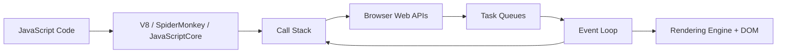
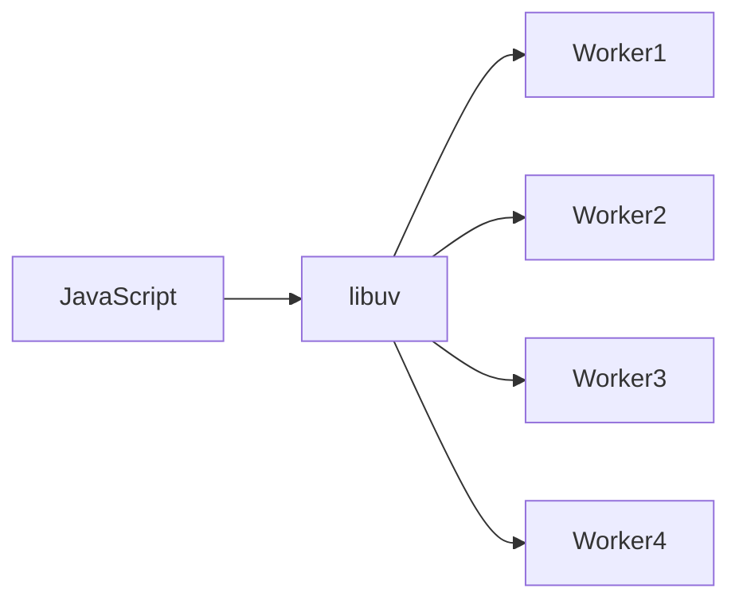
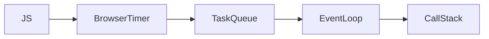
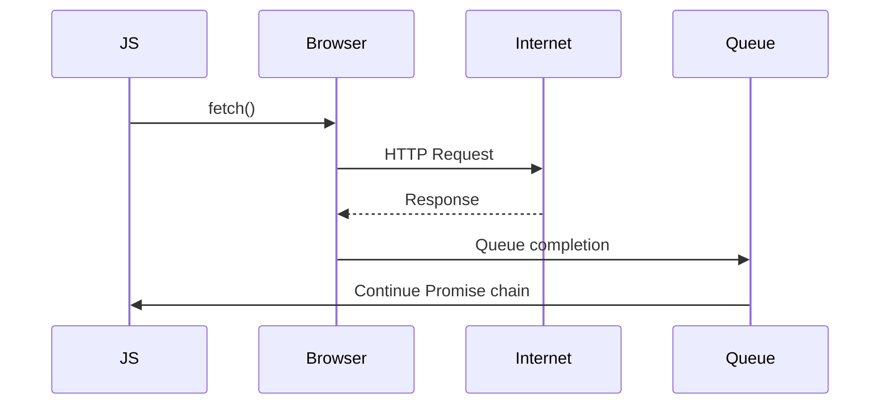
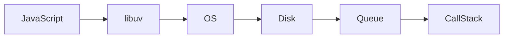

<Callout title="Attention" type="success">
Please Refer these websites for practical demo :
- https://www.jsv9000.app/
- http://latentflip.com/loupe/
</Callout>


## Why This Chapter Matters

Up until now, we know:

* JavaScript has **one Call Stack**
* JavaScript is **single-threaded**
* Long-running tasks don't block the Call Stack

But one huge question remains...

> **If JavaScript is not waiting, then who is?**

For example,

```javascript
setTimeout(() => {
    console.log("Hello");
}, 3000);
```

Who counts those **3 seconds**?

Certainly **not JavaScript**.

Another example:

```javascript
fetch("/users")
```

Who downloads the data?

JavaScript cannot directly access the Internet.

Another one:

```javascript
document.querySelector("button")
```

Who searches the HTML?

JavaScript doesn't know anything about HTML.

The answer is:

> **The Runtime Environment**

This chapter explains the "workers" that work **outside** the JavaScript Engine.


## Learning Objectives

By the end of this chapter, you will be able to:

* Understand what Runtime APIs are.
* Explain Browser Web APIs.
* Explain Node.js APIs.
* Understand how JavaScript communicates with them.
* Understand why asynchronous code doesn't block.
* Differentiate JavaScript language features from Runtime features.
* Understand libuv at a conceptual level.
* Explain the life cycle of timers, fetch requests, file reads, and user events.


## Table of Contents

1. JavaScript Can NOT Do Everything
2. Runtime Environment
3. Browser Architecture
4. Browser Web APIs
5. Node.js APIs
6. libuv (Node.js Secret Weapon)
7. Life Cycle of setTimeout()
8. Life Cycle of fetch()
9. Life Cycle of DOM Events
10. Life Cycle of File Reading
11. Browser vs Node.js
12. Industry Examples
13. Common Misconceptions
14. Summary


## 1. JavaScript Can NOT Do Everything

Many beginners think JavaScript itself provides:

* `setTimeout`
* `fetch`
* `document`
* `window`
* `alert`
* `localStorage`

This is **incorrect**.

These are **Runtime APIs**.

JavaScript itself only defines language features such as:

```javascript
let age = 20;

const person = {
    name: "Ali"
};

function greet() {}

class Student {}

const arr = [1,2,3];
```

Everything above belongs to JavaScript (ECMAScript).

But these:

```javascript
setTimeout()

fetch()

document

window

navigator

localStorage
```

come from the browser.

Similarly,

```javascript
fs.readFile()

process

Buffer

http.createServer()
```

come from Node.js.


## Real-Life Analogy

Imagine buying a new chef.

The chef knows:

* recipes,
* cooking techniques,
* food preparation.

But the chef doesn't bring:

* stove,
* refrigerator,
* oven,
* sink.

Those belong to the restaurant.

Similarly,

JavaScript is the chef.

The Browser or Node.js is the restaurant.


## 2. Runtime Environment

A Runtime Environment is the software that hosts the JavaScript engine and provides additional capabilities.

Think of it as a city.

The JavaScript engine is one building inside that city.

The city also provides:

* roads,
* electricity,
* water,
* police,
* hospitals.

Without the city, the building cannot function effectively.

Likewise, without the runtime, JavaScript cannot:

* access the DOM,
* create timers,
* make network requests,
* read files,
* listen for clicks.


## 3. Browser Architecture

A simplified browser architecture looks like this:



Notice something important:

The browser contains **many components** besides the JavaScript engine.


## Browser Components

A browser typically includes:

* JavaScript Engine
* HTML Parser
* CSS Engine
* Rendering Engine
* Networking Module
* Image Decoder
* Audio Engine
* Web APIs
* Event Loop
* GPU Process

JavaScript is only **one small part** of a browser.


## 4. Browser Web APIs

Web APIs are interfaces provided by the browser.

They allow JavaScript to communicate with browser features.

Common examples:

| API             | Purpose                 |
| --------------- | ----------------------- |
| setTimeout      | Timers                  |
| setInterval     | Repeating timers        |
| fetch           | HTTP requests           |
| DOM API         | Access HTML             |
| Local Storage   | Save data               |
| Session Storage | Temporary data          |
| WebSocket       | Real-time communication |
| Canvas API      | Drawing                 |
| Geolocation     | GPS                     |
| Audio API       | Play sounds             |
| Clipboard API   | Copy/Paste              |
| History API     | Browser history         |


### Example 1

```javascript
alert("Hello");
```

JavaScript tells the browser:

> Show a dialog.

The browser creates it.


### Example 2

```javascript
document.querySelector(".btn")
```

JavaScript asks:

> Browser, find this HTML element.

The browser searches the DOM.

JavaScript simply receives the result.


## 5. Node.js APIs

Node.js runs **outside** the browser.

Therefore it has no:

* window
* document
* HTML
* CSS
* DOM

Instead it provides server-side capabilities.

Examples:

```javascript
const fs = require("fs");

fs.readFile(...)
```

```javascript
http.createServer(...)
```

```javascript
process.env
```

```javascript
Buffer
```

Node.js APIs include:

* File System
* Networking
* HTTP Server
* TCP
* UDP
* DNS
* Streams
* Child Processes
* Crypto


## Browser vs Node.js

| Browser      | Node.js         |
| ------------ | --------------- |
| DOM          | File System     |
| window       | process         |
| document     | Buffer          |
| localStorage | Streams         |
| fetch        | HTTP Server     |
| canvas       | TCP Socket      |
| User Events  | Child Processes |

The JavaScript language is the same, but the surrounding runtime capabilities differ.


## 6. libuv — The Secret Behind Node.js

One of the biggest interview questions.

Many people ask:

> If Node.js is single-threaded, how can thousands of requests run simultaneously?

The answer:

**libuv**


## What is libuv?

libuv is a C library used by Node.js.

It handles:

* timers,
* networking,
* file system,
* asynchronous I/O,
* thread pool,
* event loop implementation.

JavaScript simply delegates work.


## Analogy

Imagine a CEO.

The CEO makes decisions.

Employees do the actual work.

CEO

↓

Employees

↓

Report back

JavaScript is the CEO.

libuv is the employees.


## Thread Pool

Some operations cannot be performed efficiently without additional threads.

Examples:

* file reading
* encryption
* compression
* DNS lookup

Node.js uses a small worker thread pool (managed by libuv) for many such operations, while network sockets are generally handled using non-blocking operating system facilities rather than the thread pool.

A simplified view:




## 7. Life Cycle of setTimeout()

Consider:

```javascript
console.log("Start");

setTimeout(() => {
    console.log("Done");
}, 3000);

console.log("End");
```


## Step 1

JavaScript executes

```javascript
console.log("Start")
```

Output:

```
Start
```


## Step 2

JavaScript reaches

```javascript
setTimeout(...)
```

JavaScript says to the browser:

> Please start a 3-second timer.

The browser accepts the request.

The timer begins **outside the Call Stack**.


## Step 3

JavaScript immediately continues.

```
End
```

Output becomes:

```
Start

End
```


## Step 4

After 3 seconds,

the browser finishes the timer.

It does **not** execute the callback immediately.

Instead, it places the callback into a task queue.

The event loop will later schedule it when appropriate.


Visualization




## 8. Life Cycle of fetch()

```javascript
fetch("/users")
```

Flow:



JavaScript does **not** wait for the internet.

The browser performs the network request.

When the response arrives, the promise is resolved and its continuation is scheduled as a **microtask**.


## 9. Life Cycle of DOM Events

Example

```javascript
button.addEventListener("click", handler);
```

What happens?

JavaScript registers the event listener.

The browser starts watching for clicks.

Nothing remains on the call stack while waiting.

When the user clicks:

```
Browser

↓

Task Queue

↓

Event Loop

↓

Call Stack

↓

handler()
```


## 10. Life Cycle of File Reading (Node.js)

```javascript
fs.readFile("notes.txt", callback);
```

Flow:



Again,

JavaScript never waits for the disk.

The runtime handles the I/O and schedules the callback when the operation completes.


## Industry Example — AI Chat Streaming

When you ask an AI a question:

1. JavaScript sends a request using `fetch()`.
2. The browser manages the network connection.
3. The AI server generates text incrementally.
4. Chunks of data stream back over the network.
5. The browser notifies JavaScript as data arrives.
6. JavaScript updates the UI progressively, creating the "typing" effect.

Without the runtime handling the network, JavaScript would have to block until the entire response was ready.


## Common Misconceptions

❌ **"`fetch()` is part of JavaScript."**

Historically, `fetch()` is a Web API provided by browsers. Modern Node.js also exposes a compatible `fetch()` implementation, but it is still part of the runtime, not the ECMAScript language specification.


❌ **"`setTimeout()` waits inside JavaScript."**

The timer is managed by the runtime. JavaScript registers it and continues executing other code.


❌ **"Node.js uses threads for everything."**

No. Most network I/O is handled using efficient non-blocking operating system mechanisms. The libuv thread pool is mainly used for operations such as file system access, DNS (in some cases), compression, and cryptography.


❌ **"The browser executes callbacks immediately when work finishes."**

No. Completed callbacks are queued. The event loop decides when they can return to the call stack.


## Summary

* JavaScript provides the language; the runtime provides access to the outside world.
* Browsers expose **Web APIs** such as timers, networking, DOM manipulation, storage, and user events.
* Node.js exposes server-side APIs such as the file system, networking, streams, and cryptography.
* Asynchronous operations are delegated to the runtime, allowing the JavaScript call stack to remain free.
* In Node.js, **libuv** plays a central role in managing asynchronous I/O and coordinating with the operating system.
* Completed operations are placed into task queues and later executed by the event loop.


## Key Takeaways

* **ECMAScript** defines the JavaScript language.
* **Web APIs** and **Node.js APIs** are runtime features, not language features.
* JavaScript never waits for timers, network requests, or file reads—it delegates them to the runtime.
* Browsers and Node.js each provide different APIs tailored to their environments.
* Understanding runtime APIs is essential before learning the **Event Loop**, **MacroTasks**, **MicroTasks**, and **Promises**.


<Callout type="Next Chapter: The Event Loop" type="success">

Now that you know **who performs asynchronous work**, the next question is:

**How do completed tasks return to JavaScript, and why do Promises run before `setTimeout()` callbacks?**

In the next chapter, we'll study the **Event Loop** in depth, including:

* The complete execution cycle
* MacroTask Queue
* MicroTask Queue
* Rendering
* Execution order puzzles
* The foundation for understanding `Promise`, `async/await`, and streaming APIs

</Callout>