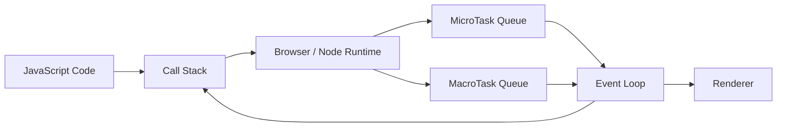
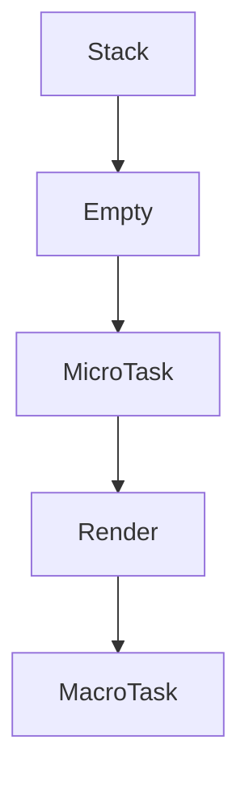
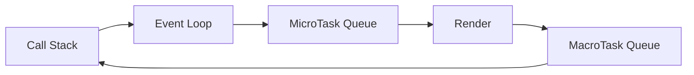
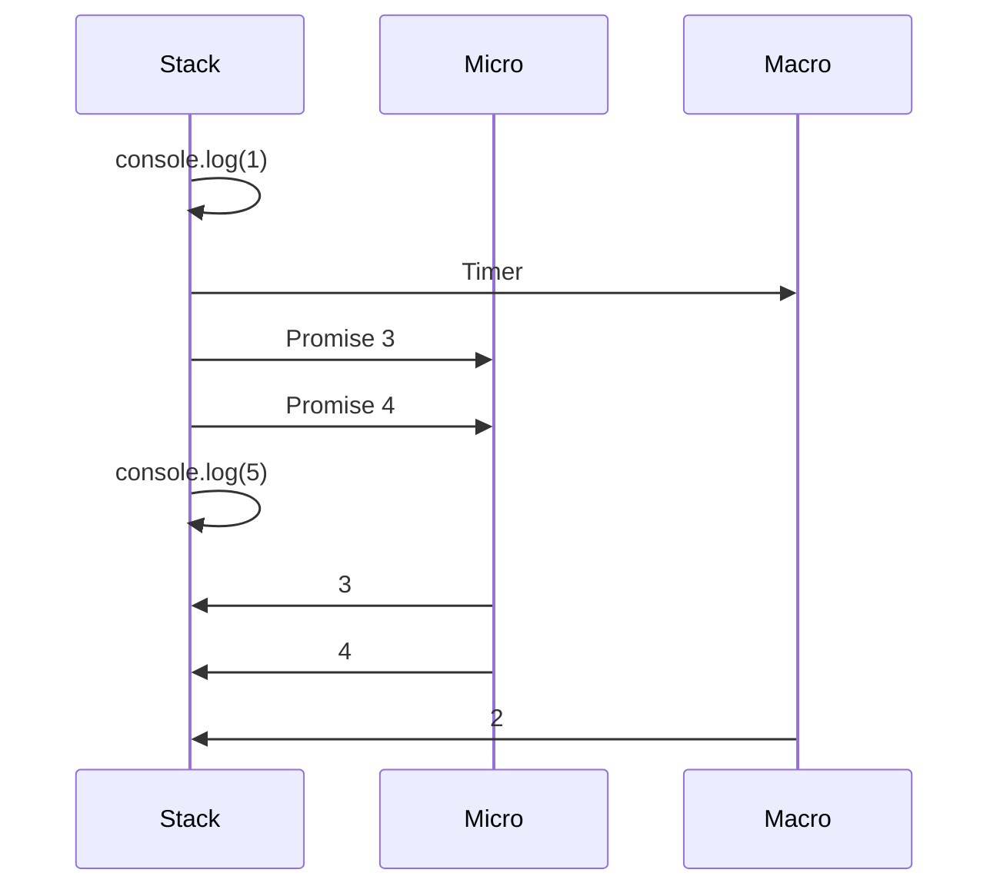

<Callout title="Goal" type="success">

These four chapters are actually **one complete system**. If you understand this system, you'll understand **90% of JavaScript asynchronous behavior**.

We'll cover:

* Chapter 5 → Event Loop
 * Chapter 6 → MacroTask Queue
 * Chapter 7 → MicroTask Queue
 * Chapter 8 → Render Queue (Rendering Phase)

Instead of studying them separately, we'll connect them into a single mental model.
</Callout>


## The Golden Rule

There is **only one JavaScript thread**.

So the biggest question is:

> **Who decides what runs next?**

The answer is:

> **The Event Loop**

The Event Loop is like a **traffic police officer**.

It never executes code itself.

It only decides **who gets permission to enter the Call Stack**.


## The Complete Runtime Architecture

This is the single most important diagram in asynchronous JavaScript.



Everything in this module revolves around this diagram.


## Chapter 5 — Event Loop

### Definition

The **Event Loop** is a scheduler.

It continuously checks:

1. Is the Call Stack empty?
2. Are there MicroTasks?
3. Are there MacroTasks?
4. Can the browser render a frame?

Think of it as an infinite loop:

```text
while(true){

    if(CallStack is empty){

        Run all MicroTasks

        Render (if needed)

        Run one MacroTask

    }

}
```

> **Note:** This pseudocode is simplified for learning. Actual browser event loop behavior is defined by the HTML specification, but this mental model is accurate enough to reason about execution order.


### Real-Life Analogy

Imagine an airport.

The Event Loop is the **air traffic controller**.

It doesn't fly airplanes.

It simply says:

> Plane A → Take off

> Plane B → Wait

> Plane C → Land

Exactly the same idea.


## Responsibilities of the Event Loop

The Event Loop:

✅ Watches the Call Stack

✅ Checks task queues

✅ Moves tasks to the Call Stack

✅ Gives MicroTasks higher priority

✅ Allows rendering between tasks when appropriate

It **does not execute your JavaScript directly**.


## Chapter 6 — MacroTask Queue

MacroTasks are the **normal-priority tasks**.

Typical sources include:

* `setTimeout`
* `setInterval`
* UI events (click, keypress)
* `postMessage`
* `MessageChannel`
* Initial script execution

Example:

```javascript
setTimeout(() => {
    console.log("Timer");
}, 0);
```

The callback goes into the **MacroTask Queue** after the timer expires.


## MacroTask Analogy

Imagine visiting a bank.

Customers receive normal queue tokens.

```
Customer 1

Customer 2

Customer 3
```

Everyone waits for their turn.

MacroTasks work similarly.


## Chapter 7 — MicroTask Queue

MicroTasks have **higher priority**.

Common sources:

* `Promise.then()`
* `Promise.catch()`
* `Promise.finally()`
* `queueMicrotask()`
* `MutationObserver`

Example:

```javascript
Promise.resolve().then(() => {
    console.log("Promise");
});
```

This callback enters the **MicroTask Queue**.


## MicroTask Analogy

Now imagine the bank manager says:

> VIP customers go first.

Even if 100 normal customers are waiting,

VIP customers are served immediately.

MicroTasks are JavaScript's VIP tasks.


## Event Loop Priority

This is the rule you must memorize:

```text
Call Stack

↓

ALL MicroTasks

↓

Browser Render (if appropriate)

↓

ONE MacroTask

↓

Repeat
```


## Why?

Promises usually represent work that has *just completed* and often needs follow-up logic before the application processes the next external event.

Example:

```javascript
fetch("/users")
    .then(updateUI)
```

If the browser delayed the `.then()` callback until after timers and user events, application state could become inconsistent or feel less responsive.

So the runtime processes **MicroTasks before moving on to the next MacroTask**.


### Example 1

```javascript
console.log("A");

setTimeout(() => {
    console.log("B");
}, 0);

Promise.resolve().then(() => {
    console.log("C");
});

console.log("D");
```


## Step-by-Step

### Call Stack

```
console.log(A)

↓

console.log(D)
```

Output:

```
A

D
```


Now:

MicroTask Queue

```
Promise
```

MacroTask Queue

```
Timer
```


Event Loop:

```
Run MicroTask
```

Output

```
C
```


Then

```
Run Timer
```

Output

```
B
```


Final Output

```text
A

D

C

B
```


Visualization


---

## Chapter 8 — Render Queue (Rendering Phase)

A browser has another important responsibility:

It must keep the screen updated.

Rendering includes:

* Painting pixels
* Updating HTML
* Applying CSS
* Animations
* Layout calculations

The browser tries to render approximately **60 frames per second** (about every **16.7 ms**) for smooth animations.


## Example

```javascript
button.innerText = "Loading...";
```

JavaScript changes the DOM.

But the user doesn't see it immediately.

The browser waits for an appropriate rendering opportunity.

Then it paints the updated UI.


## Rendering Analogy

Imagine writing on a whiteboard.

Writing text doesn't instantly show it to students if the curtain is closed.

Only when the curtain opens can everyone see the updated board.

Rendering is the curtain opening.


## The Complete Cycle



A useful mental model is:

```
Finish current JavaScript

↓

Drain ALL MicroTasks

↓

Browser may Render

↓

Execute ONE MacroTask

↓

Repeat
```


## The Most Important Interview Question

### Why does Promise execute before setTimeout?

Example:

```javascript
setTimeout(() => console.log("Timer"));

Promise.resolve().then(() => console.log("Promise"));
```

Output

```
Promise

Timer
```

Reason:

```
Promise

↓

MicroTask

↓

Higher Priority

↓

Runs First
```

The timer callback is a MacroTask, so it waits until the MicroTask queue has been emptied.


## Another Example

```javascript
console.log(1);

setTimeout(() => console.log(2));

Promise.resolve().then(() => console.log(3));

Promise.resolve().then(() => console.log(4));

console.log(5);
```

Execution:

```
1

5

3

4

2
```


Visualization




## One Mental Model to Remember Forever

Imagine a restaurant.

### The Chef

→ Call Stack

Only cooks **one dish at a time**.


### VIP Orders

→ MicroTasks

Prepared immediately after the current dish.


### Normal Orders

→ MacroTasks

Wait their turn.


### Waiter

→ Event Loop

Brings dishes to the chef.


### Customers

→ Browser Screen

Receive the finished meal (rendered UI).


The workflow:

```
Chef finishes current dish

↓

Cook ALL VIP orders

↓

Serve customers (Render)

↓

Cook ONE normal order

↓

Repeat forever
```


## Quick Comparison Table

| Component           | Job                             | Examples                                 | Priority                            |
| ------------------- | ------------------------------- | ---------------------------------------- | ----------------------------------- |
| **Call Stack**      | Executes JavaScript             | Functions                                | Highest (currently running code)    |
| **Event Loop**      | Scheduler                       | Moves tasks to the stack                 | N/A                                 |
| **MicroTask Queue** | Small, immediate follow-up work | `Promise.then()`, `queueMicrotask()`     | Higher                              |
| **Render Phase**    | Updates the UI                  | DOM painting, layout                     | After microtasks (when appropriate) |
| **MacroTask Queue** | General asynchronous work       | `setTimeout`, `setInterval`, user events | Lower                               |


## 20% That Gives You 100% Understanding

If you remember only these five rules, you'll correctly predict the execution order of most asynchronous JavaScript code:

1. **JavaScript executes only one piece of JavaScript code at a time.**
2. **The Event Loop waits until the Call Stack is empty before scheduling more work.**
3. **The Event Loop drains all pending MicroTasks before selecting the next MacroTask.**
4. **The browser gets opportunities to render between tasks, after MicroTasks have finished.**
5. **Timers don't execute "on time"; they execute only after their delay has elapsed *and* the Call Stack is free and higher-priority work has completed.**

These principles form the foundation for understanding **Promises, `async/await`, streams, React rendering behavior, Node.js event-driven programming, and AI streaming responses**.
