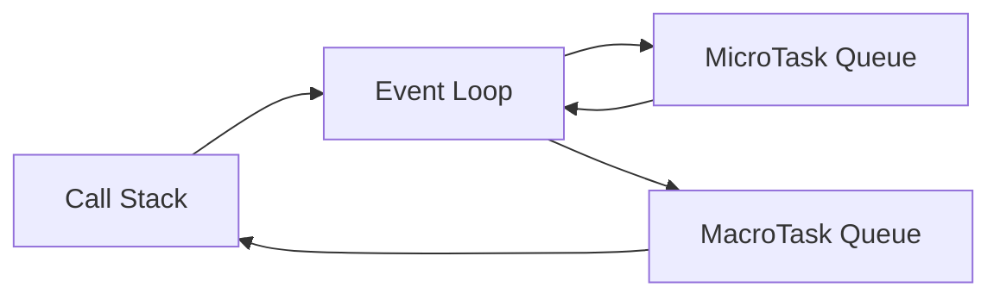
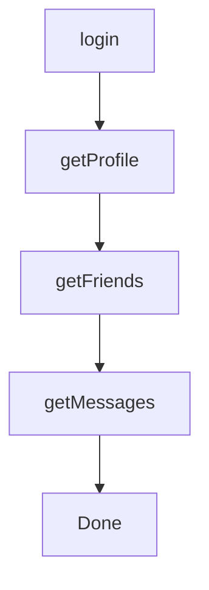

## Why These Two Chapters Are Together

These chapters answer two of the biggest JavaScript interview questions:

> **Why does `Promise.then()` execute before `setTimeout()`?**

and

> **Why was Promise invented when callbacks already existed?**

If you understand these two topics, you'll understand why modern JavaScript evolved from callbacks to Promises and eventually to `async/await`.


## Learning Roadmap

```text
JavaScript

↓

Callbacks

↓

Callback Hell 😭

↓

Promises 😊

↓

Async/Await 🚀
```


## Chapter 9 — Why Do Promises Run Before `setTimeout()`?

Let's start with one of the most famous interview questions.

```javascript
console.log("Start");

setTimeout(() => {
    console.log("Timer");
}, 0);

Promise.resolve().then(() => {
    console.log("Promise");
});

console.log("End");
```

Output

```text
Start
End
Promise
Timer
```

Most beginners expect:

```text
Start
End
Timer
Promise
```

But that's wrong.


## Understanding the Timeline

When JavaScript starts,

Call Stack

```text
console.log("Start")
```

Output

```text
Start
```


Then JavaScript sees

```javascript
setTimeout(...)
```

The browser starts the timer.

The callback is **not executed immediately**.

Instead, after the timer expires, it will enter the **MacroTask Queue**.


Then JavaScript sees

```javascript
Promise.resolve().then(...)
```

This callback enters the

```text
MicroTask Queue
```


Then

```javascript
console.log("End")
```

Output

```text
End
```

Now the Call Stack is empty.

The Event Loop checks:

```text
Call Stack Empty?

↓

YES
```

Next question:

```text
Any MicroTasks?

↓

YES
```

Run them all first.

Output

```text
Promise
```

After the MicroTask Queue becomes empty:

The Event Loop checks

```text
MacroTask Queue
```

Runs the timer.

Output

```text
Timer
```

Final output

```text
Start

End

Promise

Timer
```


# Visual Diagram




## Golden Rule

Always remember:

```text
Current Code

↓

ALL MicroTasks

↓

Render

↓

ONE MacroTask

↓

Repeat
```


## Why Does JavaScript Give Promises Higher Priority?

Imagine you're writing an email.

Before sending it,

you quickly fix a spelling mistake.

That tiny correction should happen **before** you move to the next unrelated task.

Promises are exactly these "quick follow-up" actions.

For example:

```javascript
fetch("/users")
.then(updateUI)
```

The network request has already finished.

The `.then()` callback is simply the continuation of the same logical operation.

It makes sense to run it before moving on to unrelated timers or events.


## Another Example

```javascript
console.log(1);

Promise.resolve().then(() => console.log(2));

Promise.resolve().then(() => console.log(3));

setTimeout(() => console.log(4));

console.log(5);
```

Output

```text
1
5
2
3
4
```

Execution

```text
Stack

↓

1

↓

5

↓

MicroTask

2

↓

MicroTask

3

↓

MacroTask

4
```


## Multiple Timers

```javascript
setTimeout(() => console.log("A"));

setTimeout(() => console.log("B"));

Promise.resolve().then(() => console.log("P"));
```

Output

```text
P

A

B
```

Timers preserve their order within the MacroTask Queue, but they still wait until all pending MicroTasks have been processed.


## MicroTask Starvation

A dangerous situation.

```javascript
function loop() {

    Promise.resolve().then(loop);

}

loop();
```

What happens?

The MicroTask Queue never becomes empty.

The Event Loop keeps processing MicroTasks.

The browser may not get a chance to render or process MacroTasks.

This is known as **MicroTask Starvation**.


## Industry Example

React updates often rely on Promises and microtasks to batch work efficiently.

Node.js also uses microtasks internally to complete asynchronous workflows before handling the next event.

Understanding this priority explains many real-world execution orders.


## Chapter 10 — Evolution of Asynchronous JavaScript

JavaScript did not always have Promises.

Let's see how asynchronous programming evolved.


## Stage 1 — Synchronous JavaScript

Everything executed one after another.

```javascript
const user = getUser();

const posts = getPosts();

const comments = getComments();
```

Simple.

But slow operations blocked the application.


## Stage 2 — Callbacks

JavaScript introduced callbacks.

A callback is simply:

> A function passed into another function to be executed later.

Example

```javascript
setTimeout(() => {

    console.log("Hello");

},1000);
```

The callback is

```javascript
() => {

    console.log("Hello");

}
```


## Real-Life Analogy

Ordering food.

You don't wait in the kitchen.

Instead,

you leave your phone number.

Later,

the restaurant calls you.

That phone call is the callback.


## Simple Callback Example

```javascript
function greet(name, callback) {

    console.log("Hello", name);

    callback();

}

greet("Ali", () => {

    console.log("Welcome!");

});
```

Output

```text
Hello Ali

Welcome!
```


# Callback Example with Delay

```javascript
function download(callback){

    console.log("Downloading...");

    setTimeout(() => {

        callback();

    },2000);

}

download(() => {

    console.log("Completed");

});
```

Output

```text
Downloading...

Completed
```


## Problem — Callback Hell

Suppose you need to perform these tasks in order:

1. Login
2. Fetch Profile
3. Fetch Friends
4. Fetch Messages

With callbacks:

```javascript
login(function(){

    getProfile(function(){

        getFriends(function(){

            getMessages(function(){

                console.log("Done");

            });

        });

    });

});
```

This creates a deeply nested structure known as **Callback Hell** or the **Pyramid of Doom**.


## Visualization



As more asynchronous steps are added, the code becomes harder to read, test, and maintain.


## Problems with Callback Hell ❤️

* Difficult to read
* Difficult to debug
* Difficult to handle errors
* Hard to reuse code
* Encourages deep nesting

Imagine trying to follow a conversation where each answer is hidden inside another answer. That's what callback hell feels like.


## Error Handling with Callbacks

Traditionally, callbacks used the **error-first** pattern.

```javascript
fs.readFile("file.txt", (err, data) => {

    if(err){

        console.log(err);

        return;

    }

    console.log(data);

});
```

Every callback needed its own error handling.

As nesting increased, error management became increasingly complex.


## The Birth of Promises

Promises were introduced to solve these problems.

Instead of nesting:

```javascript
login(function(){

    profile(function(){

        friends(function(){

            messages();

        });

    });

});
```

Promises allow chaining:

```javascript
login()

.then(getProfile)

.then(getFriends)

.then(getMessages)

.catch(handleError);
```

Benefits:

* Flatter code
* Centralized error handling
* Easier composition
* Better readability
* Better scalability


## Looking Ahead to Async/Await

Promises made asynchronous code much cleaner, but JavaScript went one step further.

Instead of:

```javascript
login()

.then(getProfile)

.then(getFriends)

.then(getMessages);
```

We can write:

```javascript
async function loadData(){

    await login();

    await getProfile();

    await getFriends();

    await getMessages();

}
```

It looks almost like synchronous code while remaining asynchronous under the hood.

We'll explore `async/await` in a later chapter.


## Callback vs Promise

| Callback                            | Promise                             |
| ----------------------------------- | ----------------------------------- |
| Function passed to another function | Object representing a future result |
| Can lead to deep nesting            | Supports clean chaining             |
| Error handling at each level        | Centralized `.catch()`              |
| Harder to compose                   | Easy to combine and orchestrate     |
| Older style                         | Modern standard                     |


<Callout title="Attention" type="success">
Please Refer these websites for practical demo :
- https://www.jsv9000.app/
- http://latentflip.com/loupe/
</Callout>

## Interview Questions

### Q1. Why do Promises execute before `setTimeout()`?

Because Promise callbacks are placed in the **MicroTask Queue**, which the Event Loop completely drains before processing the next **MacroTask**.


### Q2. Is `setTimeout(fn, 0)` immediate?

No.

A delay of `0` means **the callback becomes eligible immediately**, but it still waits for:

* the Call Stack to become empty,
* all pending MicroTasks to finish,
* and its turn in the MacroTask Queue.


### Q3. What is a callback?

A function passed as an argument to another function that will be executed later.


### Q4. What is Callback Hell?

A deeply nested callback structure that becomes difficult to read, debug, and maintain.


### Q5. Why were Promises introduced?

To provide:

* cleaner asynchronous code,
* centralized error handling,
* better readability,
* easier composition,
* and more maintainable asynchronous workflows.


## Key Takeaways

* **MicroTasks always have higher priority than MacroTasks.**
* Promise callbacks (`.then()`, `.catch()`, `.finally()`) are scheduled as **MicroTasks**.
* Timer callbacks (`setTimeout`, `setInterval`) are **MacroTasks**.
* The Event Loop drains **all MicroTasks** before executing the next MacroTask.
* Callbacks were JavaScript's first asynchronous pattern but often led to **Callback Hell**.
* Promises were introduced to make asynchronous code flatter, more readable, and easier to manage.
* `async/await` is built **on top of Promises**, not as a replacement for them.

<Callout title="What's Next?" type="success">
In **Chapter 11**, we'll dive deep into **Promise Architecture**:

* What is a Promise internally?
* Why is a Promise an object?
* What are the **Pending**, **Fulfilled**, and **Rejected** states?
* How does `.then()` actually work?
* How can we build a **custom Promise implementation from scratch**?

This chapter bridges the gap between *using* Promises and *understanding how they work internally*.
</Callout>


