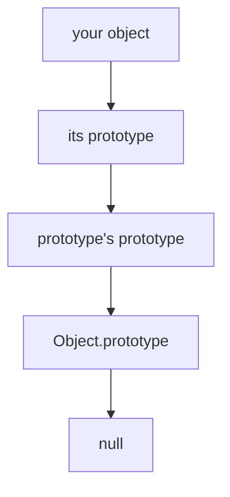
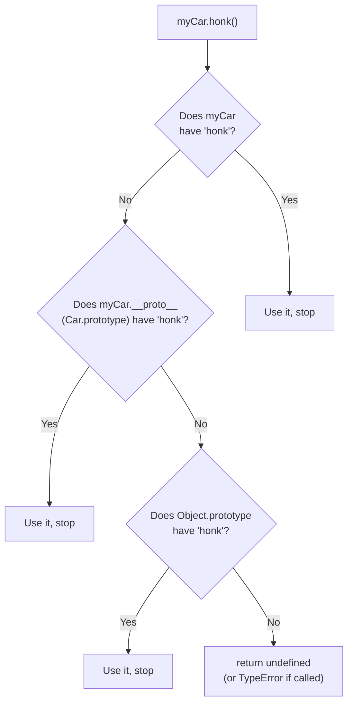
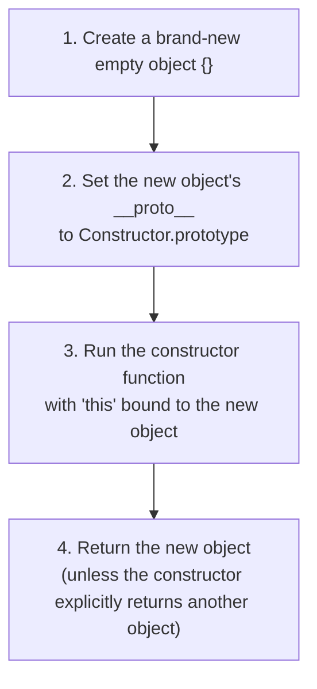
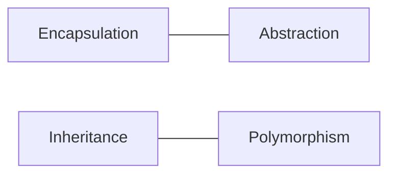
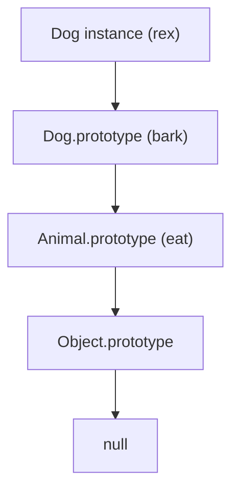

import { Callout } from 'fumadocs-ui/components/callout';
import { Tab, Tabs } from 'fumadocs-ui/components/tabs';

## Why This Module Matters

Every framework you'll ever touch — React class components, Node.js's `EventEmitter`, Express routers, Mongoose models — is built on the same foundation: **objects that share behavior through a chain**.

JavaScript doesn't have "classes" the way Java or C++ do. It has **objects linked to other objects**. Classes are just a friendlier syntax sitting on top of that link.

<Callout title="The Core Idea">
Every object in JavaScript has a hidden link to another object. When a property isn't found on the object itself, JavaScript walks up that link. This chain of links is the **prototype chain**.
</Callout>



---

## Part 1 — The Prototype Chain

### `__proto__` vs `prototype` — the most confused pair in JS

These two look similar but do completely different jobs.

| Term | What it is | Lives on |
|------|-----------|----------|
| `prototype` | A regular object property used as a **blueprint** for objects created by `new` | Only on **functions** (specifically, functions meant to be constructors) |
| `__proto__` | The actual **link** an object uses to find inherited properties | On **every object** (it's the getter/setter for the internal `[[Prototype]]` slot) |

<Callout type="warn" title="Common Misconception">
`__proto__` and `prototype` are **not** the same thing, and they don't point to the same object automatically for instances. A function's `.prototype` becomes the `.__proto__` of objects created from it with `new` — but the function itself doesn't use `.prototype` for its own lookups.
</Callout>

```javascript
function Car(brand) {
  this.brand = brand;
}

Car.prototype.honk = function () {
  console.log(`${this.brand} says beep!`);
};

const myCar = new Car("Toyota");

console.log(myCar.__proto__ === Car.prototype); // true
console.log(Car.prototype.__proto__ === Object.prototype); // true
console.log(Object.prototype.__proto__); // null
```

**Analogy:** think of `prototype` as the **master key template** kept in a locksmith's workshop, and `__proto__` as the **actual key** each customer walks away with. The customer's key (`__proto__`) was cut from the template (`Car.prototype`), but the customer doesn't hold the template itself.

### The Lookup Path

When you access `myCar.honk()`, JavaScript follows this exact algorithm:



<Callout title="Analogy">
Asking a question in a family: if you don't know the answer, you ask your parent. If they don't know, they ask the grandparent. This continues until someone knows — or until you reach the top of the family tree (`null`) with no answer.
</Callout>

### Shadowing

If you define a property directly on an object that already exists somewhere up the chain, the object's own property **wins**. This is called **shadowing** — it doesn't overwrite the prototype's version, it just hides it from that object's perspective.

```javascript
function Car(brand) {
  this.brand = brand;
}

Car.prototype.honk = function () {
  console.log("Generic beep!");
};

const myCar = new Car("Toyota");

myCar.honk = function () {
  console.log("Toyota's custom horn!");
};

myCar.honk();          // "Toyota's custom horn!" — own property wins
delete myCar.honk;
myCar.honk();          // "Generic beep!" — falls back to the prototype
```

<Callout type="info" title="Industry Relevance">
This is exactly how instance methods can "override" class methods per-object in plain JS, and it's the same mechanism behind why deleting an "override" reveals the original behavior underneath.
</Callout>

---

## Part 2 — Prototypal Inheritance

### `Object.create()`

The most direct way to create an object with a specific prototype — no constructor function needed.

```javascript
const animal = {
  eat() {
    console.log(`${this.name} is eating`);
  }
};

const dog = Object.create(animal);
dog.name = "Rex";
dog.eat(); // "Rex is eating"

console.log(dog.__proto__ === animal); // true
console.log(dog.hasOwnProperty("eat")); // false — it's inherited
```

`Object.create(proto)` builds a brand-new object whose `__proto__` is set directly to `proto`. This is prototypal inheritance in its purest, most explicit form.

### Constructor Functions

Before ES6 classes existed, this was **the** pattern for building "instances" in JavaScript.

```javascript
function Animal(name) {
  this.name = name;
}

Animal.prototype.eat = function () {
  console.log(`${this.name} is eating`);
};

const dog = new Animal("Rex");
dog.eat(); // "Rex is eating"
```

### What Actually Happens When You Call `new`

`new` is not magic — it performs four concrete steps:



```javascript
function myNew(Constructor, ...args) {
  const obj = {};                              // Step 1
  Object.setPrototypeOf(obj, Constructor.prototype); // Step 2
  const result = Constructor.apply(obj, args);  // Step 3
  return (typeof result === "object" && result !== null) ? result : obj; // Step 4
}
```

<Callout title="Analogy">
A constructor function is a **factory blueprint**. Every time you call `new Animal("Rex")`, the factory stamps out a fresh object and wires it into the shared `Animal.prototype` toolbox — so every animal can `eat()` without carrying its own private copy of that function in memory.
</Callout>

<Callout type="info" title="Why This Matters for Memory">
If `eat` were defined inside the constructor (`this.eat = function() {...}`), every single instance would carry its own copy of that function — wasteful for thousands of objects. Putting it on `.prototype` means all instances **share one function in memory**.
</Callout>

---

## Part 3 — ES6 Class Syntax

### Basic Class

```javascript
class Animal {
  constructor(name) {
    this.name = name;
  }

  eat() {
    console.log(`${this.name} is eating`);
  }
}

const dog = new Animal("Rex");
dog.eat(); // "Rex is eating"
```

### Instantiation

Instantiation with `class` works identically to constructor functions under the hood — `new` still runs the same four steps from Part 2.

```javascript
console.log(dog instanceof Animal);       // true
console.log(dog.__proto__ === Animal.prototype); // true
console.log(typeof Animal);               // "function"
```

<Callout type="warn" title="Correction / Clarification">
A JS `class` **is a function** — `typeof Animal` is `"function"`, not `"class"`. Classes are not a new runtime concept; they are **syntactic sugar**.
</Callout>

### Compilation Pattern — What a Class Compiles To

This is the single most important mental model for this section: a `class` is roughly equivalent to a constructor function plus prototype assignments.

```javascript
// What you write:
class Animal {
  constructor(name) {
    this.name = name;
  }
  eat() {
    console.log(`${this.name} is eating`);
  }
}

// What it behaves like under the hood:
function Animal(name) {
  this.name = name;
}
Animal.prototype.eat = function () {
  console.log(`${this.name} is eating`);
};
```

<Callout type="info" title="Not Identical, But Equivalent in Behavior">
Classes aren't literally transpiled to that exact code by the engine, and they have real differences from constructor functions — class bodies always run in strict mode, class methods are non-enumerable by default, and a class **cannot be called without `new`** (a constructor function can, though `this` would misbehave). But for the mental model of "where do methods live," the constructor-function view is accurate: methods still end up on `.prototype`, not on the instance.
</Callout>

---

## Part 4 — The Four OOP Pillars in JavaScript



### 1. Inheritance — `extends` and `super`

```javascript
class Animal {
  constructor(name) {
    this.name = name;
  }
  eat() {
    console.log(`${this.name} is eating`);
  }
}

class Dog extends Animal {
  constructor(name, breed) {
    super(name);          // must run before using 'this'
    this.breed = breed;
  }
  bark() {
    console.log(`${this.name} says woof!`);
  }
}

const rex = new Dog("Rex", "Labrador");
rex.eat();  // inherited from Animal
rex.bark(); // defined on Dog
```

<Callout type="warn" title="Rule">
Inside a derived class's constructor, you **cannot** access `this` until `super()` has been called — the parent constructor is what actually creates the `this` binding for the instance.
</Callout>



### 2. Encapsulation — Private Fields (`#private`)

Encapsulation means hiding internal state so it can only be touched through controlled methods.

```javascript
class BankAccount {
  #balance = 0; // truly private — not accessible outside the class

  constructor(owner) {
    this.owner = owner;
  }

  deposit(amount) {
    if (amount <= 0) throw new Error("Deposit must be positive");
    this.#balance += amount;
  }

  getBalance() {
    return this.#balance;
  }
}

const acc = new BankAccount("Abdul");
acc.deposit(500);
console.log(acc.getBalance()); // 500
console.log(acc.#balance);     // SyntaxError — # fields are inaccessible outside the class
```

<Callout title="Analogy">
Think of an ATM. You can deposit and check your balance through the machine's interface, but you can never reach into the vault directly. `#balance` is the vault; `deposit()` and `getBalance()` are the only doors in.
</Callout>

<Callout type="info" title="Before Private Fields">
Before `#private` existed (ES2022), developers faked privacy with a leading underscore (`_balance`) — a convention, not real enforcement. `#private` is enforced by the engine itself; even `Object.keys()` and `JSON.stringify()` skip it entirely.
</Callout>

### 3. Static Members

`static` properties and methods belong to the **class itself**, not to any instance.

```javascript
class Animal {
  static kingdom = "Animalia";

  static describeKingdom() {
    console.log(`All animals belong to ${Animal.kingdom}`);
  }

  constructor(name) {
    this.name = name;
  }
}

Animal.describeKingdom(); // "All animals belong to Animalia"

const dog = new Animal("Rex");
dog.describeKingdom(); // TypeError — static methods aren't on instances
```

<Callout title="Analogy">
Static members are like a **school's rulebook**, not a student's personal notebook. Every student belongs to the school, but the rulebook itself isn't something an individual student carries — you go to the school office (the class) to check it, not to any one student.
</Callout>

**Industry use:** utility/factory methods (`Array.isArray()`, `Object.create()`), counters shared across all instances, and configuration constants tied to a class.

### 4. Polymorphism — Same Method, Different Behavior

Polymorphism means different classes can respond to the **same method call** in their own way.

```javascript
class Animal {
  speak() {
    console.log(`${this.name} makes a sound`);
  }
}

class Dog extends Animal {
  speak() {
    console.log(`${this.name} barks`);
  }
}

class Cat extends Animal {
  speak() {
    console.log(`${this.name} meows`);
  }
}

const animals = [new Dog(), new Cat()];
animals.forEach(a => a.speak()); // each calls its OWN version of speak()
```

<Callout title="Analogy">
Press "play" on a remote control. On a TV it starts a show; on a speaker it plays music. Same button, same method name — different behavior depending on which device (class) receives the command.
</Callout>

**Industry use:** this is the exact mechanism behind UI component libraries — a base `Shape` class with a `render()` method, overridden differently by `Circle`, `Square`, and `Triangle`, all called the same way by the rendering loop.

---

## Comparison Table — Constructor Functions vs ES6 Classes

| Aspect | Constructor Function | ES6 Class |
|--------|----------------------|-----------|
| Can be called without `new` | Yes (but `this` breaks) | No — throws `TypeError` |
| Strict mode | Not automatic | Always on inside class body |
| Method enumerability | Enumerable by default | Non-enumerable by default |
| Private state | Faked with `_underscore` convention | Enforced with `#private` fields |
| Where methods live | `.prototype` (manually assigned) | `.prototype` (assigned automatically) |
| Under the hood | — | Still a function, still uses prototypes |

---

## Interview Questions

**Q1. What's the difference between `__proto__` and `prototype`?**

`prototype` is a property that exists on constructor functions and classes — it's the blueprint object that instances will link to. `__proto__` exists on every object (including function objects) and is the actual reference to that object's linked prototype, used during property lookup.

**Q2. What happens, step by step, when you use the `new` keyword?**

A new empty object is created; its `__proto__` is set to the constructor's `.prototype`; the constructor function runs with `this` bound to that new object; and the new object is returned automatically, unless the constructor explicitly returns a different object.

**Q3. What is shadowing in the prototype chain?**

When an object has its own property with the same name as one further up its prototype chain, JavaScript uses the object's own property and never reaches the prototype's version — the own property "shadows" it without deleting or modifying it.

**Q4. Is a JavaScript class a completely new language feature at runtime?**

No — it's syntactic sugar over the existing prototype-based system. A class is still a function, and its methods still live on `.prototype`, exactly as with constructor functions. Classes do add real behavioral differences though, such as enforced strict mode and requiring `new`.

**Q5. How do `#private` fields differ from the older underscore convention?**

The underscore convention (`_balance`) is just a naming signal — the property is still fully public and accessible from outside. `#private` fields are enforced by the JavaScript engine itself; accessing them from outside the class is a syntax error, and they're excluded from `Object.keys()`, `JSON.stringify()`, and `for...in` loops.

**Q6. Why must `super()` be called before using `this` in a derived class constructor?**

In a class hierarchy, the parent constructor is responsible for actually initializing the `this` binding. A derived class constructor has no valid `this` to work with until `super()` runs and hands one back.

**Q7. How does polymorphism work in JavaScript given there's no method overloading?**

JavaScript achieves polymorphism through **method overriding**, not overloading. Each subclass defines its own version of a method with the same name; when that method is called on an instance, the JS engine walks the prototype chain and uses the version closest to that instance — so the same call produces different behavior depending on the actual object.

---

## Industry Use Cases

| Concept | Where you'll see it |
|---------|----------------------|
| Prototype chain | Every built-in object — arrays inherit `.map()`/`.filter()` from `Array.prototype` |
| `Object.create()` | Building objects with a specific inheritance chain without a constructor, e.g. pure data models |
| Constructor functions | Legacy codebases, and libraries predating ES6 |
| ES6 classes | React class components, NestJS/Angular services and controllers, Mongoose schemas |
| `extends` / `super` | Custom error classes (`class ValidationError extends Error`), UI component hierarchies |
| `#private` fields | Encapsulating internal state in service classes, e.g. hiding a database connection or API key inside a class |
| `static` members | Utility classes, singleton-style configuration, factory methods (`Model.findById()` in Mongoose) |
| Polymorphism | Plugin/strategy patterns, rendering engines, payment gateway abstractions (`Stripe`, `PayPal` both implementing `.charge()`) |

---

## 20% Knowledge That Gives 100% Understanding

<Callout type="info" title="10 Rules to Remember">
1. Every object has a hidden link (`__proto__`) to another object — that chain is how inheritance works in JS.
2. `prototype` lives on functions/classes; `__proto__` lives on every object and is the real lookup link.
3. Property lookup walks up the chain until found, or until it hits `null`.
4. An object's own property always shadows one further up the chain — it doesn't delete it.
5. `new` does four things: create an object, link its prototype, run the constructor with `this` bound, return the object.
6. `Object.create(proto)` is the purest way to set an object's prototype directly, with no constructor involved.
7. ES6 classes are syntactic sugar — methods still live on `.prototype`, and a class is still `typeof "function"`.
8. `super()` must run before `this` is used in a derived class constructor.
9. `#private` fields are engine-enforced privacy — unlike the old `_underscore` convention, they truly can't be accessed from outside.
10. Polymorphism in JS = method overriding across a shared interface, resolved at runtime via the prototype chain.
</Callout>

---

## 🎉 Module Complete

You've now completed **Module 6 – Object-Oriented JavaScript & Prototypes**, covering:

- ✅ The Prototype Chain (`__proto__` vs `prototype`, lookup path, shadowing)
- ✅ Prototypal Inheritance (`Object.create()`, constructor functions, the mechanics of `new`)
- ✅ ES6 Class Syntax (instantiation, compilation pattern)
- ✅ The Four OOP Pillars (`extends`/`super`, `#private` fields, `static` members, polymorphism)

This module is the foundation for understanding design patterns, framework internals (React class components, Mongoose models), and any interview question that starts with "explain how inheritance works in JavaScript."