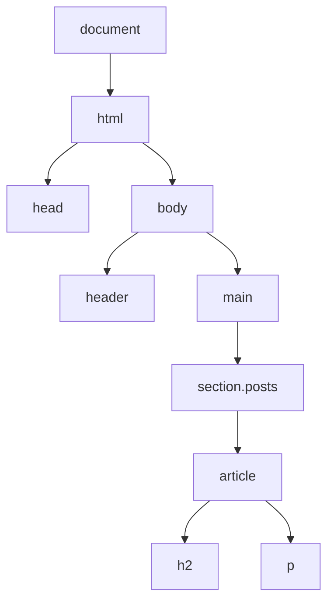
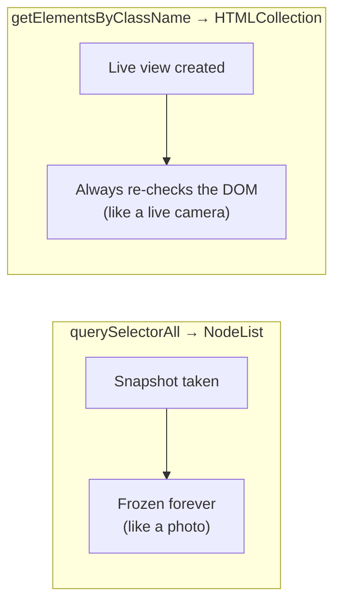
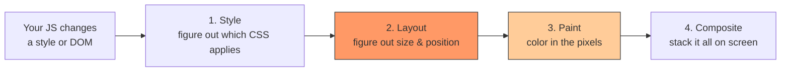
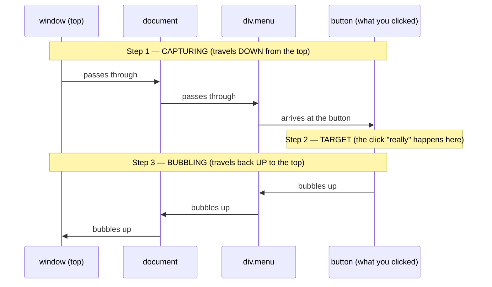
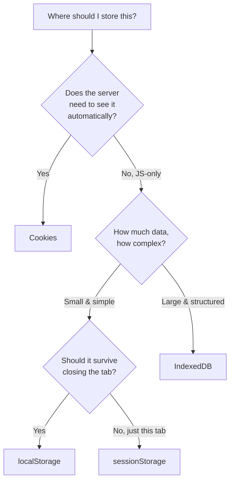
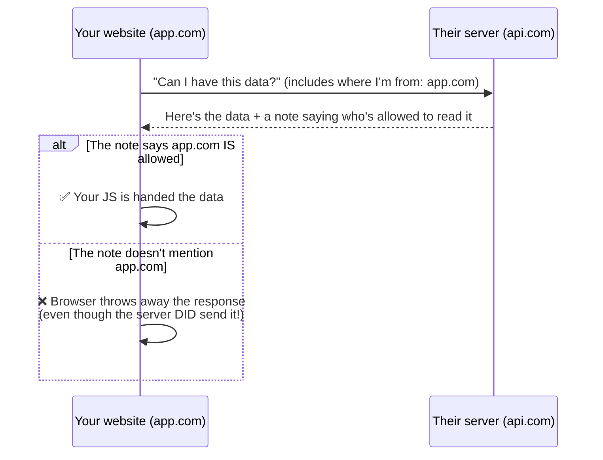

## Why This Module Matters

When you write HTML, the browser doesn't just "show" it. It builds a **live, in-memory copy** of your page that JavaScript can read and change. That live copy is called the **DOM** (Document Object Model). Every framework you'll ever use — React, Vue, plain vanilla JS — is ultimately just a clever way of changing this same DOM, and doing it *efficiently*.

<Callout title="The Simplest Way to Think About It" type="info">
HTML is the **written recipe**. The DOM is the **actual dish sitting on the table**, which you (JavaScript) can now touch, taste, and change. The browser also adds two more things on top: **Events** (a way for the page to tell your JS "something happened — a click, a keypress") and **Browser APIs** (extra tools like storage and network requests that live inside the browser, not inside JavaScript itself).
</Callout>

This module goes in this order, basic → advanced:

1. What the DOM actually is, and how to walk around it
2. The two "flavors" of element lists you'll bump into (and a bug they cause)
3. Why changing the DOM can make your page slow, and how to avoid it
4. How clicks and keypresses actually travel through the page
5. A performance trick almost every real app uses (event delegation)
6. Where to store data in the browser, and which option to pick
7. How to talk to a server the modern way (fetch, cancelling requests, streaming)

---

## Part 1 — The DOM, From Zero

### Step 1: HTML becomes a tree


Say you write this HTML:

```html
<body>
  <header>My Site</header>
  <main>
    <section class="posts">
      <article>
        <h2>Hello</h2>
        <p>My first post</p>
      </article>
    </section>
  </main>
</body>
```

The browser reads this top to bottom and turns every tag into an **object** — a little box in memory that JavaScript can grab and use. Then it connects all those boxes together based on how they were nested in your HTML. The result is a **tree**:



<Callout title="Analogy" type="info">
Think of it like a **family tree**. `document` is the great-grandparent at the very top. Every tag you wrote becomes a "child" of whichever tag it was nested inside. `<p>` is nested inside `<article>`, so in the DOM, `<p>` is a **child** of `<article>`, and `<article>` is its **parent**.
</Callout>

If you want to provide a solid, traditional "From Zero" foundation before jumping into `querySelector`, you should cover the classic element selectors, how they differ, and what they actually return.

Here is the authentic content, complete with code snippets and DevTools screenshot guides, tailored to match your module's style. You can insert this right before **Step 2: Walking the tree**.

---

### Selectors ⭐

Before `querySelector` existed, the browser gave us specific, fast methods to grab elements based on their exact attributes. Knowing these is essential because you will see them in almost every legacy codebase.

```javascript
// 1. Grab a single unique element by its ID attribute
// Returns: A single Element object (or null)
const mainHeader = document.getElementById("main-header");

// 2. Grab elements by their tag name
// Returns: A live HTMLCollection of all matching tags
const allParagraphs = document.getElementsByTagName("p");

// 3. Grab elements by their class name
// Returns: A live HTMLCollection of all matching classes
const postItems = document.getElementsByClassName("post-item");

```

#### Why we upgraded to `querySelector`

The traditional methods require you to change functions depending on what you are looking for. `querySelector` and `querySelectorAll` standardized this by letting you use the exact same CSS syntax you already use for styling:

```javascript
// The modern way replaces all three with one predictable syntax:
const mainHeader = document.querySelector("#main-header");
const firstParagraph = document.querySelector("p");
const postItems = document.querySelectorAll(".post-item");

```

<video 
  src="/videos/Dom Selector 1 encoded.mp4" 
  className="w-full rounded-md border" 
  preload="metadata" 
  controls 
  loop 
  autoPlay 
  muted 
  playsInline
/>


### Understanding the `document` Object

To interact with any of these selectors, you always start with the word `document`.

Think of `document` as the global gateway or the "master controller" object provided by the browser. It represents the entire web page currently loaded in the tab. If you don't prefix your selectors with `document.`, JavaScript has no context of where to look.

---

📸 **Screenshot Guide for DevTools:**

1. Go to the **Console** tab and type:
```javascript
console.dir(document);

```


2. *What to screenshot:* Expand the resulting `document` object dropdown. Show the massive list of built-in properties and methods (like `.URL`, `.title`, `.body`, and `.location`) to show students that the webpage is literally just a giant JavaScript object under the hood.


### Step 2: Walking the tree in JavaScript

Once you have this tree, JavaScript can move around it using simple, plain-English-named properties:

```js
const article = document.querySelector("article");

article.parentNode;         // moves UP one step → the <section>
article.children;           // moves DOWN → only the element children (h2, p)
article.firstElementChild;  // the first child element → <h2>
article.nextElementSibling; // the next element at the SAME level
```

<Callout title="Beginner Tip" type="info">
You don't need to memorize all of these on day one. Just remember the idea: **every element knows who its parent is, who its children are, and who its neighbors (siblings) are** — exactly like a family tree.
</Callout>

### Step 3: Finding elements — `querySelector`

Before you can walk the tree, you usually need to *find* your starting point. This is what `querySelector` is for:

```js
document.getElementById("main");            // find by id="main" — fastest option
document.querySelector(".card");             // find the FIRST match for a CSS selector
document.querySelectorAll(".card");          // find ALL matches for a CSS selector
```

`querySelector` and `querySelectorAll` accept **any CSS selector** you already know from styling — `.class`, `#id`, `div > p`, `[type="text"]`, and so on. This is why most modern code uses them: one function, and you already know the syntax.

---

## Part 2 — A Beginner Trap: Two Different Kinds of Lists

This is the first "gotcha" in DOM work, so let's slow down here.

There are two old-style methods you'll also see in code: `getElementsByClassName()` and `getElementsByTagName()`. They look almost identical to `querySelectorAll()`, but they behave **differently in a way that causes real bugs**.

- `querySelectorAll()` gives you a **snapshot** — like a photograph. Once taken, it never changes, even if the page changes afterward.
- `getElementsByClassName()` gives you a **live view** — like a security camera. It's always showing you what's happening *right now*, even seconds after you first asked for it.



### Where this bites beginners

```js
// ❌ Problem: this loop can behave very strangely, or seem to "never finish"
const items = document.getElementsByClassName("item"); // LIVE list

for (let i = 0; i < items.length; i++) {
  const clone = items[i].cloneNode(true);
  document.body.appendChild(clone); // this ADDS a new ".item" to the page
  // ...and because `items` is LIVE, items.length just went UP too!
  // the loop keeps chasing a target that keeps moving away from it
}
```

```js
// ✅ Solution: use querySelectorAll instead — it's frozen, so this is 100% safe
const items = document.querySelectorAll(".item"); // STATIC snapshot

items.forEach((item) => {
  const clone = item.cloneNode(true);
  document.body.appendChild(clone); // doesn't affect `items` at all
});
```

| Feature | `HTMLCollection` (old style) | `NodeList` from `querySelectorAll` (modern) |
|---|---|---|
| Behaves like | A live camera — always current | A photo — frozen at the moment you took it |
| Can you use `.forEach()` directly? | ❌ No, needs converting first | ✅ Yes |
| Safe to change the page while looping? | ❌ Risky | ✅ Safe |
| Beginner recommendation | Know it exists, avoid using it | **Use this by default** |

<Callout title="Rule of Thumb for Beginners" type="warning">
If you're not sure which one to use — always reach for `querySelectorAll()`. You'll rarely need the old live-list behavior, and it removes an entire category of confusing bugs.
</Callout>

---

## Part 3 — Why Changing the Page Can Make It Slow

### First, the basic idea

Every time the browser shows something on your screen, it goes through a mini "assembly line" of steps. You don't normally see this — but it's happening dozens of times per second.



Two of the words you'll hear a lot are **reflow** and **repaint**:

- **Reflow** = step 2 above (Layout). The browser is recalculating *where things go and how big they are*. This is the expensive one, because moving one box can push around every box near it.
- **Repaint** = step 3 above (Paint). The browser is just recoloring pixels — nothing moved, so this is cheaper.

<Callout title="Analogy" type="info">
Imagine rearranging furniture in a room (**reflow**) versus just repainting a wall a different color (**repaint**). Moving the sofa might mean the table has to move too, and the rug, and the lamp — one change cascades into many. Repainting a wall only affects that wall.
</Callout>

### The beginner mistake

A very common beginner mistake is **asking a question and giving an instruction, over and over, in a loop** — without realizing each question forces the browser to stop and do a full reflow immediately, instead of waiting and batching the work.

```js
// ❌ Problem: this "asks" (reads) and "tells" (writes) the browser, back and forth,
// 1000 times — forcing 1000 mini reflows instead of one
const boxes = document.querySelectorAll(".box");
boxes.forEach((box) => {
  const height = box.offsetHeight;       // ASKING: "how tall are you right now?"
  box.style.height = height + 10 + "px"; // TELLING: "now be 10px taller"
  // because we asked again right after telling, the browser can't batch this
});
```

```js
// ✅ Solution: ask ALL your questions first, THEN give all your instructions
const boxes = document.querySelectorAll(".box");

const heights = Array.from(boxes).map((box) => box.offsetHeight); // ask everything first
boxes.forEach((box, i) => {
  box.style.height = heights[i] + 10 + "px"; // then tell everything
});
```

<Callout title="Simple Rule" type="info">
**Read, then write. Don't alternate.** Gather all the measurements you need first, then make all your changes. This alone fixes most beginner performance issues.
</Callout>

### A second trick: build off-screen first

If you're adding many new elements, build them in an invisible "holding area" first, and only add that holding area to the real page once — so the browser only has to reflow **once**, not once per element.

```js
const fragment = document.createDocumentFragment(); // an invisible holding area

for (let i = 0; i < 1000; i++) {
  const li = document.createElement("li");
  li.textContent = `Item ${i}`;
  fragment.appendChild(li); // adding to the fragment does NOT touch the real page yet
}

document.getElementById("list").appendChild(fragment); // ONE real page update
```

<Callout title="Where You'll See This For Real" type="info">
This is exactly *why* React, Vue, and similar tools exist. They let you write simple code, but behind the scenes they batch every single change and update the real page only once per "render," instead of once per line of code — automatically doing what we just did by hand.
</Callout>

---

## Part 4 — How Clicks Actually Travel Through the Page

### The basic idea first

Say you click a button that's nested deep inside several `<div>`s. It feels like the click "just happens" on the button. But under the hood, the browser sends that click on a **round trip through the entire page**, not just to the button.



Three simple steps, always in this order:

1. **Capturing** — the click starts at the very top (`window`) and travels *down* toward the button. (Rarely used directly — good to know it exists.)
2. **Target** — the click "arrives" at the actual element you clicked.
3. **Bubbling** — the click then travels back *up*, the same path, in reverse. **This is the one used constantly.**

```js
const outer = document.getElementById("outer");
const inner = document.getElementById("inner");

inner.addEventListener("click", () => console.log("inner clicked"));
outer.addEventListener("click", () => console.log("outer heard it too"));

// clicking #inner logs BOTH lines — because the click "bubbles" up to outer
```

<Callout title="Beginner Takeaway" type="info">
By default, every click you listen for also quietly travels up to every parent above it. This isn't a bug — it's a feature, and it's the foundation of the next section.
</Callout>

---

## Part 5 — A Trick Almost Every Real App Uses: Event Delegation

### The problem, explained simply

Imagine a to-do list with 5,000 items, and you want each one to be clickable.

```js
// ❌ Problem: one listener for every single item
document.querySelectorAll(".todo-item").forEach((item) => {
  item.addEventListener("click", () => item.classList.toggle("done"));
});
```

Two issues with this:
1. You now have **5,000 separate listeners** sitting in memory — wasteful.
2. If you add a *new* to-do item later (say, after the user types one in), it has **no listener at all**, because you only attached listeners to the items that existed at that moment.

### The fix, using what you just learned in Part 4

Since we know clicks **bubble up** to parent elements automatically, we can put just **one** listener on the parent list itself, and let every click bubble up to it.

```js
// ✅ Solution: ONE listener on the parent, reused for every item — forever
document.getElementById("todo-list").addEventListener("click", (e) => {
  const item = e.target.closest(".todo-item"); // "which item did this click come from?"
  if (!item) return; // click landed somewhere else in the list, ignore it
  item.classList.toggle("done");
});
```

This single listener works for items that don't even exist yet at the time you wrote the code — because it's not watching individual items, it's watching for *any click that bubbles up through the parent*.

<Callout title="Where You'll See This For Real" type="info">
React does exactly this internally. Instead of attaching a real click listener to every button in your whole app, React attaches **one** listener near the root of the page, and figures out which component you "really" clicked using the same bubbling mechanism, just automated for you.
</Callout>

### Two commonly confused methods

Once you're inside an event handler, you'll often reach for one of these two — and beginners frequently mix them up:

| Method | What it actually does | What it does NOT do |
|---|---|---|
| `e.stopPropagation()` | Stops the click from bubbling any further up to parent listeners | Does not stop the browser's own default behavior (a link will still navigate) |
| `e.preventDefault()` | Stops the browser's built-in default behavior (e.g. stop a form from reloading the page) | Does not stop the event from still bubbling up to parents |

```js
// stopPropagation — stop a dropdown click from also triggering "close menu on outside click"
menuButton.addEventListener("click", (e) => {
  e.stopPropagation();
  menu.classList.toggle("open");
});
document.addEventListener("click", () => menu.classList.remove("open"));

// preventDefault — stop a form from reloading the page when submitted
form.addEventListener("submit", (e) => {
  e.preventDefault();
  submitViaFetch(new FormData(form));
});
```

---

## Part 6 — Where to Store Data in the Browser

Sometimes you need to remember something even after the user refreshes the page — a theme choice, a login session, a shopping cart. The browser gives you four different "storage boxes," and picking the right one matters.



| Storage | Think of it as... | Survives closing the tab? | Sent to the server automatically? | Good for |
|---|---|---|---|---|
| `localStorage` | A sticky note on your desk | ✅ Yes, until cleared | ❌ No | Theme preference, saved settings |
| `sessionStorage` | A sticky note that gets thrown away when you leave the room | ❌ No | ❌ No | Multi-step form/checkout progress |
| Cookies | An ID badge you show every time you walk through a door | ✅ Yes (configurable) | ✅ **Yes, automatically** | Login sessions |
| `IndexedDB` | A small filing cabinet, not just a sticky note | ✅ Yes, until cleared | ❌ No | Large offline data (hundreds of records) |

```js
// localStorage — simple, and stays after the tab or browser is closed
localStorage.setItem("theme", "dark");
localStorage.getItem("theme"); // "dark"

// sessionStorage — same API, but forgotten once the tab closes
sessionStorage.setItem("wizardStep", "3");

// Cookies — the ONLY one of these the browser sends to your server by itself
document.cookie = "sessionId=abc123; max-age=3600; path=/";
```

<Callout title="When Beginners Get Stuck" type="warning">
The most common beginner mistake is storing a large amount of data in `localStorage` and wondering why the page feels laggy. `localStorage` is **synchronous** — meaning it can briefly freeze the page while it reads or writes. For anything large or structured (lots of records, needs searching), reach for `IndexedDB` instead, which works in the background without freezing anything.
</Callout>

```js
// IndexedDB — a real, structured database that lives inside the browser
const request = indexedDB.open("MyAppDB", 1);

request.onupgradeneeded = (e) => {
  const db = e.target.result;
  db.createObjectStore("articles", { keyPath: "id" }); // like creating a table
};

request.onsuccess = (e) => {
  const db = e.target.result;
  const tx = db.transaction("articles", "readwrite");
  tx.objectStore("articles").put({ id: 1, title: "DOM Basics" }); // like inserting a row
};
```

---

## Part 7 — Talking to a Server: Fetch, Cancelling, and Streaming

### The basics of `fetch`

```js
const res = await fetch("https://api.example.com/users");
const data = await res.json();
```

<Callout title="A Trap for Beginners" type="warning">
Many beginners assume `fetch` will throw an error automatically if something goes wrong on the server (like a 404 "not found"). It does **not**. `fetch` only fails its promise if the request never reached the server at all (no internet, DNS error). If the server responds with an error status like 404 or 500, `fetch` still counts that as "successful" — you have to check it yourself:
</Callout>

```js
const res = await fetch("/api/users");
if (!res.ok) { // res.ok is false for any status outside 200-299
  throw new Error(`Something went wrong: ${res.status}`);
}
const data = await res.json();
```

### Cancelling a request you no longer need

Imagine a search box — every keystroke fires a new request. If an older, slower request finishes *after* a newer one, you might accidentally show outdated results.

```js
// ✅ AbortController: cancel the OLD request before starting a NEW one
let controller;

input.addEventListener("input", async (e) => {
  controller?.abort(); // stop listening for the previous request's answer
  controller = new AbortController();

  try {
    const res = await fetch(`/search?q=${e.target.value}`, {
      signal: controller.signal,
    });
    renderResults(await res.json());
  } catch (err) {
    if (err.name !== "AbortError") throw err; // ignore expected cancellations
  }
});
```

### CORS — the error every beginner eventually hits

You'll almost certainly see this error at some point: `"blocked by CORS policy"`. Here's what's really going on:



<Callout title="The Part That Confuses Everyone" type="info">
CORS is enforced by **your browser**, not by the server. The server often *does* receive and process the request just fine — the browser is the one refusing to hand the response over to your JavaScript, because the server didn't explicitly say your website is allowed to read it. That's why this error never shows up in tools like Postman, which aren't browsers and don't enforce this rule.
</Callout>

### Streaming — reading a response piece by piece

Normally, `fetch` waits for the *entire* response before giving it to you. But sometimes — like AI chat responses that "type" themselves out — you want to read and show pieces as they arrive.

```js
const res = await fetch("/api/chat-stream");
const reader = res.body.getReader();  // lets you read the response bit by bit
const decoder = new TextDecoder();    // converts raw bytes into readable text
let fullText = "";

while (true) {
  const { done, value } = await reader.read();
  if (done) break; // no more data coming

  fullText += decoder.decode(value, { stream: true });
  renderPartial(fullText); // show the page what's arrived SO FAR
}
```

<Callout title="Where You'll See This For Real" type="info">
This exact pattern is what makes ChatGPT/Claude-style typing responses possible, and it's also how video streaming and large file downloads with a progress bar work — the response arrives gradually, and your code reacts to each new piece instead of waiting for everything.
</Callout>

---

## Quick Reference — All Six Topics, Side by Side

| Concept | Beginner-Friendly Summary |
|---|---|
| `HTMLCollection` vs `NodeList` | Live camera vs frozen photo — use `querySelectorAll` by default |
| Reflow vs Repaint | Moving furniture (expensive) vs repainting a wall (cheap) |
| Capturing vs Bubbling | Click travels down then back up — bubbling is the one you'll use daily |
| `stopPropagation` vs `preventDefault` | One stops the click from spreading further; the other stops the browser's own reaction |
| `localStorage` vs `sessionStorage` | Sticky note that stays vs one that's thrown away when you leave |
| Cookies vs everything else | The only storage type your browser mails to the server automatically |
| `fetch` errors | Only fails on no-internet type problems — always check `res.ok` yourself |

---

## Interview Questions

**Q1. Why can looping over `getElementsByClassName()` while adding new matching elements behave strangely?**

Because it returns a **live** `HTMLCollection` that re-checks the DOM on every access, including `.length`. If your loop adds new matching elements as it goes, the list you're looping over keeps growing while you're still inside it. `querySelectorAll()` avoids this because it returns a frozen, one-time snapshot.

**Q2. In plain terms, what's the difference between reflow and repaint?**

Reflow is recalculating the size and position of elements — like rearranging furniture, it can affect everything nearby. Repaint is just recoloring pixels without moving anything — like repainting a single wall. Reflow is the more expensive of the two.

**Q3. What are the three phases an event goes through, in order?**

Capturing (top of the page down to the clicked element), target (the event fires on the actual element), and bubbling (back up from that element to the top). Listeners default to reacting during the bubbling phase.

**Q4. What is event delegation, and why is it useful?**

Instead of attaching a listener to every individual element, you attach one listener to a shared parent and use the fact that events bubble up to detect which child was interacted with (usually via `event.target.closest()`). It's more memory-efficient and automatically works for elements added later.

**Q5. What's the real difference between `stopPropagation()` and `preventDefault()`?**

`stopPropagation()` stops an event from continuing to bubble up to parent listeners, but doesn't stop the browser's own default reaction (like a link navigating). `preventDefault()` stops that default browser reaction, but the event still bubbles normally unless you also call `stopPropagation()`.

**Q6. Why might `fetch()` not throw an error even when the server returns a 404?**

`fetch()`'s promise only rejects for network-level failures — no connection, DNS errors, or CORS blocks. A response that comes back with an error status code is still considered a "successful" fetch technically, so you need to check `response.ok` yourself.

**Q7. Why does a CORS error happen even though the request reached the server?**

CORS is a rule enforced by the **browser**, not the server. The server can still receive and process the request — the browser is the one deciding whether to let your JavaScript actually read the response, based on whether the server's response included permission for your website's origin.

**Q8. When would you use `IndexedDB` instead of `localStorage`?**

When you're storing a large amount of structured data, or need to avoid the small performance freeze that `localStorage`'s synchronous reads/writes can cause. `IndexedDB` works asynchronously in the background and is built to handle much larger datasets.

**Q9. What problem does `AbortController` solve, and give a real example.**

It lets you cancel an in-progress request that's no longer needed — for example, in a search-as-you-type box, cancelling the previous request before firing a new one, so an old, slower response can't overwrite newer results on screen.

**Q10. How is a streamed fetch response different from a normal one?**

A normal `res.json()` call waits for the entire response to finish before giving you anything. A streamed response lets you read and act on pieces of the data as they arrive, using `res.body.getReader()` — the same mechanism behind AI "typing" responses and file-download progress bars.

---

## Industry Use Cases

| Concept | Where you'll see it in real projects |
|---|---|
| Live vs static lists | Legacy jQuery-era bugs; modern code sticks to `querySelectorAll` to avoid them |
| Reflow/repaint batching | Exactly why React/Vue exist — they batch DOM changes instead of applying them one by one |
| `DocumentFragment` | Rendering big lists (data tables, infinite scroll) without slowing the page down |
| Event bubbling | "Click outside to close" dropdowns and modals |
| Event delegation | React's internal event system; large dynamic lists like chat messages |
| `localStorage` | Theme preference, saved settings, guest shopping cart |
| `sessionStorage` | Multi-step checkout or onboarding forms |
| Cookies | Login sessions (`express-session`, `connect.sid`), CSRF protection |
| `IndexedDB` | Offline-capable apps like Google Docs offline mode |
| `AbortController` | Search-as-you-type boxes; cancelling requests when a React component unmounts |
| CORS | Any MERN app where the frontend (`localhost:5173`) and backend (`localhost:5000`) run on different ports |
| Streamed fetch | ChatGPT/Claude-style responses, video streaming, download progress bars |

---

## 20% Knowledge That Gives 100% Understanding

<Callout title="10 Rules to Remember" type="info">
1. The DOM is just your HTML turned into a tree of connected objects that JavaScript can read and change.
2. When picking between the two list types, default to `querySelectorAll` — it's the safe, frozen-snapshot option.
3. Reading a layout property right after changing one forces the browser to redo work immediately — read everything first, then write everything.
4. `DocumentFragment` lets you prepare many new elements off-screen and add them to the page in one go.
5. Every click travels down (capturing), fires at the target, then travels back up (bubbling) — bubbling is what you'll use daily.
6. Event delegation = one listener on a parent, using bubbling, instead of many listeners on many children.
7. `stopPropagation()` stops an event from spreading; `preventDefault()` stops the browser's built-in reaction — they're not the same thing.
8. `localStorage`/`sessionStorage`/cookies are simple and small; `IndexedDB` is for bigger, structured, offline-friendly data.
9. Cookies are the only browser storage automatically sent to your server — that's why they're used for login sessions.
10. `fetch()` doesn't throw errors for bad HTTP status codes — check `response.ok` yourself. Use `AbortController` to cancel stale requests and streams to handle data as it arrives.
</Callout>

---

## Resources for Practical Demo

<Callout title="Hands-On Practice" type="info">
- [MDN — Event reference](https://developer.mozilla.org/en-US/docs/Web/API/Event) — the official reference for every event type and phase covered above.
- [MDN — Using the Fetch API](https://developer.mozilla.org/en-US/docs/Web/API/Fetch_API/Using_Fetch) — step-by-step guide, including streaming and cancelling requests.
- [web.dev — Rendering Performance](https://web.dev/articles/rendering-performance) — a visual explanation of the style → layout → paint → composite pipeline.
- [Chrome DevTools — Performance panel](https://developer.chrome.com/docs/devtools/performance) — record any interaction on a real website and literally watch reflow/repaint happen as colored bars. This is the single best way to make this module click.
- [MDN — IndexedDB API](https://developer.mozilla.org/en-US/docs/Web/API/IndexedDB_API) — full reference; also worth trying the `idb` npm package, which makes `IndexedDB` much friendlier to use.
- **Try this yourself:** open DevTools on any real website → Elements panel → "Event Listeners" tab, and look at how few listeners are actually attached compared to how many clickable things are on the page. That gap is event delegation in action.
</Callout>

---

## 🎉 Module Complete

You've now completed **Module 7 — DOM Engineering & Browser APIs**, covering:

- ✅ What the DOM actually is, and how to walk through it
- ✅ Live `HTMLCollection` vs static `NodeList`, and the bug this difference causes
- ✅ Reflow, repaint, and how to avoid slowing your page down
- ✅ How events travel through the page (capturing, target, bubbling)
- ✅ Event delegation, `stopPropagation`, and `preventDefault`
- ✅ Browser storage — `localStorage`, `sessionStorage`, cookies, `IndexedDB`
- ✅ Modern fetching — Fetch API, `AbortController`, CORS, and streaming responses

This module is the foundation for understanding why React/Vue exist the way they do, why offline-first apps use `IndexedDB`, and any interview question that starts with "walk me through what happens when a user clicks a button on your page."