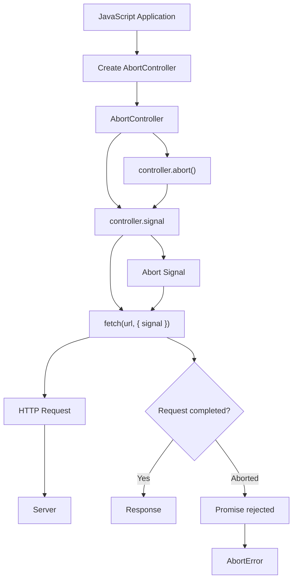

# `AbortController` — Complete Concept

## 1. The problem: What if we want to cancel `fetch()`?

Suppose your application starts this request:

```js
const response = await fetch("/api/users");
```

The browser sends:

```text
JavaScript
    ↓
fetch()
    ↓
Network
    ↓
Server
```

But imagine the user clicks:

> Cancel

Or the user leaves the page.

Or you start a new search:

```text
User types: j
User types: ja
User types: jav
User types: java
```

You may have several requests running.

You don't necessarily want old requests to continue.

That's where:

> **`AbortController`**

comes in.

---

# 2. What is `AbortController`?

`AbortController` is a browser API that allows you to **signal that an asynchronous operation should be cancelled/aborted**.

Very simple mental model:

```text
AbortController
       │
       │ "STOP!"
       ↓
   Fetch request
```

The controller doesn't perform the request.

It gives you a mechanism to tell a supported asynchronous operation:

> "Abort this operation."

---

# 3. Creating an AbortController

You create one like this:

```js
const controller = new AbortController();
```

Now you have a controller.

```text
controller
    │
    ├── signal
    │
    └── abort()
```

The two things you should know immediately are:

```js
controller.signal
```

and:

```js
controller.abort()
```

---

# 4. The Most Important Relationship

This is the heart of `AbortController`.

```js
const controller = new AbortController();

fetch("/api/users", {
  signal: controller.signal
});
```

Then, somewhere later:

```js
controller.abort();
```

Conceptually:

```text
              AbortController
               /           \
              /             \
       controller.signal   controller.abort()
              │                  │
              │                  │
              ↓                  ↓
           fetch()          sends abort signal
              │
              ↓
       Request is aborted
```

This is the most important thing to understand.

---

# 5. Why do we pass `signal`?

You might ask:

> Why can't I simply do `controller.abort()`?

Because the controller needs to know **which operation should listen to it**.

We connect them using:

```js
signal: controller.signal
```

So:

```js
fetch("/api/users", {
  signal: controller.signal
});
```

means:

> "Fetch, listen to this controller's signal."

Then:

```js
controller.abort();
```

means:

> "Send the abort signal."

---

# 6. Complete Basic Example

Here is the simplest complete example:

```js
const controller = new AbortController();

fetch("/api/users", {
  signal: controller.signal
})
  .then(response => response.json())
  .then(data => {
    console.log(data);
  })
  .catch(error => {
    console.log(error);
  });

// Later...
controller.abort();
```

The important sequence is:

```text
1. Create controller
       ↓
2. Get controller.signal
       ↓
3. Give signal to fetch
       ↓
4. Fetch starts
       ↓
5. controller.abort()
       ↓
6. Fetch is aborted
```

---

# 7. Think of `signal` as a Communication Channel

This is a useful mental model.

Imagine:

```text
Controller
     │
     │ signal
     ↓
  Fetch
```

The `signal` is basically the connection between the controller and the operation.

When:

```js
controller.abort();
```

happens:

```text
Controller
     │
     │ ABORT!
     ↓
  Signal
     │
     ↓
  Fetch
     │
     ↓
Abort operation
```

---

# 8. What Happens to the Promise?

This is important.

Suppose:

```js
const controller = new AbortController();

const response = await fetch("/api/users", {
  signal: controller.signal
});
```

If you abort the request before it completes:

```js
controller.abort();
```

the Fetch promise is rejected.

Therefore you should usually handle it:

```js
try {
  const response = await fetch("/api/users", {
    signal: controller.signal
  });

  const data = await response.json();

} catch (error) {
  console.log(error);
}
```

---

# 9. `AbortError`

When Fetch is aborted, browsers normally reject with an error whose name is:

```text
AbortError
```

You can detect it:

```js
try {
  const response = await fetch("/api/users", {
    signal: controller.signal
  });

  const data = await response.json();

} catch (error) {
  if (error.name === "AbortError") {
    console.log("Request was cancelled");
  } else {
    console.error("Something else went wrong", error);
  }
}
```

This distinction is useful.

Because:

```text
Network failure
```

is different from:

```text
User/application intentionally cancelled request
```

---

# 10. Why Would We Cancel a Request?

There are several real-world situations.

### Situation 1 — User cancels an operation

For example:

```text
Uploading large file...

[ Cancel ]
```

When the user clicks Cancel:

```js
controller.abort();
```

---

### Situation 2 — User leaves a page

Suppose:

```text
User opens:
User Profile
```

The application starts:

```text
GET /api/profile
```

But before it finishes, the user navigates away.

Continuing the operation may no longer be useful.

---

### Situation 3 — Search requests

Imagine a search box:

```text
User types:

j
ja
jav
java
javascript
```

Without cancellation:

```text
j          → Request 1
ja         → Request 2
jav        → Request 3
java       → Request 4
javascript → Request 5
```

You might have five requests.

Older requests may finish after newer ones.

That's where cancellation becomes extremely useful.

---

# 11. Search Example

Suppose:

```js
async function searchUsers(query) {
  const response = await fetch(
    `/api/users?q=${encodeURIComponent(query)}`
  );

  return response.json();
}
```

If the user types quickly:

```text
a
al
ali
```

you could have:

```text
Request A
Request AL
Request ALI
```

running simultaneously.

A better design can cancel the previous request when a new search starts.

---

# 12. The Search Cancellation Pattern

Conceptually:

```js
let controller;

async function searchUsers(query) {
  // Cancel previous request
  controller?.abort();

  // Create new controller
  controller = new AbortController();

  const response = await fetch(
    `/api/users?q=${encodeURIComponent(query)}`,
    {
      signal: controller.signal
    }
  );

  return response.json();
}
```

Now:

```text
User types "a"
       ↓
Request A starts

User types "al"
       ↓
Abort A
       ↓
Request AL starts

User types "ali"
       ↓
Abort AL
       ↓
Request ALI starts
```

This is a very practical pattern.

---

# 13. Why Create a New Controller?

This is a subtle but extremely important concept.

Suppose:

```js
const controller = new AbortController();
```

Then:

```js
controller.abort();
```

Once a controller has been aborted, its signal is permanently aborted.

You should **not expect to reset it**.

Instead:

```text
Controller 1
     ↓
abort()
     ↓
finished

Controller 2
     ↓
new request
```

So for a new independent request, create a new controller.

---

# 14. `signal.aborted`

You can check whether a signal has already been aborted:

```js
const controller = new AbortController();

console.log(controller.signal.aborted);
```

Initially:

```text
false
```

After:

```js
controller.abort();
```

it becomes:

```text
true
```

So:

```js
console.log(controller.signal.aborted);
```

returns:

```text
true
```

---

# 15. `abort` Event

The signal also emits an abort event.

For example:

```js
const controller = new AbortController();

controller.signal.addEventListener("abort", () => {
  console.log("Operation aborted");
});

controller.abort();
```

Output:

```text
Operation aborted
```

This demonstrates something important:

> The signal is an event-based notification mechanism.

The controller says:

```text
abort()
```

and the signal notifies listeners:

```text
"An abort happened."
```

---

# 16. The Architecture

Now you can understand the relationship properly:

```text
             AbortController
                    │
                    │ abort()
                    ↓
             AbortSignal
              /     |     \
             /      |      \
            ↓       ↓       ↓
         fetch()  listener  another API
```

The controller **causes** the abort.

The signal **communicates** the abort.

---

# 17. Controller vs Signal

This is a common interview/viva question.

### `AbortController`

Used to:

```js
controller.abort();
```

It is the thing that **initiates cancellation**.

### `AbortSignal`

Used to:

```js
signal: controller.signal
```

It is the thing that **receives/communicates the cancellation signal**.

Think:

```text
Controller = Remote control
Signal     = Remote's signal
Fetch      = Device being controlled
```

Press:

```text
ABORT
```

and the signal tells Fetch:

```text
STOP
```

---

# 18. Mermaid Diagram

Here's the core architecture:



---

# 19. The Complete Mental Model

Remember this:

```text
Create controller
       ↓
Get signal
       ↓
Give signal to fetch
       ↓
Fetch starts
       ↓
Something happens
       ↓
controller.abort()
       ↓
Signal changes
       ↓
Fetch is aborted
       ↓
Promise rejects
       ↓
catch()
```

---

# 20. A Real Example with `try/catch`

This is the pattern I want you to understand deeply:

```js
const controller = new AbortController();

async function loadUsers() {
  try {
    const response = await fetch("/api/users", {
      signal: controller.signal
    });

    if (!response.ok) {
      throw new Error(`HTTP ${response.status}`);
    }

    const users = await response.json();

    console.log(users);

  } catch (error) {

    if (error.name === "AbortError") {
      console.log("Request cancelled");
      return;
    }

    console.error("Request failed:", error);
  }
}
```

Then:

```js
loadUsers();
```

And if necessary:

```js
controller.abort();
```

---

# 21. Don't Confuse Abort With HTTP Errors

This is important because we already learned Fetch errors.

### Server returns 404:

```text
GET /api/users
        ↓
Server
        ↓
404 Not Found
```

Fetch generally resolves:

```js
response.ok === false
```

---

### You abort the request:

```text
fetch()
  ↓
controller.abort()
  ↓
AbortError
```

Fetch Promise rejects.

So:

```text
HTTP error
    ↓
response.ok === false

Abort
    ↓
Promise rejection
```

This distinction is important in professional error handling.

---

# 22. Abort With a Timeout

One of the most useful applications is:

> "If this request takes too long, cancel it."

Modern browsers provide:

```js
AbortSignal.timeout()
```

For example:

```js
const response = await fetch("/api/users", {
  signal: AbortSignal.timeout(5000)
});
```

This means approximately:

> Abort this request if it hasn't completed within 5 seconds.

Conceptually:

```text
fetch()
   │
   ├── finishes within 5 sec
   │        ↓
   │      success
   │
   └── exceeds 5 sec
            ↓
          abort
```

This is extremely useful for production applications.

---

# 23. `AbortSignal.timeout()` vs `AbortController`

These are related but different.

### Manual cancellation

```js
const controller = new AbortController();

fetch(url, {
  signal: controller.signal
});

controller.abort();
```

You control **when** cancellation happens.

---

### Automatic timeout

```js
fetch(url, {
  signal: AbortSignal.timeout(5000)
});
```

The browser automatically aborts after the specified duration.

So:

```text
AbortController
→ manual cancellation

AbortSignal.timeout()
→ automatic time-based cancellation
```

---

# 24. Multiple Operations Can Share One Signal

This is a powerful concept.

You can theoretically give the same signal to multiple abortable operations:

```js
const controller = new AbortController();

fetch("/api/users", {
  signal: controller.signal
});

fetch("/api/posts", {
  signal: controller.signal
});
```

Then:

```js
controller.abort();
```

can signal both operations to abort.

Think:

```text
                Controller
                    │
                  abort()
                    │
              AbortSignal
               /         \
              ↓           ↓
        Users Fetch    Posts Fetch
              ↓           ↓
           Abort         Abort
```

This is useful when multiple operations belong to one logical task.

---

# 25. React Example

This is where you'll encounter `AbortController` frequently.

Suppose a component loads data:

```js
useEffect(() => {
  const controller = new AbortController();

  fetch("/api/users", {
    signal: controller.signal
  })
    .then(response => response.json())
    .then(data => {
      console.log(data);
    })
    .catch(error => {
      if (error.name !== "AbortError") {
        console.error(error);
      }
    });

  return () => {
    controller.abort();
  };
}, []);
```

Why?

When the component unmounts:

```text
Component mounted
       ↓
Fetch starts
       ↓
User leaves page
       ↓
Component unmounts
       ↓
cleanup function
       ↓
controller.abort()
```

This prevents the request from continuing unnecessarily.

---

# 26. Why This Matters in React

Imagine:

```text
User Profile Page
       ↓
GET /api/profile
       ↓
Request takes 5 seconds
       ↓
User navigates to Dashboard
```

The profile component no longer needs that request.

So cleanup can cancel it:

```js
return () => {
  controller.abort();
};
```

This is part of good asynchronous resource management.

---

# 27. A Very Important Modern Concept: Cancellation Is Not "Undo"

This distinction is subtle.

When you call:

```js
controller.abort();
```

you are telling the client-side operation to stop waiting/processing the response.

It does **not necessarily mean**:

> "Undo whatever the server already did."

For example:

```text
POST /api/payment
       ↓
Server receives request
       ↓
Server processes payment
       ↓
Client aborts
```

Aborting the client's Fetch does not magically roll back the server's business operation.

This is why cancellation and transaction rollback are completely different concepts.

---

# 28. Another Important Concept: Abort Is Cooperative

Think of:

```js
signal: controller.signal
```

as registering an operation with a cancellation signal.

APIs that support `AbortSignal` can respond to the signal.

Fetch supports it.

Many modern Web APIs support `AbortSignal` as well.

So the broader idea is:

> **AbortController provides a standardized cancellation signal that can be shared with APIs that support it.**

This is bigger than Fetch.

---

# 29. Common Beginner Mistakes

### Mistake 1

Creating controller but never passing its signal:

```js
const controller = new AbortController();

fetch("/api/users");

controller.abort();
```

This doesn't connect your controller to that Fetch request.

Correct:

```js
fetch("/api/users", {
  signal: controller.signal
});
```

---

### Mistake 2

Trying to reuse an aborted controller:

```js
controller.abort();

fetch("/api/users", {
  signal: controller.signal
});
```

Don't treat the signal as resettable.

Create a new controller for a new operation.

---

### Mistake 3

Treating AbortError as a server failure

```js
catch (error) {
  showError("Server is down");
}
```

Not necessarily.

It may simply mean:

```text
The application intentionally cancelled the request.
```

Handle it separately.

---

### Mistake 4

Thinking abort rolls back server operations

It doesn't.

Cancellation of the client request is not equivalent to database transaction rollback.

---

# 30. The 20% You Must Remember

If you remember only this:

### Step 1

Create:

```js
const controller = new AbortController();
```

### Step 2

Give Fetch the signal:

```js
fetch(url, {
  signal: controller.signal
});
```

### Step 3

Cancel:

```js
controller.abort();
```

### Step 4

Handle cancellation:

```js
catch (error) {
  if (error.name === "AbortError") {
    console.log("Cancelled");
  }
}
```

That's the core.

---

# 31. One Final Mental Picture

Imagine Fetch is a worker.

```text
                 YOU
                  │
                  │ "Start this request"
                  ↓
                FETCH
                  │
                  │ working...
                  ↓
               SERVER

Meanwhile:

          AbortController
                  │
                  │ abort()
                  ↓
             AbortSignal
                  │
                  │ "STOP"
                  ↓
                FETCH
                  │
                  ↓
             AbortError
```

So the simplest definition is:

> **`AbortController` is a mechanism for telling an asynchronous operation, such as `fetch()`, that you want it to stop. `AbortSignal` carries that cancellation signal to the operation.**

And the core code is:

```js
const controller = new AbortController();

try {
  const response = await fetch("/api/users", {
    signal: controller.signal
  });

  const data = await response.json();

  console.log(data);
} catch (error) {
  if (error.name === "AbortError") {
    console.log("Request cancelled");
  } else {
    console.error(error);
  }
}

// Whenever you need to cancel:
controller.abort();
```

### The connection with what you just learned

You now have:

```text
FETCH API
   │
   ├── sends HTTP request
   ├── receives Response
   ├── reads response body
   │
   └── can receive AbortSignal
              ↑
              │
       AbortController
              │
              └── abort()
```

**Next in the sequence is CORS.** That's a different kind of problem: Fetch can successfully create a request, but the **browser's same-origin security rules can prevent JavaScript from accessing a cross-origin response**. Once you understand that distinction, CORS becomes much less mysterious.
