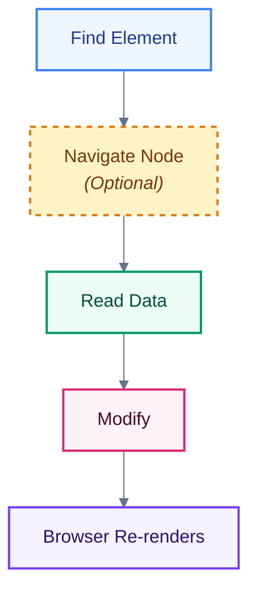

<Callout title="Goal" type="success" >
Learn how JavaScript finds elements, moves through the DOM tree, creates new elements, updates existing ones, and removes them efficiently.
</Callout>


## 🎯 Learning Objectives

After this chapter, you will be able to:

* Select DOM elements using every major API
* Understand `HTMLCollection` vs `NodeList`
* Traverse parent, child, and sibling relationships
* Create, insert, replace, clone, and remove elements
* Understand `innerHTML`, `innerText`, and `textContent`
* Manage attributes, classes, and inline styles
* Avoid common performance and security mistakes


## The DOM Engineering Workflow

Every DOM task follows the same pattern:



Example:

```javascript
const card = document.querySelector(".card");
card.classList.add("active");
```


## Part 1 — Selecting Elements

Imagine your webpage is a city.

Before repairing a house, you must know **which house** it is.

DOM selection is simply "finding the correct element."


## 1. `getElementById()`

Fastest way to find a unique element.

HTML

```html
<h1 id="title">DOM Engineering</h1>
```

JavaScript

```javascript
const title = document.getElementById("title");

console.log(title);
```

Output

```text
<h1 id="title">DOM Engineering</h1>
```

### Best Practice

Use IDs only when the element is unique.


## 2. `getElementsByClassName()`

Returns **all elements** having the class.

```html
<p class="item">One</p>
<p class="item">Two</p>
<p class="item">Three</p>
```

```javascript
const items = document.getElementsByClassName("item");

console.log(items);
```

Output

```text
HTMLCollection(3)
```

Important

It returns an **HTMLCollection**, not an array.


## 3. `getElementsByTagName()`

Finds all elements of the same tag.

```javascript
const paragraphs = document.getElementsByTagName("p");
```


## 4. `querySelector()`

Modern and most commonly used.

Returns the **first matching element**.

```javascript
document.querySelector("#title");

document.querySelector(".item");

document.querySelector("button");

document.querySelector(".card button");
```

It accepts any valid CSS selector.


## 5. `querySelectorAll()`

Returns **all matching elements**.

```javascript
const buttons = document.querySelectorAll("button");
```

Output

```text
NodeList(5)
```


## HTMLCollection vs NodeList

This is one of the most common interview questions.

| HTMLCollection          | NodeList                  |
| ----------------------- | ------------------------- |
| Live                    | Static                    |
| Updates automatically   | Snapshot                  |
| Older API               | Modern API                |
| From `getElementsBy...` | From `querySelectorAll()` |


## Live Collection

```html
<ul id="list">
  <li>Apple</li>
</ul>
```

```javascript
const items = document.getElementsByTagName("li");
console.log(items.length); // 1
document.querySelector("#list").innerHTML += "<li>Mango</li>";
console.log(items.length); // 2 ✅
```

The collection updates itself.


## Static NodeList

```javascript
const items = document.querySelectorAll("li");
console.log(items.length); // 1
document.querySelector("#list").innerHTML += "<li>Orange</li>";
console.log(items.length); // Still 1
```

Why?

Because it is a snapshot.


### Easy Analogy

**HTMLCollection** → CCTV Live Camera

Always shows the latest scene.

**NodeList** → Photograph

Captures only one moment.

---

## Part 2 — Traversing the DOM

Sometimes you already have one element.

Now you want to move around.


## Parent

```javascript
element.parentElement
```

Example

```html
<div>
    <h1>Hello</h1>
</div>
```

```javascript
const h1 = document.querySelector("h1");
console.log(h1.parentElement);
```

Output

```text
<div>
```


## Children

```javascript
element.children
```
Returns only HTML elements.


## `childNodes`

Returns everything.

* Elements
* Text
* Comments

Example

```html
<div>
<h1>Hello</h1>
</div>
```

The spaces and newlines become **text nodes**, so `childNodes` often contains more entries than you expect.


## First Child

```javascript
element.firstElementChild
```


## Last Child

```javascript
element.lastElementChild
```


## Next Sibling

```javascript
element.nextElementSibling
```


## Previous Sibling

```javascript
element.previousElementSibling
```


---

## Part 3 — Creating Elements

Imagine building a new card.

```javascript
const card = document.createElement("div");
```

Browser creates

```html
<div></div>
```

Only in memory.
Nothing appears yet.


## Add Content

```javascript
card.textContent = "Hello";
```

Now

```html
<div>Hello</div>
```


## Add Class

```javascript
card.classList.add("box");
```


## Add Attribute

```javascript
card.setAttribute("id","card1");
```

---

## Part 4 — Inserting Elements

Nothing appears until inserted.


## append()

```javascript
document.body.append(card);
```

Result

```html
<body>

<div>Hello</div>

</body>
```


## prepend()

```javascript
document.body.prepend(card);
```

Adds to the beginning.


## before()

```javascript
heading.before(card);
```


## after()

```javascript
heading.after(card);
```


## appendChild()

Old but still widely used.

```javascript
parent.appendChild(child);
```


### Difference

`append()`

Supports

* Text
* Multiple Nodes

`appendChild()`

Supports

* One Node only

---

## Part 5 — Removing Elements

```javascript
element.remove();
```
Simple.


### Old method

```javascript
parent.removeChild(child);
```

---

## Part 6 — Replacing Elements

```javascript
oldElement.replaceWith(newElement);
```

Example

```javascript
const newHeading = document.createElement("h2");
newHeading.textContent = "Updated";
heading.replaceWith(newHeading);
```

---

## Part 7 — Cloning Elements

```javascript
const copy = card.cloneNode(true);
```

`true`

Copies children too.

`false`

Copies only the element itself.

---

## Part 8 — Reading & Updating Content

This is a very important interview topic.


## `textContent`

Returns all text and Ignores styling.

```html
<div>
Hello
<span>World</span>
</div>
```

Output

```text
Hello World
```

Fastest option for plain text.


## `innerText`

- Returns only visible text.
- Respects CSS.

If an element is hidden with `display: none`, `innerText` ignores it.
Because it depends on layout calculations, it is usually slower than `textContent`.


## `innerHTML`

Reads or writes HTML.

```javascript
box.innerHTML = "<b>Hello</b>";
```

Result

```html
<div>
<b>Hello</b>
</div>
```

---

### Security Warning (XSS)

Never insert untrusted user input with `innerHTML`.

Bad

```javascript
box.innerHTML = userInput;
```

If `userInput` contains:

```html
<script>alert("Hacked")</script>
```

The browser may execute it.

Safer

```javascript
box.textContent = userInput;
```

---

## Part 9 — Attributes

Read

```javascript
element.getAttribute("href");
```

Write

```javascript
element.setAttribute("href","/about");
```

Remove

```javascript
element.removeAttribute("disabled");
```

Check

```javascript
element.hasAttribute("required");
```

---

## Custom Data Attributes

HTML

```html
<button data-id="101">Edit</button>
```

JavaScript

```javascript
button.dataset.id;
```

Output

```text
101
```

Widely used for IDs and metadata.

---

## Part 10 — Class Manipulation

```javascript
element.classList.add("active");

element.classList.remove("active");

element.classList.toggle("dark");

element.classList.replace("old","new");

element.classList.contains("active");
```

Modern, readable, and preferred over manually editing `className`.

---

## Part 11 — Inline Styles

```javascript
box.style.color = "red";
box.style.backgroundColor = "black";
box.style.fontSize = "20px";
```

Prefer adding/removing CSS classes instead of setting many inline styles. It keeps styling maintainable and separates concerns.

---

## Performance Tips

❌ Don't repeatedly search for the same element.

```javascript
document.querySelector("#title").textContent = "A";
document.querySelector("#title").style.color = "red";
document.querySelector("#title").style.fontSize = "30px";
```

✔️ Cache the reference.

```javascript
const title = document.querySelector("#title");

title.textContent = "A";
title.style.color = "red";
title.style.fontSize = "30px";
```

This avoids unnecessary DOM queries.

---

## Common Mistakes

❌ Assuming `querySelectorAll()` stays updated.

✔️ It returns a static `NodeList`.


❌ Using `innerHTML` for plain text.

✔️ Use `textContent` when you don't need HTML parsing.


❌ Manipulating `className` strings manually.

✔️ Use the `classList` API.

---

## Interview Questions

1. Difference between `getElementById()` and `querySelector()`.
2. Explain `HTMLCollection` vs `NodeList`.
3. Why is `querySelectorAll()` static?
4. Difference between `children` and `childNodes`.
5. Difference between `textContent`, `innerText`, and `innerHTML`.
6. Why is `innerHTML` considered a security risk?
7. Difference between `append()` and `appendChild()`.
8. What does `cloneNode(true)` do?
9. What is the purpose of `dataset`?
10. Why should DOM queries be cached?

---

## Exam Notes (20% That Covers 100%)

* **Selection APIs:** `getElementById()`, `getElementsByClassName()`, `getElementsByTagName()`, `querySelector()`, `querySelectorAll()`.
* **HTMLCollection:** Live collection that updates automatically when the DOM changes.
* **NodeList:** Static snapshot returned by `querySelectorAll()`.
* **Traversal:** Use `parentElement`, `children`, `childNodes`, `firstElementChild`, `lastElementChild`, `nextElementSibling`, and `previousElementSibling` to navigate the DOM.
* **Creation & Insertion:** Use `createElement()`, `append()`, `prepend()`, `before()`, `after()`, and `appendChild()`.
* **Removal & Replacement:** Use `remove()`, `replaceWith()`, and `cloneNode()`.
* **Content APIs:** Prefer `textContent` for plain text, `innerHTML` only for trusted HTML, and `innerText` when visible text is required.
* **Attributes & Classes:** Use `getAttribute()`, `setAttribute()`, `dataset`, and `classList` for clean DOM manipulation.
* **Performance:** Cache frequently used DOM elements and avoid unnecessary DOM queries or excessive use of `innerHTML`.

---

## 🏗️ Mini Project — Dynamic Todo List

Build a small application **without any framework** using only DOM APIs:

### Features

* Add a new todo (`createElement`, `append`)
* Delete a todo (`remove`)
* Mark as completed (`classList.toggle`)
* Store the todo ID using `data-id`
* Display the total number of todos
* Do **not** use `innerHTML` to generate the list

This project will reinforce nearly every API covered in this chapter and prepare you for the next topic: **DOM Events & Event Delegation**, where you'll make these elements interactive.
