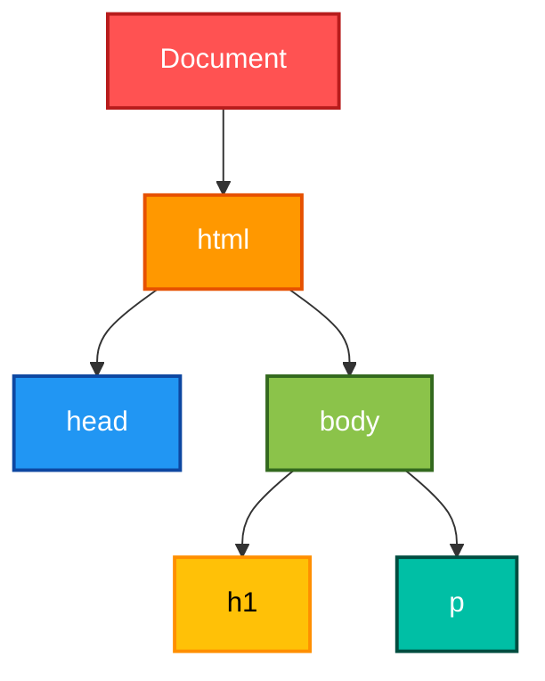
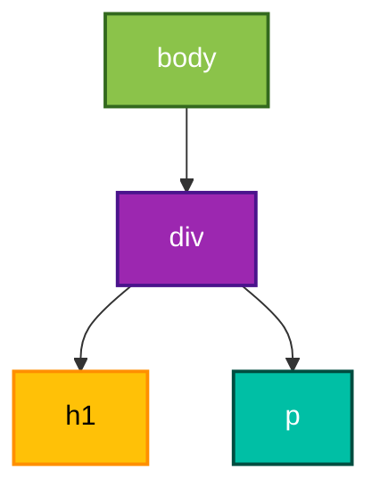
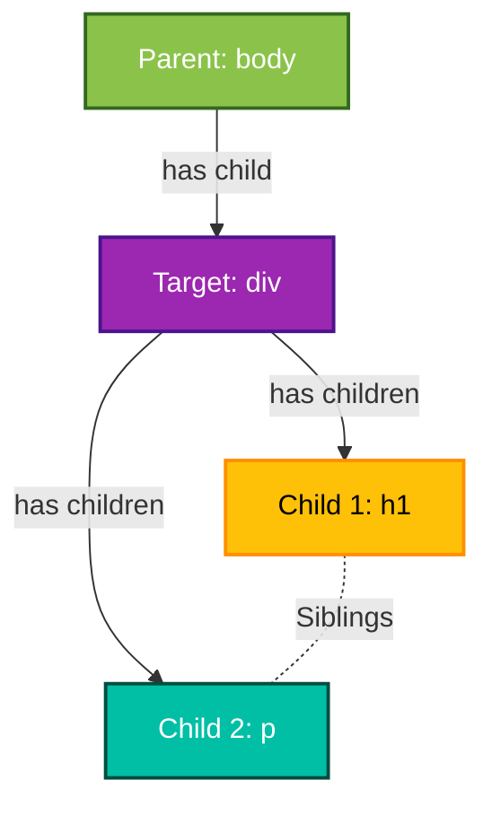
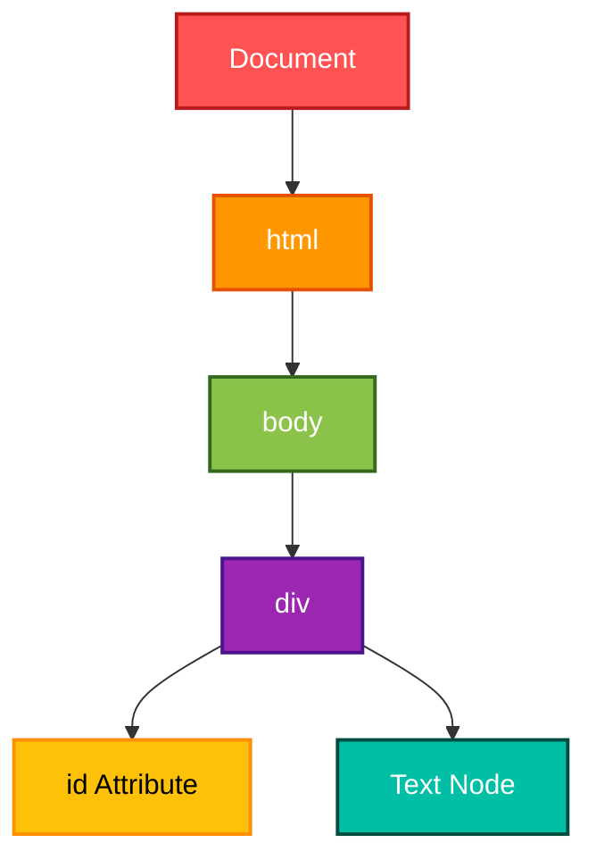
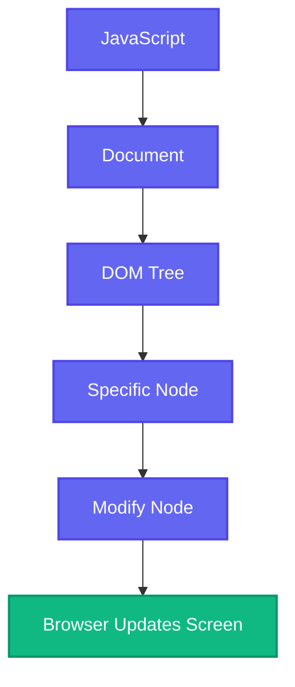

<Callout title="Goal" type="success" >
Understand what the DOM really is and how JavaScript communicates with a webpage.
</Callout>


## 🎯 Learning Objectives

After this chapter, you should be able to:

* Understand what the DOM is
* Explain why the DOM exists
* Differentiate HTML and DOM
* Understand the DOM Tree
* Identify every Node type
* Understand `window`
* Understand `document`
* Navigate parent-child relationships
* Understand live DOM updates


## Why Does the DOM Exist?

Imagine you wrote this HTML.

```html
<h1>Hello World</h1>
```

Can JavaScript directly modify this file?

**No.**

The HTML file is just **plain text** stored on disk or received from a server.

JavaScript cannot manipulate plain text HTML directly.

Instead, the browser converts HTML into JavaScript objects.

Those objects are called the **DOM**.


## Real Life Analogy

Imagine reading a PDF.

The PDF is static.

You cannot simply change one sentence inside it.

Instead, imagine converting the PDF into Microsoft Word.

Now every paragraph becomes editable.

Exactly the same happens here.

```
HTML File

↓

Browser

↓

Editable Object Structure (DOM)

↓

JavaScript can modify it
```

The DOM is **an editable version of HTML**.

---

## HTML vs DOM

Many beginners think they are identical.

They are **not**.

| HTML                   | DOM                        |
| ---------------------- | -------------------------- |
| Plain text             | JavaScript Objects         |
| Static source          | Live structure             |
| Stored on server       | Created in browser memory  |
| Cannot execute methods | Has methods and properties |
| Sent once              | Changes continuously       |

Example

HTML

```html
<h1>Hello</h1>
```

Browser converts it into something conceptually like

```javascript
{
    tagName: "H1",
    textContent: "Hello"
}
```

You never see these objects directly, but JavaScript interacts with them.

---

## DOM Tree

The browser doesn't create random objects.

It creates a **tree**.

Why a tree?

Because HTML is hierarchical.

Example

```html
<html>
<head>
</head>
<body>
    <h1>Hello</h1>
    <p>World</p>
</body>
</html>
```

DOM Tree



Every HTML document becomes a tree.

---

## Why Tree?

Think about your computer.

```
C:

├── Users

│   ├── AbdulRahim

│   │    ├── Documents

│   │    ├── Downloads

│   │    └── Pictures
```

Folders contain folders.

HTML works exactly the same.

Every element can contain children.


## Parent, Child and Siblings

Consider

```html
<body>
    <div>
        <h1>Hello</h1>
        <p>Paragraph</p>
    </div>
</body>
```

Tree



### Relationships



Exactly like a family tree.


## Every Box is a Node

Everything inside the DOM is called a **Node**.

Not only elements.

Example

```html
<div>
Hello
</div>
```

Browser sees

```
Document

↓

HTML

↓

Body

↓

Div

↓

Text Node ("Hello")
```

Even text is a node.

---

## Types of Nodes

| Node      | Example            |
| --------- | ------------------ |
| Document  | Whole page         |
| Element   | `<div>`            |
| Text      | Hello              |
| Comment   | `<!-- comment -->` |
| Attribute | class="box"        |

Remember

**Every Element is a Node.**

But

**Not every Node is an Element.**

Interview favorite.


### Example

```html
<body>
<div id="card">
Hello
</div>
</body>
```

Browser creates




<Callout title='Notice !' type='warn'>
Text is not an Element.
</Callout>


## Node vs Element

Suppose someone asks

"Find every Node."

You return

```
Document

html

body

div

Text

Comment
```

Suppose they ask

"Find every Element."

You return only

```
html

body

div
```

Elements are only HTML tags.

---

## The Global `window` Object

When a webpage loads, the browser creates the **window** object.

Think of it as the **boss of the browser tab**.

```
Window

↓

Everything else
```

The browser exposes almost every API through `window`.

Examples

```javascript
window.alert("Hello")
window.location
window.history
window.document
window.fetch()
window.localStorage
```


In most cases, `window` is implicit, so these are equivalent:

```javascript
alert("Hello");
window.alert("Hello");
```


---

## The `document` Object

Inside `window` lives the `document`.

```
Window
│
└── Document
```

The document represents the **current HTML page**.

Without it, JavaScript has no way to access the DOM.

Example

```javascript
document.title
```

```javascript
document.body
```

```javascript
document.head
```

```javascript
document.documentElement
```


## Browser Object Hierarchy

```text
Window
│
├── document
├── history
├── location
├── navigator
├── localStorage
├── sessionStorage
├── fetch
├── console
└── setTimeout
```

This is why you'll often hear:

> "Everything starts from `window`."


## `document.documentElement`

Returns

```html
<html>
```

Example

```javascript
console.log(document.documentElement)
```

Output


## `document.head`

Returns

```html
<head>
```

## `document.body`

Returns

```html
<body>
```

Example

```javascript
console.log(document.body)
```


## Live DOM

One of the most important concepts.

Suppose HTML is

```html
<h1>Hello</h1>
```

JavaScript

```javascript
document.querySelector("h1").textContent = "Welcome";
```

Immediately

Browser updates

```
Hello

↓

Welcome
```

The DOM is **live**.

There is no "Save" button.

---

## How JavaScript Talks to the DOM



This communication path is the foundation of all frontend frameworks like React, Vue, Angular, and Svelte.

---

## Why React Exists

Without frameworks, developers manually update the DOM:

```javascript
const heading = document.querySelector("h1");
heading.textContent = "Welcome";
```

React still updates the DOM—but instead of you writing every DOM operation manually, React determines what changed and performs efficient updates on your behalf.

Understanding the real DOM first makes React's Virtual DOM much easier to understand later.

---

## Common Mistakes

❌ HTML and DOM are the same.

✔️ HTML is the source; the DOM is the in-memory object representation.


❌ Only elements are nodes.

✔️ Text, comments, attributes, and the document itself are also nodes.


❌ `window` and `document` are the same.

✔️ `window` represents the browser tab's global environment, while `document` represents the loaded HTML page.


## Interview Questions

1. What is the DOM?
2. How is the DOM different from HTML?
3. Why is the DOM represented as a tree?
4. What is a Node?
5. What is the difference between a Node and an Element?
6. What is the relationship between `window` and `document`?
7. Why is the DOM called a "live" object model?
8. What does `document.documentElement` return?
9. What is the purpose of `document.body`?
10. Why do JavaScript frameworks interact with the DOM?

---

## Exam Notes (20% That Covers 100%)

* **DOM (Document Object Model):** A live, object-based representation of an HTML document created by the browser.
* **HTML vs DOM:** HTML is the source markup; the DOM is the editable object structure in memory.
* **Tree Structure:** Every HTML document is represented as a hierarchical tree with parent, child, and sibling relationships.
* **Node:** Any object in the DOM (document, element, text, comment, attribute).
* **Element:** A specific type of node representing an HTML tag.
* **Window:** The global object representing the browser environment; it owns APIs like `document`, `fetch`, `localStorage`, and `setTimeout`.
* **Document:** The entry point for accessing and manipulating the current webpage.
* **Live DOM:** Changes made through JavaScript are reflected immediately in the rendered page.

---

## Hands-on Lab

Create an `index.html`:

```html
<!DOCTYPE html>
<html>
<head>
  <title>DOM Basics</title>
</head>
<body>
  <h1 id="title">Hello DOM</h1>

  <p>Learning Browser Engineering</p>

  <script>
    console.log(window);
    console.log(document);

    console.log(document.documentElement);
    console.log(document.head);
    console.log(document.body);

    const title = document.getElementById("title");

    console.log(title);
    console.log(title.parentElement);
    console.log(title.childNodes);

    title.textContent = "DOM Updated Successfully!";
  </script>
</body>
</html>
```

> **Expected outcome:** Open DevTools (`F12`), inspect the Console, and observe how the browser exposes the DOM hierarchy. Then inspect the Elements panel and verify that the `<h1>` text changes immediately without reloading the page.

---

**Next chapter:** **Selecting, Traversing & Manipulating the DOM**. This is where you'll learn every major DOM API (`querySelector`, `querySelectorAll`, `getElementById`, `createElement`, `append`, `remove`, `cloneNode`, `innerHTML`, `textContent`, `classList`, and more), along with their performance characteristics and industry best practices.
