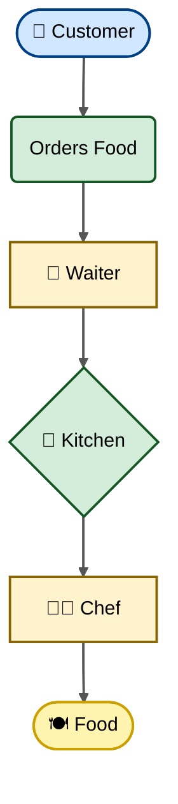
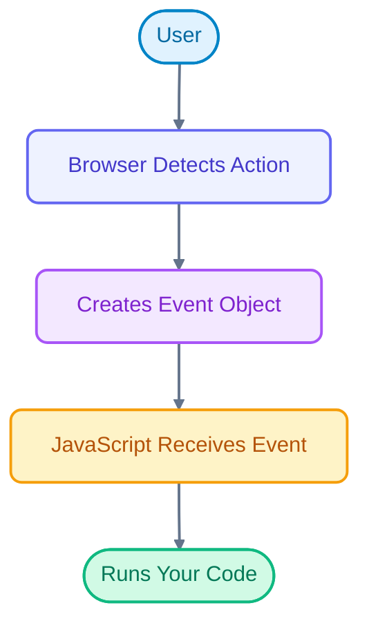
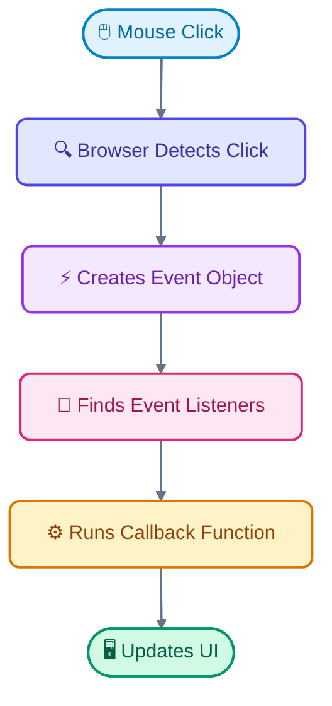

Now we reach the chapter that separates beginners from professional frontend engineers.

Most courses teach:

```javascript
button.addEventListener("click", () => {});
```

and stop there.

A browser engineer asks:

* **How does the browser know which element was clicked?**
* **Why do parent click events sometimes fire too?**
* **What exactly travels through the DOM?**
* **Why does React use event delegation?**
* **Why do some bugs disappear when using `stopPropagation()`?**

This chapter answers all of those questions.

<Callout title="Goal" type="success" >
Understand how browsers detect user actions, create events, propagate them through the DOM tree, and how to build scalable event-driven applications.
</Callout>


## 🎯 Learning Objectives

After this chapter, you should be able to:

* Understand what an Event is
* Explain the Event Object
* Register and remove event listeners
* Understand the Event Flow
* Explain Capturing, Target and Bubbling
* Use Event Delegation
* Understand `event.target` vs `event.currentTarget`
* Use `preventDefault()`
* Use `stopPropagation()`
* Build scalable event-driven applications


## Why Do Events Exist?

Imagine a webpage with no events.

```html
<button>Save</button>
```

You click.

Nothing happens.

Why?

Because HTML only describes **what exists**.

JavaScript decides **how it behaves**.

Events are the communication bridge between the **user** and the **application**.


## Real Life Analogy

Imagine a restaurant.



The customer never talks directly to the chef.

The waiter carries the request.

The Event System works the same way.



---

## What is an Event?

An Event is simply **a notification that something happened.**

Examples

* Mouse Click
* Keyboard Press
* Page Loaded
* Form Submitted
* Scroll
* Resize
* Touch
* Drag
* Copy
* Paste

Every user interaction creates an Event Object.


## Event Lifecycle

Suppose you click a button.

The browser performs these steps.




## Adding Event Listeners

HTML

```html
<button id="btn">
    Click Me
</button>
```

JavaScript

```javascript
const btn = document.querySelector("#btn");

btn.addEventListener("click", () => {
    console.log("Button clicked");
});
```

Output

```
Button clicked
```

## Why `addEventListener()`?

Old method

```javascript
btn.onclick = function(){
    ...
}
```

Problem

```javascript
btn.onclick = firstFunction;

btn.onclick = secondFunction;
```

Only the second function survives.

Modern

```javascript
btn.addEventListener("click", firstFunction);

btn.addEventListener("click", secondFunction);
```

Both execute.

---

## Anatomy of `addEventListener()`

```javascript
element.addEventListener(

    eventType,

    callbackFunction,

    options

);
```

Example

```javascript
button.addEventListener(

    "click",

    handleClick

);
```


## Common Event Types

### Mouse

```text
click

dblclick

mousedown

mouseup

mousemove

mouseenter

mouseleave
```


### Keyboard

```text
keydown

keyup

keypress (deprecated)
```


### Form

```text
submit

input

change

focus

blur
```


### Window

```text
load

resize

scroll
```


### Clipboard

```text
copy

paste

cut
```

---

## The Event Object

Whenever an event occurs,

the browser creates an object.

Example

```javascript
button.addEventListener("click",(event)=>{

    console.log(event);

});
```

The browser automatically passes the Event Object.

Example Output

```js
MouseEvent

{

target,

type,

clientX,

clientY,

timeStamp,

...

}
```

Practical Example


---

# Useful Event Properties

```javascript
event.type
```

Returns

```
click
```

---

```javascript
event.target
```

Returns

The actual clicked element.

---

```javascript
event.currentTarget
```

Returns

The element whose listener is executing.

---

```javascript
event.clientX
```

Mouse X position.

---

```javascript
event.clientY
```

Mouse Y position.

---

# Example

```javascript
button.addEventListener("click",(event)=>{

console.log(event.type);

console.log(event.target);

console.log(event.clientX);

});
```

---

# Event Flow

This is the most important concept.

Imagine this HTML.

```html
<div>

    <button>

        Click

    </button>

</div>
```

Question

When the button is clicked,

who receives the event first?

The button?

The div?

The body?

The document?

The answer is

**Everyone.**

Just not at the same time.

---

# The Three Phases

```text
Capturing

↓

Target

↓

Bubbling
```

Memorize this.

Every browser follows these three phases.

---

## Step 1 — Capturing Phase

The event travels

from

```text
Window

↓

Document

↓

HTML

↓

Body

↓

Div

↓

Button
```

Think of it as travelling **down** the tree.

---

## Step 2 — Target Phase

The event reaches

```text
Button
```

Your button listener executes.

---

## Step 3 — Bubbling Phase

Now the event travels

back up.

```text
Button

↓

Div

↓

Body

↓

HTML

↓

Document

↓

Window
```

---

# Complete Visualization

```text
Window
│
Document
│
HTML
│
BODY
│
DIV
│
BUTTON

Capturing
↓

↓

↓

↓

↓

Target

↑

↑

↑

↑

↑

Bubbling
```

This explains why clicking a child element can also trigger handlers attached to its ancestors.

---

# Example

```html
<div id="parent">

<button id="child">

Click

</button>

</div>
```

```javascript
parent.addEventListener("click",()=>{

console.log("Parent");

});

child.addEventListener("click",()=>{

console.log("Child");

});
```

Click button

Output

```
Child

Parent
```

Why?

Because bubbling happens after the target phase.

---

# Event Bubbling in Real Life

Imagine dropping a stone into a pond.

```
Stone

↓

Water

↓

Ripples move outward
```

The click starts at the target.

Then spreads upward through parents.

---

# `stopPropagation()`

Stops further propagation.

```javascript
child.addEventListener("click",(event)=>{

event.stopPropagation();

});
```

Now

```
Child
```

Parent never receives the event.

---

# `preventDefault()`

Some HTML elements have default behavior.

Example

```html
<a href="https://google.com">

Google

</a>
```

Normally

Click

↓

Browser opens Google.

---

Prevent it

```javascript
link.addEventListener("click",(event)=>{

event.preventDefault();

});
```

Now

No navigation.

Useful for

* Form Validation
* SPA Routing
* Custom Buttons

---

# Event Delegation

One of the most important engineering techniques.

Imagine

10,000 buttons.

Bad

```javascript
buttons.forEach(button=>{

button.addEventListener(...);

});
```

10,000 listeners.

Large memory usage.

---

Better

Attach

ONE listener.

```javascript
list.addEventListener("click",(event)=>{

});
```

Use

```javascript
event.target
```

to determine which child was clicked.

---

Example

```html
<ul id="list">

<li>Apple</li>

<li>Mango</li>

<li>Orange</li>

</ul>
```

```javascript
list.addEventListener("click",(event)=>{

console.log(event.target.textContent);

});
```

Click

```
Mango
```

Output

```
Mango
```

One listener.

Unlimited list items.

---

# Why React Uses Event Delegation

React doesn't attach listeners to every component.

Instead,

it attaches very few listeners near the root.

Then,

it uses the Event Object to determine what was clicked.

Benefits

* Less memory
* Faster startup
* Easier updates
* Better scalability

---

# Removing Event Listeners

Sometimes you need to clean up listeners to avoid memory leaks.

```javascript
function handleClick() {
  console.log("Clicked");
}

button.addEventListener("click", handleClick);

// Later
button.removeEventListener("click", handleClick);
```

**Important:** The same function reference must be passed to `removeEventListener()`. Anonymous arrow functions cannot be removed because you no longer have a reference to them.

---

# Common Mistakes

❌ Creating thousands of identical event listeners.

✔️ Use **event delegation** whenever appropriate.

---

❌ Using `preventDefault()` to stop bubbling.

✔️ `preventDefault()` stops the browser's default action, **not** event propagation.

---

❌ Assuming `event.target` and `event.currentTarget` are always the same.

✔️ `event.target` is the element that originated the event; `event.currentTarget` is the element whose listener is currently executing.

---

# Interview Questions

1. What is an Event?
2. What is the Event Object?
3. Explain the three phases of event propagation.
4. What is the difference between Capturing and Bubbling?
5. What is the difference between `event.target` and `event.currentTarget`?
6. What does `preventDefault()` do?
7. What does `stopPropagation()` do?
8. Why is Event Delegation important?
9. Why does React use Event Delegation?
10. Why should you remove unused event listeners?

---

# Exam Notes (20% That Covers 100%)

* **Event:** A notification generated by the browser when an interaction or change occurs.
* **Event Listener:** A function registered with `addEventListener()` that runs when a specific event occurs.
* **Event Object:** Contains information about the event, such as `target`, `type`, `clientX`, and `clientY`.
* **Event Flow:** Every event passes through three phases: **Capturing → Target → Bubbling**.
* **`event.target`:** The element where the event originated.
* **`event.currentTarget`:** The element whose event listener is currently executing.
* **`preventDefault()`:** Prevents the browser's default behavior (for example, form submission or link navigation).
* **`stopPropagation()`:** Stops the event from continuing through the propagation phases.
* **Event Delegation:** A technique where a parent element handles events for its child elements using a single listener, improving performance and scalability.

---

# 🏗️ Mini Project — Interactive Todo List

Upgrade the Todo application from the previous chapter:

### Features

* Add new todos.
* Delete todos by clicking a delete button.
* Mark todos as completed by clicking the item.
* Use **only one** click listener on the `<ul>` (Event Delegation).
* Prevent the form from reloading the page with `preventDefault()`.
* Use `data-id` attributes to identify todos.
* Add a "Clear Completed" button.

> **Engineering Challenge:** Try to implement the entire application with **only one click listener** and **one submit listener**. This mirrors the event architecture used in many modern UI frameworks and demonstrates that you understand how the browser's event system scales.
