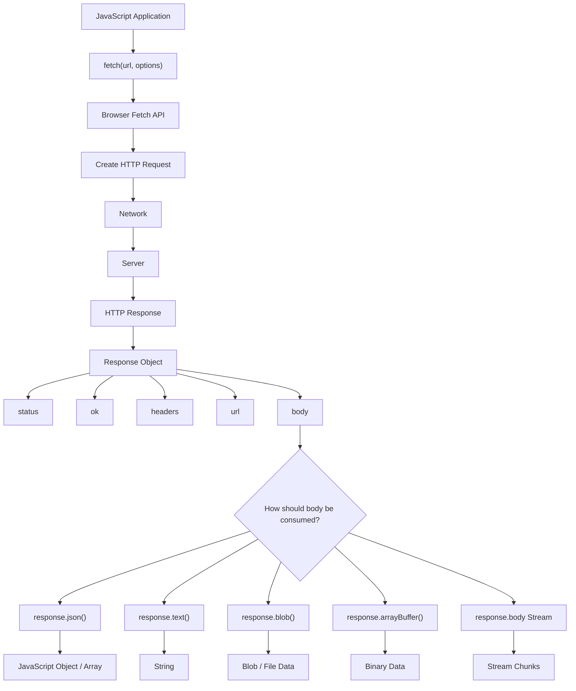

# 1. Fetch API — Complete Concept

The **Fetch API** is the modern browser API used to communicate with servers over HTTP.

In simple words:

> **JavaScript uses `fetch()` to send a request to a server and receive a response.**

For example:

```js
const response = await fetch("/api/users");
```

This looks simple, but underneath it involves several concepts:

```text
JavaScript
    ↓
fetch()
    ↓
HTTP Request
    ↓
Network
    ↓
Server
    ↓
HTTP Response
    ↓
Response object
    ↓
Read response body
    ↓
JavaScript data
```

---

# 2. Why do we need Fetch?

Suppose your frontend is:

```text
Next.js / React
```

and your backend is:

```text
Express.js
```

The browser needs some mechanism to communicate with the backend.

For example:

```text
React App
   |
   | GET /api/users
   ↓
Express Server
   |
   | JSON
   ↓
React App
```

Fetch provides that communication mechanism.

---

# 3. Basic Fetch

The simplest example:

```js
fetch("/api/users");
```

But this isn't usually enough because `fetch()` is asynchronous.

A better version:

```js
const response = await fetch("/api/users");

console.log(response);
```

And if the server returns JSON:

```js
const response = await fetch("/api/users");

const data = await response.json();

console.log(data);
```

This gives us:

```text
fetch()
   ↓
Response
   ↓
response.json()
   ↓
JavaScript object/array
```

---

# 4. The Most Important Concept: `fetch()` Does NOT Return Your Data

This is one of the most important things to understand.

When you write:

```js
const result = await fetch("/api/users");
```

`result` is **not**:

```js
[
  { name: "Ali" },
  { name: "Ahmed" }
]
```

Instead, it is a **Response object**.

Conceptually:

```text
fetch()
  ↓
Response object
  ├── status
  ├── ok
  ├── headers
  ├── url
  ├── body
  └── other metadata
```

Then you read the body:

```js
const response = await fetch("/api/users");

const users = await response.json();
```

Now:

```text
fetch()
   ↓
Response object
   ↓
.json()
   ↓
JavaScript data
```

This distinction becomes extremely important when you work with streams later.

---

# 5. Why are there TWO `await`s?

You often see:

```js
const response = await fetch("/api/users");

const data = await response.json();
```

Beginners often wonder:

> Why do we need `await` twice?

Because **two asynchronous operations are happening**.

### First:

```js
await fetch(...)
```

means:

> Wait until the HTTP response is available.

### Second:

```js
await response.json()
```

means:

> Wait while the response body is read and converted from JSON into JavaScript data.

So:

```text
await fetch()
       ↓
HTTP response arrives
       ↓
Response object
       ↓
await response.json()
       ↓
Response body is consumed
       ↓
JavaScript object
```

---

# 6. Fetch is Promise-based

`fetch()` returns a **Promise**.

Therefore:

```js
fetch("/api/users")
```

is conceptually:

```text
Promise<Response>
```

You can use `.then()`:

```js
fetch("/api/users")
  .then(response => response.json())
  .then(data => {
    console.log(data);
  });
```

Or modern `async/await`:

```js
async function getUsers() {
  const response = await fetch("/api/users");
  const data = await response.json();

  console.log(data);
}
```

Both are valid.

For modern application code, you'll commonly see:

```js
async/await
```

because it is easier to read.

---

# 7. GET Request

The default method of `fetch()` is:

```http
GET
```

Therefore:

```js
fetch("/api/users");
```

is approximately:

```http
GET /api/users
```

You can explicitly write it:

```js
fetch("/api/users", {
  method: "GET"
});
```

But normally this is unnecessary.

---

# 8. POST Request

Suppose you want to create a user.

You can send:

```js
const response = await fetch("/api/users", {
  method: "POST",
  headers: {
    "Content-Type": "application/json"
  },
  body: JSON.stringify({
    name: "Ali",
    email: "ali@example.com"
  })
});
```

Notice something important:

```js
body: JSON.stringify(...)
```

Why?

Because HTTP sends bytes/text, while JavaScript has an object.

We convert:

```js
{
  name: "Ali"
}
```

into JSON:

```json
{
  "name": "Ali"
}
```

using:

```js
JSON.stringify()
```

---

# 9. `Content-Type`

This:

```js
headers: {
  "Content-Type": "application/json"
}
```

tells the server:

> "The request body contains JSON."

Without the appropriate content type, the server may not interpret the body as intended.

Conceptually:

```text
JavaScript Object
       ↓
JSON.stringify()
       ↓
JSON request body
       ↓
Content-Type: application/json
       ↓
Server
```

---

# 10. PUT vs PATCH

Fetch doesn't care whether you use:

```text
GET
POST
PUT
PATCH
DELETE
```

You specify the method.

### PUT

Usually means replacing/updating a resource.

```js
await fetch("/api/users/10", {
  method: "PUT",
  headers: {
    "Content-Type": "application/json"
  },
  body: JSON.stringify({
    name: "Ahmed",
    email: "ahmed@example.com"
  })
});
```

### PATCH

Usually means partially updating a resource.

```js
await fetch("/api/users/10", {
  method: "PATCH",
  headers: {
    "Content-Type": "application/json"
  },
  body: JSON.stringify({
    name: "Ahmed"
  })
});
```

### DELETE

```js
await fetch("/api/users/10", {
  method: "DELETE"
});
```

---

# 11. Understanding the Response Object

Suppose:

```js
const response = await fetch("/api/users");
```

You can inspect:

```js
console.log(response.status);
```

Example:

```text
200
```

You can check:

```js
console.log(response.ok);
```

For successful HTTP status codes, this is generally:

```js
true
```

You can inspect:

```js
console.log(response.headers);
```

and:

```js
console.log(response.url);
```

So think:

```text
Response
│
├── status
├── ok
├── statusText
├── headers
├── url
├── body
└── ...
```

---

# 12. `response.ok`

This is extremely useful.

Example:

```js
const response = await fetch("/api/users");

if (!response.ok) {
  throw new Error("Request failed");
}

const data = await response.json();
```

Why?

Because **Fetch does not automatically reject the Promise for normal HTTP errors**.

This is a critical concept.

---

# 13. Fetch and HTTP 404

Suppose the server responds:

```http
404 Not Found
```

You might expect:

```js
fetch(...)
```

to throw an error automatically.

It generally doesn't.

Instead:

```js
const response = await fetch("/missing-page");

console.log(response.status);
```

could produce:

```text
404
```

and:

```js
response.ok
```

will be:

```text
false
```

So you should often explicitly check:

```js
if (!response.ok) {
  throw new Error(`HTTP error: ${response.status}`);
}
```

---

# 14. HTTP Error vs Network Error

This distinction is extremely important for production applications.

### HTTP error

Server successfully responded:

```text
404
401
403
500
```

Fetch itself generally resolves.

You check:

```js
response.ok
```

---

### Network failure

For example:

```text
No internet
DNS failure
Connection failure
Request blocked at network level
```

Then the Fetch Promise can reject.

Example:

```js
try {
  const response = await fetch("/api/users");

  if (!response.ok) {
    throw new Error(`HTTP ${response.status}`);
  }

  const data = await response.json();

} catch (error) {
  console.error(error);
}
```

This gives you a useful mental model:

```text
fetch()
   │
   ├── Network failure
   │       ↓
   │     catch
   │
   └── Response received
           │
           ├── 2xx → response.ok = true
           │
           └── 4xx/5xx → response.ok = false
```

---

# 15. Reading JSON

The most common response format for APIs is JSON.

Suppose server sends:

```json
{
  "name": "Hafaz",
  "role": "developer"
}
```

You do:

```js
const response = await fetch("/api/user");

const data = await response.json();

console.log(data.name);
```

Output:

```text
Hafaz
```

---

# 16. Important: Response Body Can Be Consumed

This is another deeper concept.

When you do:

```js
const data = await response.json();
```

the response body is **consumed**.

You generally cannot then do:

```js
const text = await response.text();
```

on the same body and expect it to work normally.

Think of the body like a stream:

```text
Response Body
     ↓
  consumed
     ↓
.json()
```

After consumption, the body is no longer available in the same way.

This becomes particularly important when we reach:

> **Stream chunk parsing**

---

# 17. Other Response Readers

Fetch provides different ways to consume the response body.

### JSON

```js
await response.json();
```

For APIs returning JSON.

### Text

```js
await response.text();
```

For plain text, HTML, etc.

### Blob

```js
await response.blob();
```

Useful for files/images.

### ArrayBuffer

```js
await response.arrayBuffer();
```

Useful when working with raw binary data.

There are also stream-oriented APIs we'll cover separately.

---

# 18. Query Parameters

Suppose you need:

```text
/api/users?page=2&limit=20
```

You can construct the URL:

```js
const params = new URLSearchParams({
  page: "2",
  limit: "20"
});

const response = await fetch(`/api/users?${params}`);
```

This is preferable to manually constructing complicated query strings.

<Card title='What is Query Parameter?' href='/docs/module7/query'>

A query parameter is a key-value pair appended to the end of a URL to pass extra data or instructions to a web server. They allow a single webpage or API endpoint to dynamic alter its behavior—such as filtering, sorting, or searching data—without changing the core address itself.

</Card>

---

# 19. Headers

Headers contain metadata about the request/response.

Example:

```js
const response = await fetch("/api/users", {
  headers: {
    Accept: "application/json"
  }
});
```

A common authenticated request might look like:

```js
const response = await fetch("/api/profile", {
  headers: {
    Authorization: `Bearer ${token}`
  }
});
```

But authentication strategy depends on your application architecture. In modern web applications, cookies are often preferable to exposing long-lived tokens to JavaScript.

---

# 20. Credentials

Fetch has a `credentials` option.

Example:

```js
fetch("/api/profile", {
  credentials: "include"
});
```

This is relevant when requests need browser-managed credentials such as cookies, particularly with cross-origin requests.

The common values are:

```text
omit
same-origin
include
```

Default behavior is generally:

```text
same-origin
```

Understanding this will become important when we study **CORS**.

---

# 21. Fetch + FormData

You don't always send JSON.

For file uploads:

```js
const formData = new FormData();

formData.append("username", "Ali");
formData.append("avatar", file);

const response = await fetch("/api/upload", {
  method: "POST",
  body: formData
});
```

Notice:

**Do not manually set:**

```js
Content-Type: multipart/form-data
```

when using `FormData`.

The browser needs to generate the correct multipart boundary automatically.

---

# 22. Fetch is Not Only for APIs

Although we commonly use Fetch for REST APIs:

```js
fetch("/api/users");
```

it can fetch:

```text
JSON
HTML
text
images
files
binary data
streaming responses
```

So:

> Fetch is fundamentally an HTTP resource-fetching API, not merely a "JSON API function."

This distinction becomes valuable as you become more advanced.

---

# 23. Same-Origin Requests

Suppose your frontend runs at:

```text
https://example.com
```

and requests:

```text
https://example.com/api/users
```

That's the same origin.

But:

```text
Frontend:
https://example.com

Backend:
https://api.example.com
```

is a **different origin** because the host differs.

And:

```text
http://localhost:3000
```

vs:

```text
http://localhost:5000
```

are also different origins because the ports differ.

That's where **CORS** becomes important.

We'll cover CORS separately.

---

# 24. A Professional Fetch Function

Instead of repeating:

```js
const response = await fetch(...);

if (!response.ok) {
  ...
}

const data = await response.json();
```

everywhere, you can create a reusable API function.

Example:

```js
async function fetchUsers() {
  const response = await fetch("/api/users");

  if (!response.ok) {
    throw new Error(`HTTP error: ${response.status}`);
  }

  return response.json();
}
```

Then:

```js
try {
  const users = await fetchUsers();

  console.log(users);
} catch (error) {
  console.error(error);
}
```

This separation is useful:

```text
UI
 ↓
fetchUsers()
 ↓
fetch()
 ↓
HTTP
 ↓
Server
```

---

# 25. Production-Level Fetch Wrapper

As applications become larger, you may create something like:

```js
async function apiFetch(url, options = {}) {
  const response = await fetch(url, options);

  if (!response.ok) {
    throw new Error(`Request failed: ${response.status}`);
  }

  return response.json();
}
```

Then:

```js
const users = await apiFetch("/api/users");
```

and:

```js
const user = await apiFetch("/api/users/10");
```

This centralizes common behavior.

Later you can add:

```text
authentication
logging
error normalization
timeouts
retry policies
request IDs
JSON handling
refresh logic
```

But don't make an abstraction too early. Understand raw Fetch first.

---

# 26. Complete Request Lifecycle

Here's the conceptual model you should remember:

```text
                    FETCH LIFECYCLE

JavaScript
    │
    │ fetch(url, options)
    ↓
Browser Fetch machinery
    │
    │ construct HTTP request
    ↓
Network
    │
    ↓
Server
    │
    │ process request
    ↓
HTTP Response
    │
    ↓
Response object
    │
    ├── status
    ├── headers
    ├── ok
    └── body
          │
          ↓
      Consume body
          │
      ┌───┼───────────┐
      ↓   ↓           ↓
    json text       blob
      │
      ↓
JavaScript data
```

---

# 27. Mermaid Diagram

You can use this in your notes:



---

# 28. The 20% You Must Remember

If you remember only these concepts, you already understand the core of Fetch:

### 1. `fetch()` returns a Promise

```js
const response = await fetch(url);
```

### 2. The result is a `Response`

Not your JSON data.

```js
response
```

### 3. Read the body separately

```js
const data = await response.json();
```

### 4. HTTP errors don't automatically mean Fetch rejected

Check:

```js
if (!response.ok) {
  throw new Error(...);
}
```

### 5. Request configuration goes in the second argument

```js
fetch(url, {
  method: "POST",
  headers: {},
  body: ...
});
```

### 6. JSON requests normally require serialization

```js
body: JSON.stringify(data)
```

### 7. Response bodies can be consumed in different ways

```js
json()
text()
blob()
arrayBuffer()
body
```

And the last one, `response.body`, is the bridge toward our later topic:

> **stream chunk parsing**

---

# 29. Your Mental Model

Don't memorize Fetch as:

> "`fetch()` gets data."

Think of it as:

> **Fetch creates an HTTP request and gives JavaScript a Response object whose body must then be consumed.**

That mental model will make the next three topics much easier:

```text
                 MODERN FETCHING

                      fetch()
                         │
                         ↓
                  HTTP Request
                         │
                         ↓
                     Response
                         │
              ┌──────────┼──────────┐
              ↓          ↓          ↓
        AbortController  CORS    Response.body
                                    │
                                    ↓
                              Stream chunks
```

### Next topic: **`AbortController`**

We'll cover it from the ground up, including **why cancellation is needed, how `AbortSignal` works, cancelling Fetch, React use cases, race conditions, timeouts, multiple requests, and common mistakes**, with a Mermaid diagram.
