<Callout type='info'>
Before learning the DOM, understand **how a browser converts code into pixels on the screen.**
</Callout>


## 🎯 Learning Objectives

After this chapter you should understand:

* What a browser actually is
* Browser architecture
* Browser processes
* Rendering Engine
* JavaScript Engine
* HTML Parsing
* CSS Parsing
* DOM Tree
* CSSOM
* Render Tree
* Layout
* Paint
* Composite
* Rendering Pipeline


## Why Should We Learn Browser Internals?

Most beginners think

```
HTML
↓

Browser

↓

Website
```

Reality is much more complex.

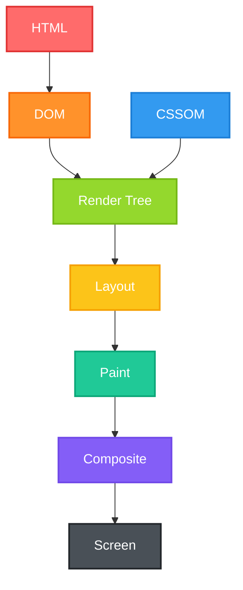

If you understand this pipeline, you can solve almost every frontend performance problem.


## Real Life Analogy

Imagine building a house.

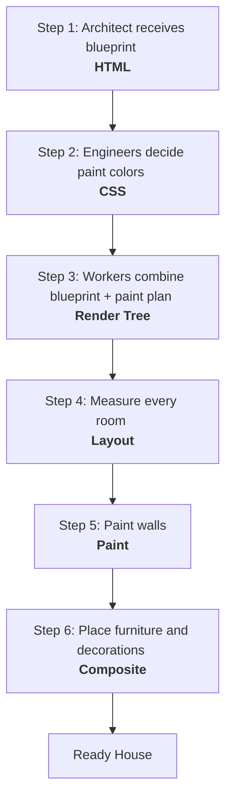

Exactly how browsers build webpages.


## What is a Browser?

A browser is **software that understands web technologies and displays web pages**.

Examples

* Chrome
* Edge
* Firefox
* Safari
* Brave

A browser's responsibilities include:

* Downloading HTML
* Downloading CSS
* Downloading JavaScript
* Executing JavaScript
* Rendering the UI
* Handling user interactions
* Managing storage
* Managing network requests
* Enforcing security

Think of the browser as a **mini operating system dedicated to web applications**.

---

## Browser Architecture

Modern browsers consist of multiple independent processes for performance and security.

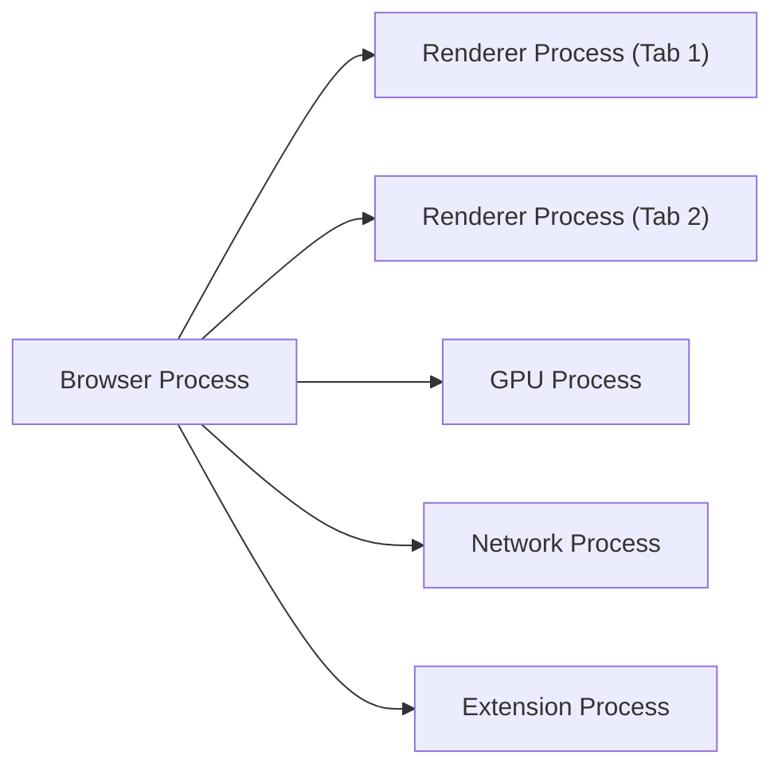

---

## 1. Browser Process

Controls everything.

Responsibilities:

* Tabs
* Address bar
* Navigation
* Bookmarks
* History
* Permissions

Think of it as the **manager**.

---

## 2. Renderer Process

Every tab gets its own renderer.

Responsibilities:

* Parse HTML
* Parse CSS
* Execute JavaScript
* Build DOM
* Render UI

Think of it as the **construction team**.

---

## 3. GPU Process

Handles

* Animations
* CSS transforms
* Videos
* Hardware acceleration

Analogy:

Instead of asking one worker to lift a heavy object, you use a crane.

---

## 4. Network Process

Responsible for

* HTTP Requests
* HTTPS
* Caching
* Downloads

---

## 5. Extension Process

Runs browser extensions safely.

Examples:

AdBlock, Grammarly, Dark Reader

---

## Why Multiple Processes?

Imagine opening ten tabs.

Without process isolation:

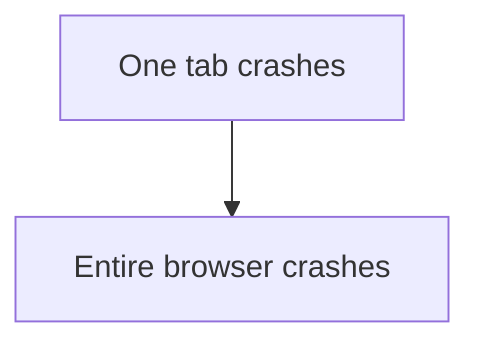

Modern browsers:

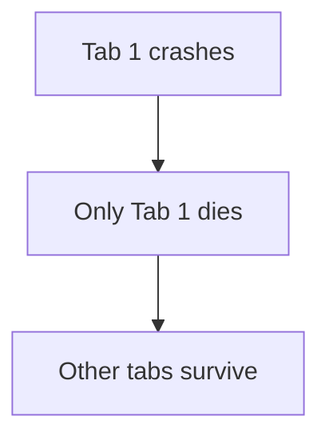

This is called **Process Isolation**.

---

## Inside the Renderer Process

<Callout title='For More information please visit :' type='info'>
https://developer.chrome.com/blog/inside-browser-part3
</Callout>


The renderer itself contains multiple engines.

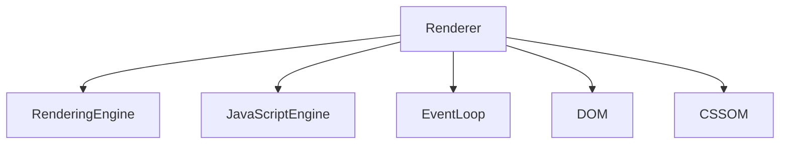

---

## Rendering Engine

Responsible for displaying webpages.

Chrome uses

**Blink**

Responsibilities:

* Parse HTML
* Parse CSS
* Build DOM
* Build CSSOM
* Render Tree
* Layout
* Paint

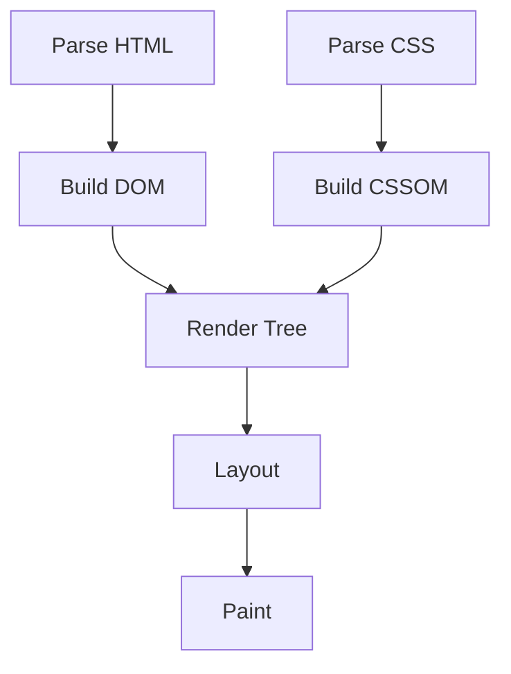
---

## JavaScript Engine

Responsible for executing JavaScript.

Chrome uses

**V8 Engine**

Responsibilities:

* Parse JavaScript
* Compile JavaScript
* Execute JavaScript
* Garbage Collection
* Memory Management

Think of V8 as the **brain** of your JavaScript application.

---

## Browser Rendering Pipeline

This is the most important concept in DOM Engineering.

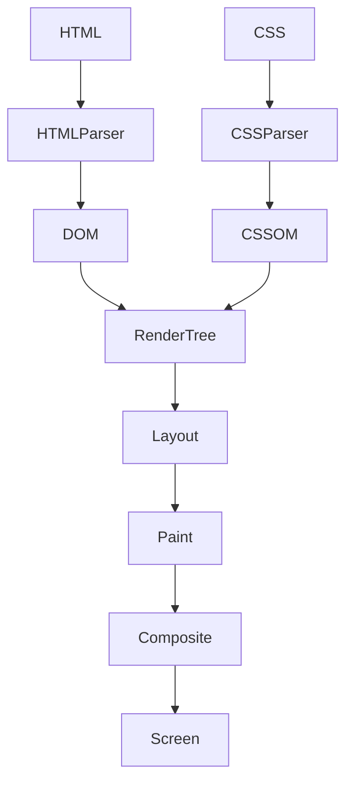

Memorize this pipeline. It appears in interviews, performance debugging, and browser optimization.


## Step 1 — HTML Parsing

Browser receives HTML.

Example

```html
<body>
  <h1>Hello</h1>
  <p>Welcome</p>
</body>
```

The browser doesn't display this text directly.

Instead it creates objects.

```
Body
↓
h1
↓
p
```

These objects form the DOM Tree.


## Step 2 — DOM Tree

DOM stands for

**Document Object Model**

HTML

```html
<body>
    <h1>Hello</h1>
    <p>Welcome</p>
</body>
```

DOM Tree

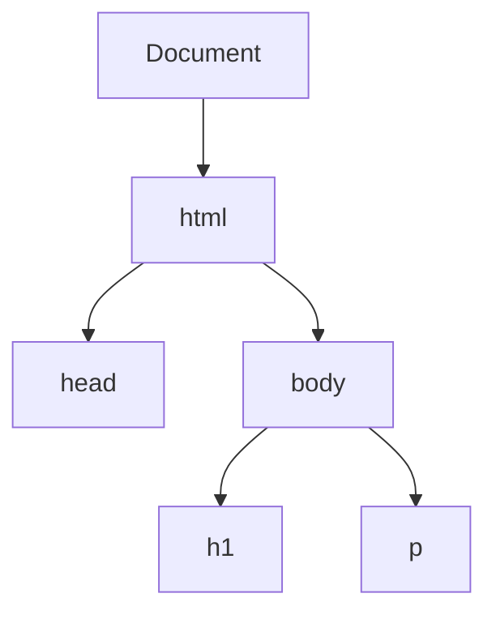

The DOM is a live object model that JavaScript can read and modify.


## Step 3 — CSS Parsing

CSS

```css
h1{
 color:red;
}

p{
 color:blue;
}
```

Browser builds

```
CSSOM
```

CSSOM (CSS Object Model)

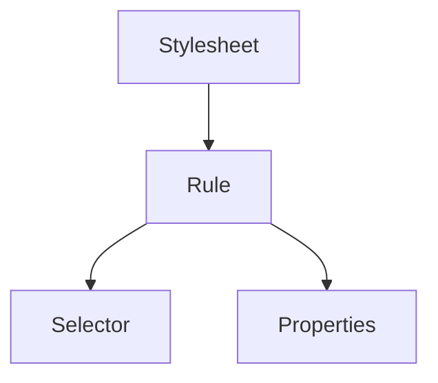


## Step 4 — Render Tree

DOM contains everything.

CSSOM contains styles.

Browser merges them.

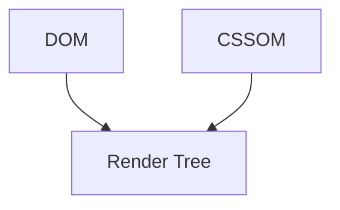

Only **visible** elements become part of the Render Tree.

Example

```html
<div>Hello</div>

<div style="display:none">
Hidden
</div>
```

Render Tree contains

```
div

```
NOT hidden `div` Because `display: none` removes it from rendering.


## Step 5 — Layout (Reflow)

Now the browser calculates

* Width
* Height
* Position
* Margin
* Padding

Everything receives exact coordinates.

Example

**Button:**
```
Width = 150px

Height = 40px

X = 250px

Y = 500px
```

Without layout, the browser knows an element exists but not where to place it.


## Step 6 — Paint

Browser paints

* Text
* Borders
* Shadows
* Backgrounds
* Images

Imagine coloring a sketch after all measurements are complete.


## Step 7 — Composite

Finally, layers are combined.

GPU joins them together.

Screen displays

```
Finished Website
```


## Complete Rendering Flow


This is the rendering pipeline every modern browser follows.

---

## What Happens When JavaScript Changes the DOM?

Example

```javascript
document.querySelector("h1").textContent = "Welcome!";
```

The browser does not rebuild everything from scratch. It intelligently updates the affected parts:

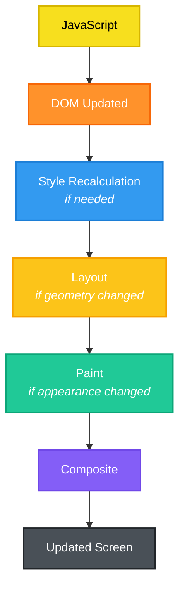

Understanding which operations trigger style recalculation, layout, or paint is the foundation of frontend performance optimization.

---

## Industry Insight

Performance engineers spend a lot of time avoiding unnecessary work in this pipeline. For example:

* Changing only `color` usually skips layout and only repaints.
* Changing `width` often forces layout because element sizes and positions change.
* Animating `transform` or `opacity` is usually the most efficient because it can often be handled by the compositor and GPU.

We'll explore these optimizations in later chapters.


## Common Misconceptions

❌ HTML is the DOM.

✔️ HTML is **source code**. The DOM is an **object tree** created from that source.


❌ CSS directly styles HTML.

✔️ CSS is first parsed into the **CSSOM**, then combined with the DOM.


❌ JavaScript changes the screen directly.

✔️ JavaScript modifies the DOM or CSSOM, and the browser decides how to update the rendered page.


## Interview Questions

1. What is the difference between the DOM and HTML?
2. What is the CSSOM?
3. What is the Render Tree?
4. Why are elements with `display: none` excluded from the Render Tree?
5. Explain the browser rendering pipeline.
6. What is the role of the Renderer Process?
7. What is the difference between Blink and V8?
8. Why do modern browsers use multiple processes?
9. What happens after JavaScript modifies the DOM?
10. Which rendering stages are the most expensive, and why?


## Exam Notes (20% That Covers 100%)

* **Browser:** Software that downloads resources, executes JavaScript, renders pages, and enforces web security.
* **Browser Process:** Manages tabs, navigation, history, permissions, and coordinates other processes.
* **Renderer Process:** Parses HTML/CSS, executes JavaScript, builds the DOM and CSSOM, and renders the page.
* **Blink:** Chrome's rendering engine responsible for turning HTML/CSS into pixels.
* **V8:** Chrome's JavaScript engine responsible for compiling and executing JavaScript.
* **DOM:** Object representation of the HTML document.
* **CSSOM:** Object representation of all parsed CSS rules.
* **Render Tree:** Combination of the DOM and CSSOM containing only visible elements.
* **Layout (Reflow):** Calculates the size and position of every visible element.
* **Paint:** Draws text, colors, borders, backgrounds, and images.
* **Composite:** Combines painted layers into the final image displayed on the screen.
* **Rendering Pipeline:** HTML → DOM → CSSOM → Render Tree → Layout → Paint → Composite → Screen.


## Hands-on Practice

Create a simple HTML page with a heading, paragraph, image, and button.

1. Open Chrome DevTools (`F12`).
2. Inspect the **Elements** panel to view the live DOM tree.
3. Open the **Console** and execute:

```javascript
document.querySelector("h1").textContent = "Browser Engineering!";
```

Observe how the page updates instantly without a full reload.

Then experiment by changing:

* `style.color`
* `style.width`
* `style.display`

As you proceed through this module, revisit this page to observe how different DOM and CSS changes affect the browser's rendering pipeline. This practical understanding will make the later topics—reflow, repaint, event handling, and performance optimization—much easier to master.
