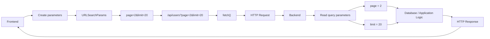

# Query Parameters — From Zero

Imagine you have an API:

```text
/api/users
```

This means:

> "Give me users."

But what if you don't want **all** users?

You might want:

* page 2
* only 20 users
* users from CS department
* users whose name contains "Ali"

We can send this extra information through the URL.

That's where **query parameters** come in.

---

## 1. First understand this URL

Look at:

```text
/api/users?page=2&limit=20
```

Break it apart:

```text
/api/users
     │
     └── endpoint

?page=2&limit=20
│
└── query parameters
```

The `?` means:

> "The main URL ends here. Now I'm sending additional information."

So:

```text
/api/users?page=2&limit=20
```

means approximately:

> "Give me users, but I want page 2 and a limit of 20 users."

---

# 2. What is `page=2`?

This is a **key-value pair**:

```text
page = 2
```

Similarly:

```text
limit = 20
```

So:

```text
page=2&limit=20
```

contains two query parameters:

| Parameter | Value |
| --------- | ----: |
| `page`    |   `2` |
| `limit`   |  `20` |

The `&` separates multiple parameters.

```text
page=2 & limit=20
       ↑
   separator
```

---

# 3. Real-Life Analogy

Imagine going to a restaurant.

You say:

> "Give me pizza."

That's like:

```text
/api/pizza
```

But then you say:

> "Give me pizza, large size, quantity 2."

Now you are giving additional instructions:

```text
/api/pizza?size=large&quantity=2
```

The main resource is:

```text
/api/pizza
```

Additional information:

```text
size=large
quantity=2
```

That's basically what query parameters do.

---

# 4. Why are query parameters useful?

Imagine your university social platform has:

```text
/api/posts
```

You have 10,000 posts.

You don't want the server to send all 10,000 posts every time.

You could request:

```text
/api/posts?page=1&limit=20
```

Meaning:

> Give me the first 20 posts.

Then:

```text
/api/posts?page=2&limit=20
```

Meaning:

> Give me the next page of 20 posts.

This is called **pagination**.

---

# 5. Manually Writing the URL

You could simply write:

```js
const response = await fetch(
  "/api/users?page=2&limit=20"
);
```

This works.

So why did I introduce:

```js
URLSearchParams
```

?

Because manually constructing URLs becomes messy when there are many parameters.

For example:

```js
const response = await fetch(
  `/api/users?page=${page}&limit=${limit}&department=${department}&search=${search}&sort=${sort}`
);
```

Now things become harder to manage.

---

# 6. Enter `URLSearchParams`

JavaScript provides a built-in API called:

```js
URLSearchParams
```

It helps you construct query parameters safely and cleanly.

For example:

```js
const params = new URLSearchParams({
  page: "2",
  limit: "20"
});
```

Now `params` represents:

```text
page=2&limit=20
```

You can see it:

```js
console.log(params.toString());
```

Output:

```text
page=2&limit=20
```

Then:

```js
const response = await fetch(`/api/users?${params}`);
```

becomes:

```text
/api/users?page=2&limit=20
```

---

# 7. Let's Understand the Code Slowly

This:

```js
const params = new URLSearchParams({
  page: "2",
  limit: "20"
});
```

means:

> Create a query-parameter object containing `page=2` and `limit=20`.

Then:

```js
`${params}`
```

converts it into:

```text
page=2&limit=20
```

Therefore:

```js
fetch(`/api/users?${params}`);
```

becomes:

```text
/api/users?page=2&limit=20
```

---

# 8. Visualize the Transformation

```text
JavaScript object
       ↓
{
  page: "2",
  limit: "20"
}
       ↓
new URLSearchParams(...)
       ↓
"page=2&limit=20"
       ↓
"/api/users?" + params
       ↓
/api/users?page=2&limit=20
       ↓
fetch()
       ↓
Server
```

This is the entire idea.

---

# 9. Why not just use an object?

You might ask:

> Why can't I do this?

```js
const params = {
  page: 2,
  limit: 20
};
```

Because `fetch()` doesn't automatically know that you want that object converted into URL query syntax.

You need:

```text
JavaScript data
       ↓
URL representation
```

`URLSearchParams` is specifically designed for this job.

---

# 10. A More Realistic Example

Suppose your API supports:

```text
/api/products
```

and you want:

```text
page = 2
limit = 10
category = laptops
```

You could do:

```js
const params = new URLSearchParams({
  page: "2",
  limit: "10",
  category: "laptops"
});

const response = await fetch(`/api/products?${params}`);
```

The final URL becomes:

```text
/api/products?page=2&limit=10&category=laptops
```

---

# 11. Why Strings?

You may notice:

```js
page: "2"
```

instead of:

```js
page: 2
```

Don't get confused.

URL query parameters are ultimately represented as **text**.

So:

```js
page: 2
```

can also be converted:

```js
const params = new URLSearchParams({
  page: 2,
  limit: 20
});
```

and you'll get:

```text
page=2&limit=20
```

Using strings explicitly is just a clear way to show what eventually goes into the URL.

---

# 12. Another Important Example: Search

Imagine your website has a search box.

User types:

```text
javascript tutorial
```

You might send:

```text
/api/search?q=javascript%20tutorial
```

Notice something interesting:

```text
javascript tutorial
```

contains a space.

URLs cannot simply contain arbitrary characters in their raw form, so URL encoding is required.

`URLSearchParams` handles this kind of encoding for you.

```js
const params = new URLSearchParams({
  q: "javascript tutorial"
});

console.log(params.toString());
```

You get an encoded query representation such as:

```text
q=javascript+tutorial
```

The important concept is:

> **`URLSearchParams` handles URL encoding for you.**

This is one reason it's safer than manually concatenating strings.

---

# 13. Without `URLSearchParams`

You might write:

```js
const search = "javascript tutorial";

const url = `/api/search?q=${search}`;
```

This can become problematic when values contain special characters.

For example:

```text
&
?
=
spaces
#
```

So instead:

```js
const params = new URLSearchParams({
  q: search
});

const url = `/api/search?${params}`;
```

The browser gets a properly formatted query string.

---

# 14. Multiple Parameters

Suppose:

```js
const page = 2;
const limit = 20;
const search = "Ali";
const department = "Software Engineering";
```

You can write:

```js
const params = new URLSearchParams({
  page: String(page),
  limit: String(limit),
  search,
  department
});

const response = await fetch(`/api/users?${params}`);
```

Conceptually:

```text
/api/users
    ?
    page=2
    &
    limit=20
    &
    search=Ali
    &
    department=Software+Engineering
```

---

# 15. Query Parameters Are NOT the Request Body

This distinction is important.

### Query parameters

```text
/api/users?page=2&limit=20
```

are part of the **URL**.

### Request body

For example:

```js
fetch("/api/users", {
  method: "POST",
  body: JSON.stringify({
    name: "Ali"
  })
});
```

has data in the **HTTP body**.

Conceptually:

```text
                 HTTP Request
                      │
          ┌───────────┴───────────┐
          ↓                       ↓
        URL                     Body
          │                       │
          ↓                       ↓
/api/users?page=2          {"name":"Ali"}
```

Query parameters are commonly used for things like:

```text
search
filtering
sorting
pagination
options
```

while the request body is commonly used when sending a larger payload to create/update something.

---

# 16. Very Important: Query Parameters Don't Automatically Do Anything

This is another key concept.

If you send:

```text
/api/users?page=2&limit=20
```

the **server must understand these parameters**.

For example, Express might do:

```js
app.get("/api/users", (req, res) => {
  console.log(req.query.page);
  console.log(req.query.limit);
});
```

The server receives:

```text
page → "2"
limit → "20"
```

So the complete communication is:

```text
Frontend
   │
   │ /api/users?page=2&limit=20
   ↓
Backend
   │
   │ req.query.page
   │ req.query.limit
   ↓
Database query
```

---

# 17. In Your Next.js Context

Suppose your USIS application has:

```text
/api/posts
```

and you want to load 10 posts from page 3.

Frontend:

```js
const params = new URLSearchParams({
  page: "3",
  limit: "10"
});

const response = await fetch(`/api/posts?${params}`);

const data = await response.json();
```

The browser sends:

```text
GET /api/posts?page=3&limit=10
```

Your backend can read:

```js
request.nextUrl.searchParams.get("page");
```

and:

```js
request.nextUrl.searchParams.get("limit");
```

So this isn't just a Fetch feature.

It's a **general web development concept**.

---

# 18. Mermaid Diagram



---

# 19. The Simplest Mental Model

Forget the complicated terminology for now.

Just remember:

```text
/api/users
```

means:

> Give me users.

While:

```text
/api/users?page=2&limit=20
```

means:

> Give me users, with these additional instructions: page 2, maximum 20.

And:

```js
const params = new URLSearchParams({
  page: "2",
  limit: "20"
});
```

means:

> JavaScript, please help me construct those URL instructions correctly.

Then:

```js
fetch(`/api/users?${params}`);
```

sends the final URL.

### One-line definition

> **Query parameters are key-value pairs added to a URL after `?` to provide extra information to the server. `URLSearchParams` is JavaScript's built-in tool for creating and manipulating those parameters safely.**

Once this clicks, you'll start seeing query parameters everywhere: **Google searches, YouTube filters, pagination, REST APIs, dashboards, e-commerce filters, and Next.js route handlers.**
