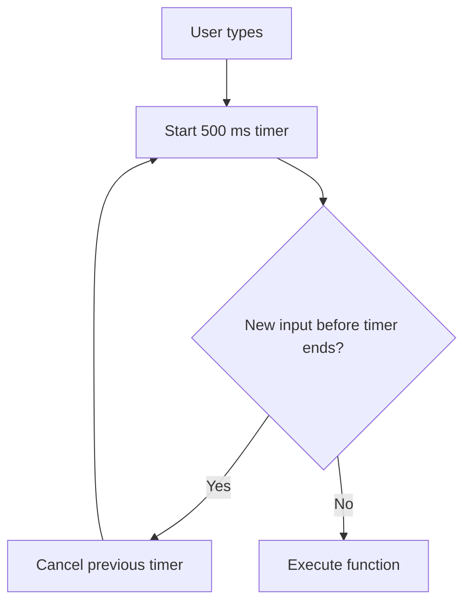
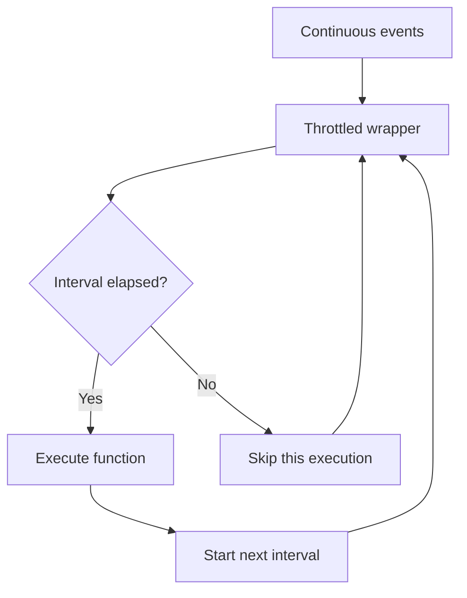
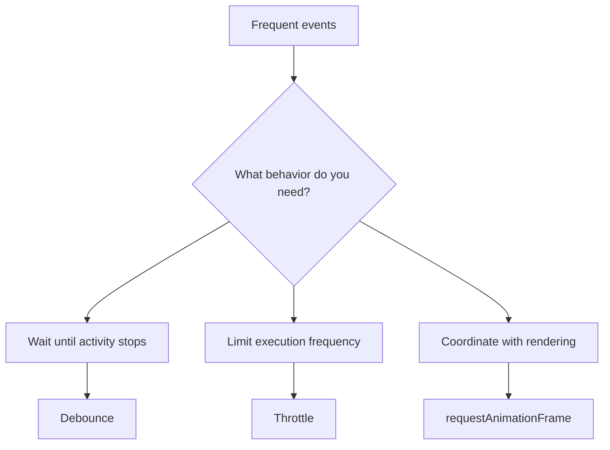

## Debouncing & Throttling in JavaScript

## 1. The problem: too many function calls

Imagine you're building a search feature for an AI-powered application.

```javascript
function searchAI(query) {
  console.log("Searching for:", query);
}
```

A user types: `javascript`

The browser produces a series of input events:

```text
j → ja → jav → java → javas → javasc → javascript
```

If you call the search function after every keystroke, you might send many API requests for one search.

### Without optimization

```text
User types a character
        ↓
Input event fires
        ↓
API request or expensive work
        ↓
Repeat for every keystroke
```

This causes wasted work, unnecessary requests, and potentially slower UX.

Two algorithms help us control this:

- **Debouncing:** execute after events stop happening for a specified period.
- **Throttling:** execute at most once per specified time interval.

These are different strategies for different problems.

## 2. What is debouncing?

Debouncing delays a function until a period of inactivity has passed. Each new event resets the timer.

Suppose the delay is 500 milliseconds.

- User types `j`: start a timer.
- User types `a` 100 ms later: cancel the previous timer and start another.
- User types `v`: reset it again.
- User stops typing.
- After 500 ms of inactivity, execute the function.

### Mermaid diagram



Think of a doorbell: if someone keeps pressing it rapidly, you only want to respond once they've stopped pressing it for a while.

### Basic implementation

```javascript
function debounce(callback, delay) {
  let timerId;

  return function (...args) {
    clearTimeout(timerId);

    timerId = setTimeout(() => {
      callback.apply(this, args);
    }, delay);
  };
}
```

Let's understand every line.

| Code                         | Purpose                                                      |
| ---------------------------- | ------------------------------------------------------------ |
| `let timerId`                | Remembers the currently scheduled timer.                     |
| `clearTimeout(timerId)`      | Cancels the previous scheduled execution.                    |
| `setTimeout(...)`            | Schedules a new execution after the delay.                   |
| `...args`                    | Preserves all arguments passed to the returned function.     |
| `callback.apply(this, args)` | Calls the callback with the original receiver and arguments. |
| `return function`            | Returns the debounced wrapper that callers will use.         |

### Why does this require a closure?

The returned function needs to remember `timerId` between calls.

```text
debounce(callback, 500)
          │
          ▼
     Closure created
          │
          ▼
     timerId retained
          │
          ▼
Repeated calls reset the same timer
```

The variable remains available because the returned function closes over the surrounding scope.

This is a direct connection between your previous JavaScript studies of closures and practical performance engineering.

## 3. Hands-on: build a debounced search

Here is a complete browser example.

```html
<input id="search" placeholder="Search JavaScript topics..." />
<p id="status">Start typing...</p>

<script>
  function debounce(callback, delay) {
    let timerId;

    return function (...args) {
      clearTimeout(timerId);

      timerId = setTimeout(() => {
        callback.apply(this, args);
      }, delay);
    };
  }

  const input = document.querySelector("#search");
  const status = document.querySelector("#status");

  function search(query) {
    status.textContent = `Searching for: ${query}`;
    console.log("Search executed:", query);
  }

  const debouncedSearch = debounce(search, 500);

  input.addEventListener("input", function (event) {
    debouncedSearch(event.target.value);
  });
</script>
```

Try typing quickly. The search executes only after you pause for 500 ms.

**Important:** This example delays a local function. In a real application, `search()` might call an API.

```javascript
async function search(query) {
  const response = await fetch(
    `/api/search?q=${encodeURIComponent(query)}`
  );

  if (!response.ok) {
    throw new Error(`Search failed: ${response.status}`);
  }

  return response.json();
}
```

You can pass this function to `debounce` too, but the basic wrapper above does not return the callback's eventual result to its caller. That is usually fine for event handlers. If callers need a Promise for each invocation, design a Promise-aware debounce with explicit semantics.

Also, debouncing does not cancel a request that has already started. Use `AbortController` if you need to cancel outdated fetch requests.

## 4. What is throttling?

Throttling limits how frequently a function can execute.

Suppose a scroll handler fires 100 times in one second. If you throttle it to 200 ms, it can execute at most about five times per second over a sustained period, depending on the implementation and timing.

Unlike debouncing, throttling does not need the user to stop interacting.

### Mermaid diagram



Examples where throttling is useful:

- Scroll-position tracking.
- Mouse movement tracking.
- Window resize calculations.
- Limiting how often a costly visual update runs.

### Basic implementation

This version executes immediately on the first call, then allows another execution after the interval has elapsed.

```javascript
function throttle(callback, delay) {
  let lastExecution = 0;

  return function (...args) {
    const now = Date.now();

    if (now - lastExecution >= delay) {
      lastExecution = now;

      return callback.apply(this, args);
    }
  };
}
```

Usage:

```javascript
const logScroll = throttle(() => {
  console.log("Scroll handler executed");
}, 200);

window.addEventListener("scroll", logScroll);
```

### Understand the timestamp

Suppose `delay = 200`.

| Time   | Event        | Result   |
| ------ | ------------ | -------- |
| 0 ms   | First event  | Executes |
| 50 ms  | Second event | Skipped  |
| 100 ms | Third event  | Skipped  |
| 200 ms | Fourth event | Executes |
| 250 ms | Fifth event  | Skipped  |
| 400 ms | Sixth event  | Executes |

The actual behavior depends on the timing of events and the chosen implementation.

**Production detail:** This is a leading-edge throttle. It can discard the last value received during an interval. Some applications instead need a trailing-edge execution, which runs once more with the latest arguments when the interval ends.

## 5. Debounce vs. throttle

### Debouncing

Wait for inactivity.

```text
Events: • • • • • • • •
Runs:   ✓
```

Best for search suggestions, autosave after typing, and validation after the user finishes editing.

### Throttling

Limit the execution frequency.

```text
Events: • • • • • • • • • •
Runs:   ✓   ✓   ✓   ✓
```

Best for continuous events, such as scroll tracking and pointer movement.

| Requirement                              | Better choice                 |
| ---------------------------------------- | ----------------------------- |
| Search after typing stops                | Debounce                      |
| Validate after typing stops              | Debounce                      |
| Autosave after a pause                   | Debounce                      |
| Periodically process scroll events       | Throttle                      |
| Limit analytics event processing         | Often throttle or batching    |
| Update an animation every rendered frame | Often `requestAnimationFrame` |

Neither algorithm is universally better. Select the one that matches the intended behavior.

## 6. A subtle but important issue: trailing-edge throttle

Our first throttle executes at the beginning of an eligible interval. Sometimes, however, the final event contains the most important value.

Imagine the user resizes a window continuously. You want to run your expensive calculation during resizing, but you also want to guarantee a final calculation using the latest dimensions.

Here is a trailing-edge throttle:

```javascript
function throttleTrailing(callback, delay) {
  let timerId = null;
  let latestArgs;
  let latestThis;

  return function (...args) {
    latestArgs = args;
    latestThis = this;

    if (timerId !== null) return;

    timerId = setTimeout(() => {
      timerId = null;

      callback.apply(latestThis, latestArgs);
    }, delay);
  };
}
```

This implementation waits until the end of each scheduled interval, then executes with the most recent arguments.

There are multiple valid throttle designs:

- **Leading-edge:** execute at the start.
- **Trailing-edge:** execute at the end.
- **Leading + trailing:** execute at both boundaries, with carefully defined semantics.

In interviews and production code, always clarify which behavior is required.

## 7. Debounce, throttle, and `requestAnimationFrame`

Since you are learning browser APIs, one distinction matters.

`requestAnimationFrame()` schedules work for a browser rendering opportunity. It is useful for coordinating visual updates with rendering, such as scroll-linked visual effects.

```javascript
let scheduled = false;

window.addEventListener("scroll", () => {
  if (scheduled) return;

  scheduled = true;

  requestAnimationFrame(() => {
    scheduled = false;

    // Read scroll position and update visual state.
    console.log(window.scrollY);
  });
});
```

This coalesces multiple scroll events into at most one scheduled callback per rendering opportunity. It is not a fixed-millisecond throttle, and it does not guarantee that the callback runs if the browser pauses rendering.

For layout-heavy code, also avoid repeatedly mixing DOM reads and writes, which can trigger expensive layout recalculations.

## 8. Production concerns engineers should know

The basic implementations are excellent for learning, but real applications require more thought.

1. **Cleanup**

   If a component unmounts, a pending debounced callback may still execute. A production wrapper may need a `.cancel()` method, and the component should clean up listeners and pending work.

2. **Stale network results**

   Debouncing reduces request frequency, but two requests that have already started can finish out of order. Use cancellation or request identifiers when only the latest result should be displayed.

3. **`this` and arguments**

   A reusable utility should preserve the caller's `this` and arguments when the callback depends on them. Arrow functions and regular functions have different `this` semantics.

4. **Leading and trailing behavior**

   Make the timing contract explicit. Different products need different semantics.

5. **Performance measurement**

   Don't assume a handler is expensive just because it runs frequently. Measure it using browser DevTools Performance tools and optimize the actual bottleneck.

## 9. Hands-on engineering challenges

Complete these in order.

### Your practice checklist

- [ ] **Build a debounce utility**  
  Log a message only after 500 ms of inactivity.

- [ ] **Build a throttle utility**  
  Limit a frequently called function to one execution per 200 ms.

- [ ] **Debounced search**  
  Create an input handler and verify the number of API calls in DevTools.

- [ ] **Prevent stale results**  
  Use `AbortController` to cancel an older search request when a newer query starts.

## 10. Interview questions

**Q1. Why does debounce use a closure?**

To retain the timer identifier across calls so each new call can cancel the previous scheduled execution.

**Q2. Does debouncing guarantee only one API request?**

No. It reduces requests generated by a burst of events, but already-started requests are not automatically canceled.

**Q3. Can throttling lose events?**

Yes. A throttle may skip intermediate calls, depending on its implementation. A trailing-edge version can preserve the latest arguments for a scheduled execution.

**Q4. Is `setTimeout(fn, 500)` guaranteed to execute exactly after 500 ms?**

No. It schedules execution after at least the requested delay under normal circumstances, but event-loop work, browser scheduling, and background-tab throttling can delay it.

**Q5. Are debounce and throttle built into JavaScript?**

No. They are programming patterns commonly implemented using timers, timestamps, or other scheduling mechanisms.

**Q6. Why does `callback.apply(this, args)` appear in reusable utilities?**

It preserves the invocation receiver and arguments instead of discarding them.

## Final mental model



Remember these three rules:

- **Debounce:** wait until the activity pauses.
- **Throttle:** limit how often work runs.
- **`requestAnimationFrame`:** coordinate visual work with browser rendering.

For your AI-enabled full-stack engineering journey, these patterns are especially useful when optimizing search interfaces, dashboards, large forms, editor timelines, and other interactive applications.

---

**Next topic in Module 8:** Memoization Strategies — caching expensive computations, cache keys, invalidation, memory trade-offs, and when memoization actually improves performance.