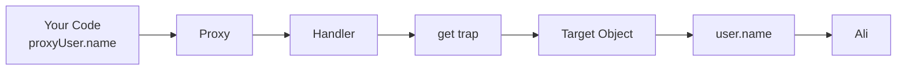
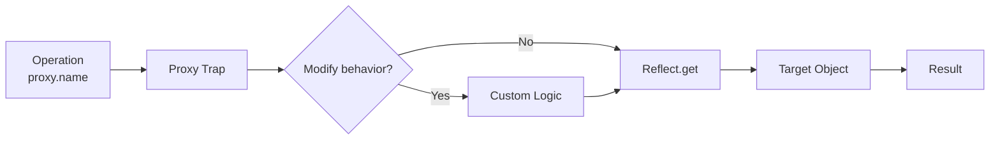
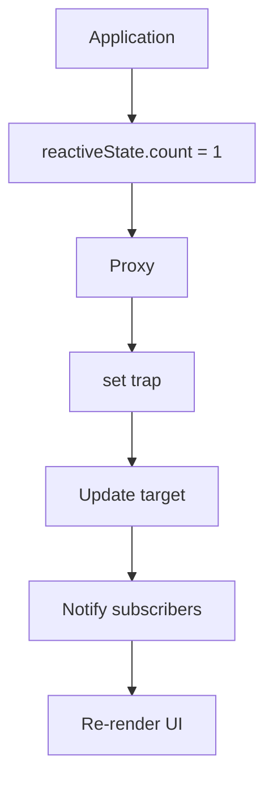
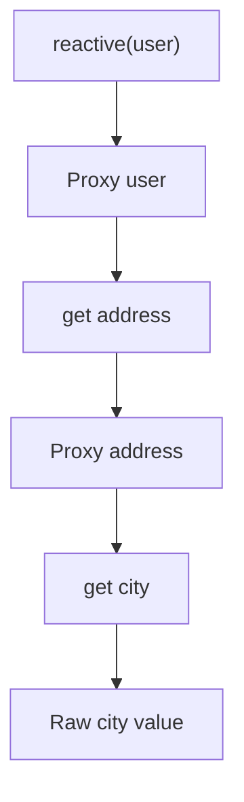
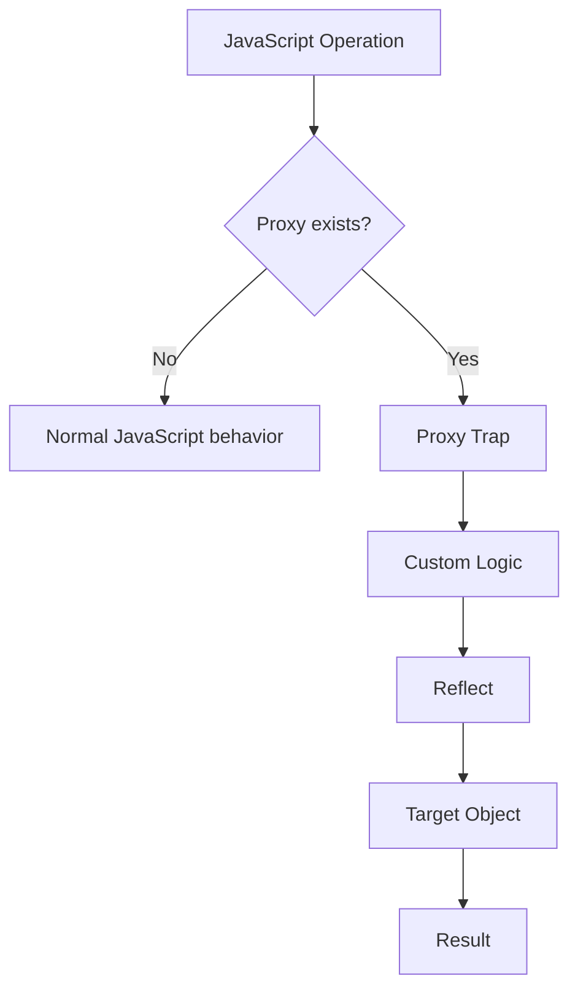

## Topic 1: Proxy & Reflect APIs

> **Goal:** Understand not only *how* `Proxy` works, but **why it exists, what problem it solves, how `Reflect` fits into it, and where real engineers use it.**

---

# 1. First: What is Metaprogramming?

Before `Proxy`, understand the word **metaprogramming**.

Normally, your JavaScript code works **with data**:

```js
const user = {
  name: "Ali",
  age: 22
};

console.log(user.name);
user.age = 23;
```

Here your program is manipulating an object.

**Metaprogramming** means writing code that can **observe, control, or modify the behavior of other code**.

Think:

```text
Normal Programming
────────────────────────────
Your code → Data


Metaprogramming
────────────────────────────
Your code → Behavior of code/data
```

For example:

```js
user.name
```

Normally means:

> "Get the `name` property."

With a `Proxy`, we can say:

> "Whenever someone tries to get a property, let me intercept that operation first."

That is metaprogramming.

---

# 2. What Problem Does Proxy Solve?

Suppose we have:

```js
const user = {
  name: "Ali",
  age: 22
};
```

We want to know whenever someone accesses a property.

Without Proxy:

```js
console.log(user.name);
console.log(user.age);
```

JavaScript simply performs the operation.

But imagine we want:

```text
user.name
    ↓
"Someone accessed name"
    ↓
return actual value
```

Or:

```text
user.age = 25
       ↓
"Someone changed age"
       ↓
validate
       ↓
save
       ↓
notify UI
```

This is where **Proxy** becomes powerful.

---

# 3. What is a Proxy?

A JavaScript `Proxy` is an object that **wraps another object and intercepts operations performed on it**.

Basic syntax:

```js
const proxy = new Proxy(target, handler);
```

There are two important pieces:

```text
Proxy
│
├── target
│   └── Original object
│
└── handler
    └── Rules for intercepting operations
```

Example:

```js
const user = {
  name: "Ali",
  age: 22
};

const proxyUser = new Proxy(user, {
  get(target, property) {
    console.log("Getting:", property);

    return target[property];
  }
});
```

Now:

```js
console.log(proxyUser.name);
```

Output:

```text
Getting: name
Ali
```

The important thing is:

```js
proxyUser.name
```

didn't directly access the original object.

It went through the Proxy.

---

# 4. Proxy Architecture

Understand this diagram carefully.



So:

```text
Your code
   ↓
Proxy
   ↓
Handler
   ↓
Trap
   ↓
Target
```

This is the fundamental mental model.

---

# 5. Target

The **target** is the original object.

```js
const user = {
  name: "Ali",
  age: 22
};
```

Here:

```js
user
```

is the target.

Then:

```js
const proxyUser = new Proxy(user, handler);
```

The Proxy sits between your code and `user`.

---

# 6. Handler

The handler defines what operations you want to intercept.

```js
const handler = {
  get() {
    // ...
  },

  set() {
    // ...
  }
};
```

The functions inside the handler are called **traps**.

Why "trap"?

Because they trap/intercept a JavaScript operation.

---

# 7. The `get` Trap

The most important starting point.

```js
const user = {
  name: "Ali",
  age: 22
};

const proxyUser = new Proxy(user, {
  get(target, property) {
    console.log("GET:", property);

    return target[property];
  }
});
```

Now:

```js
proxyUser.name;
```

JavaScript effectively does:

```text
proxyUser.name
      ↓
get trap
      ↓
target = user
property = "name"
      ↓
target["name"]
      ↓
"Ali"
```

Example:

```js
console.log(proxyUser.name);
```

Output:

```text
GET: name
Ali
```

---

# 8. Understanding `target` and `property`

Look at:

```js
get(target, property) {
  return target[property];
}
```

Suppose:

```js
proxyUser.name;
```

Then:

```js
target   → user object
property → "name"
```

So:

```js
target[property]
```

becomes:

```js
user["name"]
```

which returns:

```text
Ali
```

---

# 9. The `set` Trap

Now we intercept assignments.

Normally:

```js
user.age = 23;
```

With Proxy:

```js
const proxyUser = new Proxy(user, {
  set(target, property, value) {
    console.log("SET:", property, value);

    target[property] = value;

    return true;
  }
});
```

Now:

```js
proxyUser.age = 23;
```

Output:

```text
SET: age 23
```

---

# 10. Why Must `set` Return `true`?

This is an important interview concept.

A `set` trap should return a boolean indicating whether the assignment succeeded.

```js
set(target, property, value) {
  target[property] = value;

  return true;
}
```

`true` means:

> "The operation was successfully handled."

If you return `false` in strict mode, JavaScript can throw a `TypeError`.

Example:

```js
const proxy = new Proxy(user, {
  set() {
    return false;
  }
});
```

Then:

```js
proxy.age = 30;
```

can fail.

---

# 11. Real Use Case: Validation

This is where Proxy starts becoming useful.

Suppose:

```js
const user = {
  name: "Ali",
  age: 22
};
```

We don't want:

```js
user.age = -500;
```

We can intercept it.

```js
const validatedUser = new Proxy(user, {
  set(target, property, value) {

    if (property === "age" && value < 0) {
      throw new Error("Age cannot be negative");
    }

    target[property] = value;

    return true;
  }
});
```

Now:

```js
validatedUser.age = 25;
```

Works.

But:

```js
validatedUser.age = -10;
```

throws:

```text
Error: Age cannot be negative
```

This pattern is useful for:

```text
Validation
    ↓
Proxy
    ↓
Intercept assignment
    ↓
Validate
    ↓
Allow / Reject
```

---

# 12. Proxy Can Intercept Many Operations

`get` and `set` are only the beginning.

Some important traps include:

| Trap                       | Intercepts                 |
| -------------------------- | -------------------------- |
| `get`                      | property reading           |
| `set`                      | property assignment        |
| `has`                      | `in` operator              |
| `deleteProperty`           | `delete`                   |
| `apply`                    | function calls             |
| `construct`                | `new`                      |
| `ownKeys`                  | `Object.keys()` etc.       |
| `getOwnPropertyDescriptor` | property descriptor lookup |
| `defineProperty`           | `Object.defineProperty()`  |
| `getPrototypeOf`           | prototype lookup           |
| `setPrototypeOf`           | prototype changes          |
| `isExtensible`             | extensibility check        |
| `preventExtensions`        | prevent extensions         |
| `deleteProperty`           | deleting properties        |

You don't need to memorize all of them immediately.

The important concept is:

> **Proxy lets you intercept fundamental object operations.**

---

# 13. `has` Trap

The `has` trap intercepts:

```js
property in object
```

Example:

```js
const user = {
  name: "Ali",
  age: 22
};

const proxyUser = new Proxy(user, {
  has(target, property) {
    console.log("Checking:", property);

    return property in target;
  }
});
```

Now:

```js
console.log("name" in proxyUser);
```

Output:

```text
Checking: name
true
```

---

# 14. `deleteProperty`

Intercept:

```js
delete object.property;
```

Example:

```js
const user = {
  name: "Ali",
  age: 22
};

const proxyUser = new Proxy(user, {
  deleteProperty(target, property) {

    console.log("Deleting:", property);

    return delete target[property];
  }
});
```

Now:

```js
delete proxyUser.age;
```

Output:

```text
Deleting: age
```

---

# 15. `ownKeys`

This trap controls operations such as:

```js
Object.keys(proxy);
```

Example:

```js
const user = {
  name: "Ali",
  age: 22,
  password: "secret"
};

const safeUser = new Proxy(user, {
  ownKeys(target) {
    return Object.keys(target)
      .filter(key => key !== "password");
  }
});
```

Now:

```js
console.log(Object.keys(safeUser));
```

Result:

```js
["name", "age"]
```

This demonstrates how metaprogramming can alter how an object behaves.

---

# 16. The Most Important Question: Why Reflect?

Now we reach the second half.

You will often see Proxy code written like this:

```js
const proxy = new Proxy(target, {
  get(target, property) {
    return Reflect.get(target, property);
  }
});
```

You may ask:

> Why not simply use `target[property]`?

Excellent question.

That's exactly what you should understand.

---

# 17. What is Reflect?

`Reflect` is a built-in JavaScript object containing methods for performing many **fundamental object operations**.

For example:

```js
Reflect.get(target, property);
```

is related to:

```js
target[property];
```

Similarly:

```js
Reflect.set(target, property, value);
```

performs the underlying property assignment operation.

Think:

```text
Proxy
    ↓
intercept operation

Reflect
    ↓
perform the default operation
```

This combination is extremely important.

---

# 18. Proxy + Reflect Mental Model

Think of it like a security checkpoint.



Proxy says:

> "I'll intercept this."

Reflect says:

> "Now perform the normal JavaScript operation correctly."

---

# 19. Basic Proxy + Reflect Pattern

Professional code often looks like:

```js
const proxy = new Proxy(target, {
  get(target, property, receiver) {
    console.log("Reading:", property);

    return Reflect.get(target, property, receiver);
  },

  set(target, property, value, receiver) {
    console.log("Writing:", property, value);

    return Reflect.set(target, property, value, receiver);
  }
});
```

This is an extremely useful pattern to remember.

```text
Proxy
  ↓
Intercept
  ↓
Custom logic
  ↓
Reflect
  ↓
Default behavior
```

---

# 20. Why `Reflect` Is Better Than Direct Access

Consider:

```js
return target[property];
```

It works for simple objects.

But JavaScript property access has more complexity involving:

* getters
* setters
* prototypes
* `this`
* receiver semantics
* property descriptors

`Reflect.get()` and `Reflect.set()` are designed to perform the corresponding language-level operations.

For example:

```js
Reflect.get(target, property, receiver);
```

has a third parameter:

```text
receiver
```

This becomes particularly important when getters/setters and inheritance are involved.

---

# 21. Understanding `receiver`

Consider:

```js
const person = {
  firstName: "Ali",

  get name() {
    return this.firstName;
  }
};
```

Now:

```js
const proxy = new Proxy(person, {
  get(target, property, receiver) {
    return Reflect.get(target, property, receiver);
  }
});
```

When:

```js
proxy.name
```

is accessed:

```text
proxy.name
    ↓
get trap
    ↓
Reflect.get(...)
    ↓
getter
    ↓
this = proxy
```

That `receiver` helps preserve the correct object context.

This is one reason experienced JavaScript developers prefer:

```js
Reflect.get(target, property, receiver);
```

over blindly doing:

```js
target[property];
```

inside Proxy traps.

---

# 22. Proxy + Reflect = Powerful Combination

The pattern:

```js
new Proxy(target, {
  get(target, property, receiver) {
    // custom logic

    return Reflect.get(target, property, receiver);
  }
});
```

gives you:

```text
             Proxy
               │
        ┌──────┴──────┐
        │             │
   Observe         Modify
        │             │
        └──────┬──────┘
               ↓
            Reflect
               ↓
       Normal JS behavior
```

---

# 23. Reactive Systems

Now we reach one of the most important real-world applications.

Imagine a UI:

```text
state
 ↓
UI
```

Suppose:

```js
const state = {
  count: 0
};
```

When:

```js
state.count = 1;
```

we want:

```text
state changes
     ↓
detect change
     ↓
update UI
```

Proxy can detect this.

---

# 24. Simple Reactivity Example

```js
const state = {
  count: 0
};

const reactiveState = new Proxy(state, {
  set(target, property, value, receiver) {

    console.log(`${property} changed to ${value}`);

    return Reflect.set(
      target,
      property,
      value,
      receiver
    );
  }
});
```

Now:

```js
reactiveState.count = 1;
```

Output:

```text
count changed to 1
```

A real reactive system could then notify subscribers.

---

# 25. Reactive Architecture



This basic idea appears in reactive frameworks and state-management techniques.

Important distinction:

> A Proxy itself does **not** magically make a UI reactive.

You have to build the dependency tracking / notification mechanism around it.

---

# 26. Building a Tiny Reactive System

Let's make a small educational example.

```js
const state = {
  count: 0
};

const subscribers = [];

const reactiveState = new Proxy(state, {

  set(target, property, value, receiver) {

    const result = Reflect.set(
      target,
      property,
      value,
      receiver
    );

    subscribers.forEach(fn => fn(property, value));

    return result;
  }
});
```

Subscribe:

```js
subscribers.push((property, value) => {
  console.log(
    `State changed: ${property} = ${value}`
  );
});
```

Now:

```js
reactiveState.count = 10;
```

Output:

```text
State changed: count = 10
```

You've created a primitive reactive mechanism.

---

# 27. Logging / Observability

Another very practical use is logging.

```js
const apiConfig = {
  baseURL: "https://api.example.com",
  timeout: 5000
};

const monitoredConfig = new Proxy(apiConfig, {

  get(target, property, receiver) {

    console.log(
      `Reading config.${String(property)}`
    );

    return Reflect.get(
      target,
      property,
      receiver
    );
  },

  set(target, property, value, receiver) {

    console.log(
      `Changing config.${String(property)} → ${value}`
    );

    return Reflect.set(
      target,
      property,
      value,
      receiver
    );
  }
});
```

This can be useful for debugging complex applications.

---

# 28. Function Proxy

Proxy isn't limited to objects.

Functions can also be proxied.

For example:

```js
function add(a, b) {
  return a + b;
}
```

We can intercept calls using the `apply` trap.

```js
const trackedAdd = new Proxy(add, {

  apply(target, thisArg, argumentsList) {

    console.log("Function called with:", argumentsList);

    return Reflect.apply(
      target,
      thisArg,
      argumentsList
    );
  }
});
```

Now:

```js
trackedAdd(10, 20);
```

Output:

```text
Function called with: [10, 20]
30
```

---

# 29. `Reflect.apply`

For functions:

```js
Reflect.apply(
  target,
  thisArg,
  argumentsList
);
```

This performs the equivalent function invocation while explicitly controlling:

```text
target
this
arguments
```

This becomes useful in advanced wrappers, instrumentation, decorators, middleware-like systems, etc.

---

# 30. Constructor Interception

You can even intercept:

```js
new Something();
```

using:

```js
construct
```

Example:

```js
class User {
  constructor(name) {
    this.name = name;
  }
}

const TrackedUser = new Proxy(User, {

  construct(target, args, newTarget) {

    console.log("Creating user:", args);

    return Reflect.construct(
      target,
      args,
      newTarget
    );
  }
});
```

Now:

```js
const user = new TrackedUser("Ali");
```

Output:

```text
Creating user: ["Ali"]
```

---

# 31. Proxy Does NOT Copy the Object

This is a very important concept.

```js
const user = {
  name: "Ali"
};

const proxy = new Proxy(user, {});
```

`proxy` is **not a copy**.

Both refer to the same underlying target.

```text
proxy
  │
  │ wraps
  ▼
user
```

So:

```js
proxy.name = "Ahmed";
```

changes:

```js
user.name
```

as well.

```js
console.log(user.name);
```

Output:

```text
Ahmed
```

---

# 32. Proxy Identity

Another important point:

```js
proxy === user
```

is:

```text
false
```

because they are different objects.

But:

```js
proxy.name
```

can access:

```js
user.name
```

because Proxy wraps the target.

---

# 33. Proxy Is Not Deep by Default

Consider:

```js
const user = {
  name: "Ali",
  address: {
    city: "Rawalpindi"
  }
};
```

If you do:

```js
const proxy = new Proxy(user, {
  get(target, property, receiver) {
    console.log("GET", property);

    return Reflect.get(target, property, receiver);
  }
});
```

Then:

```js
proxy.address.city
```

The Proxy intercepts:

```js
proxy.address
```

But the returned `address` object isn't automatically proxied.

So:

```js
proxy.address.city
```

doesn't automatically mean:

```text
Proxy
 ↓
Proxy
 ↓
Proxy
```

You need **recursive/deep Proxy wrapping** if you want that behavior.

This becomes important when building reactive systems.

---

# 34. Deep Reactive Proxy

Conceptually:



A simplified implementation:

```js
function reactive(target) {

  return new Proxy(target, {

    get(target, property, receiver) {

      const value = Reflect.get(
        target,
        property,
        receiver
      );

      if (
        typeof value === "object" &&
        value !== null
      ) {
        return reactive(value);
      }

      return value;
    },

    set(target, property, value, receiver) {

      console.log(
        `Changed ${String(property)}`
      );

      return Reflect.set(
        target,
        property,
        value,
        receiver
      );
    }
  });
}
```

This is educational, not production-ready.

There are additional issues such as:

* repeated Proxy creation
* identity preservation
* caching
* arrays
* Maps/Sets
* circular references
* performance

---

# 35. A Critical Security Lesson

Proxy is **not a security boundary**.

For example, this:

```js
const safeUser = new Proxy(user, {
  get(target, property) {
    if (property === "password") {
      return undefined;
    }

    return Reflect.get(target, property);
  }
});
```

doesn't actually remove the password from:

```js
user
```

The original object still contains it.

Someone with access to:

```js
user
```

can read:

```js
user.password
```

So Proxy provides **behavioral control**, not secure data isolation.

---

# 36. Common Mistake: Forgetting `Reflect`

Bad-ish pattern:

```js
const proxy = new Proxy(target, {
  get(target, property) {
    console.log(property);

    return target[property];
  }
});
```

Better general pattern:

```js
const proxy = new Proxy(target, {
  get(target, property, receiver) {

    console.log(property);

    return Reflect.get(
      target,
      property,
      receiver
    );
  }
});
```

And:

```js
set(target, property, value, receiver) {

  console.log(property, value);

  return Reflect.set(
    target,
    property,
    value,
    receiver
  );
}
```

Why?

Because you're preserving JavaScript's normal semantics instead of manually reproducing them.

---

# 37. Proxy Invariants

This is an advanced but important concept.

JavaScript imposes certain **invariants** on Proxy traps.

You cannot use Proxy to arbitrarily violate object rules.

For example, if a property is non-configurable and non-writable, a Proxy cannot simply lie about its value in certain situations.

Example:

```js
const user = {};

Object.defineProperty(user, "id", {
  value: 123,
  writable: false,
  configurable: false
});
```

A Proxy cannot freely pretend that:

```js
proxy.id
```

is:

```text
999
```

in violation of the target's non-configurable property constraints.

This protects the language's internal consistency.

Think:

```text
Proxy gives flexibility
       +
JavaScript invariants
       ↓
Proxy cannot break fundamental object rules
```

---

# 38. Proxy Performance

Proxy is powerful, but don't use it everywhere just because you can.

Every intercepted operation can introduce additional work.

For example:

```js
proxy.user.name
```

may involve multiple Proxy operations depending on how the objects are wrapped.

Potential concerns:

* extra function calls
* trap overhead
* complex debugging
* hidden behavior
* difficult performance analysis
* accidental recursive Proxy creation

Therefore:

> Use Proxy when interception provides meaningful architectural value.

Not simply because it looks advanced.

---

# 39. Real-World Applications

You should recognize these patterns in professional codebases.

### 1. Reactivity

```text
state change
     ↓
Proxy
     ↓
detect mutation
     ↓
notify
     ↓
UI update
```

### 2. Validation

```text
object.property = value
        ↓
Proxy
        ↓
validate
        ↓
allow / reject
```

### 3. Logging

```text
object.property
       ↓
Proxy
       ↓
log access
       ↓
return value
```

### 4. Access control

```text
object.secret
      ↓
Proxy
      ↓
permission check
      ↓
allow / deny
```

### 5. API / SDK wrappers

You can dynamically intercept methods and create higher-level behavior.

### 6. Observability

Track:

* reads
* writes
* function calls
* configuration changes

### 7. Reactive state libraries

Proxy is particularly useful for state systems where changes need to be detected automatically.

---

# 40. Proxy vs Reflect

This distinction must be crystal clear.

| Proxy                       | Reflect                     |
| --------------------------- | --------------------------- |
| Intercepts operations       | Performs operations         |
| Defines custom behavior     | Provides standard behavior  |
| Wraps target                | Doesn't wrap target         |
| Uses traps                  | Uses methods                |
| Can observe/modify          | Usually delegates           |
| `get`, `set`, `apply`, etc. | `get`, `set`, `apply`, etc. |

Mental shortcut:

```text
Proxy  = "Intercept"
Reflect = "Perform"
```

That's not the complete specification-level definition, but it's an excellent engineering mental model.

---

# 41. The Golden Pattern

Memorize this pattern—not by blindly memorizing syntax, but by understanding it:

```js
const proxy = new Proxy(target, {

  get(target, property, receiver) {

    // custom behavior

    return Reflect.get(
      target,
      property,
      receiver
    );
  },

  set(target, property, value, receiver) {

    // custom behavior

    return Reflect.set(
      target,
      property,
      value,
      receiver
    );
  }
});
```

This pattern will appear again and again in advanced JavaScript.

---

# 42. Complete Practical Example

Let's combine:

* `get`
* `set`
* validation
* logging
* Reflect

```js
const user = {
  name: "Ali",
  age: 22
};

const smartUser = new Proxy(user, {

  get(target, property, receiver) {

    console.log(
      `Reading property: ${String(property)}`
    );

    return Reflect.get(
      target,
      property,
      receiver
    );
  },

  set(target, property, value, receiver) {

    if (
      property === "age" &&
      typeof value !== "number"
    ) {
      throw new TypeError(
        "Age must be a number"
      );
    }

    if (
      property === "age" &&
      value < 0
    ) {
      throw new RangeError(
        "Age cannot be negative"
      );
    }

    console.log(
      `Updating ${String(property)} → ${value}`
    );

    return Reflect.set(
      target,
      property,
      value,
      receiver
    );
  }
});
```

Usage:

```js
console.log(smartUser.name);
```

Then:

```js
smartUser.age = 25;
```

But:

```js
smartUser.age = -5;
```

throws:

```text
RangeError: Age cannot be negative
```

---

# 43. Complete Mental Model

At this point, your mental model should look like this:



And conceptually:

```text
Proxy
  =
"I want to intercept JavaScript behavior."

Reflect
  =
"I want to perform the corresponding standard operation."
```

---

# 44. What You Should Be Able to Explain in an Interview

After this topic, you should be able to answer:

### What is Proxy?

> A Proxy is an object that wraps another object and allows us to intercept and customize fundamental operations performed on the target.

### What is a trap?

> A trap is a handler method that intercepts a specific operation, such as property access or assignment.

### What does `get` do?

```js
get(target, property, receiver)
```

It intercepts property access.

### What does `set` do?

```js
set(target, property, value, receiver)
```

It intercepts property assignment.

### What is Reflect?

> Reflect provides methods for performing standard JavaScript object operations programmatically and is commonly used inside Proxy traps to preserve normal language semantics.

### Why Proxy + Reflect?

```text
Proxy → intercept
Reflect → perform default operation
```

### Is Proxy a copy?

No.

It wraps the target.

### Is Proxy deep?

No.

Nested objects aren't automatically proxied.

### Can Proxy intercept functions?

Yes.

Using:

```js
apply
```

and constructors using:

```js
construct
```

### Is Proxy a security mechanism?

No.

It controls behavior through a wrapper but doesn't securely remove data from the underlying object.

---

# 45. Hands-On Challenge

Don't skip this. This is where the concept becomes engineering knowledge.

Build:

## `createReactiveObject()`

Requirements:

```js
const state = createReactiveObject({
  count: 0,
  username: "Ali"
});
```

When someone reads:

```js
state.count;
```

print:

```text
GET count
```

When someone writes:

```js
state.count = 10;
```

print:

```text
SET count = 10
```

When someone writes:

```js
state.count = "hello";
```

throw:

```text
TypeError: count must be a number
```

Use:

```text
Proxy
+
get
+
set
+
Reflect
```

Bonus:

Make nested objects reactive:

```js
const state = createReactiveObject({
  user: {
    name: "Ali"
  }
});
```

Then:

```js
state.user.name
```

should also be intercepted.

---

# 46. Your 20/80 Knowledge

If you're short on time, master these **20% concepts**:

```text
1. Metaprogramming
        ↓
2. Proxy
        ↓
3. Target
        ↓
4. Handler
        ↓
5. Traps
        ↓
6. get
        ↓
7. set
        ↓
8. Reflect.get()
        ↓
9. Reflect.set()
        ↓
10. Reactivity
```

The most important mental model:

```text
                    JavaScript
                        │
                        ▼
                     Proxy
                        │
              ┌─────────┴─────────┐
              ▼                   ▼
            get                  set
              │                   │
              └─────────┬─────────┘
                        ▼
                     Reflect
                        │
                        ▼
                      Target
```

And the one sentence to remember:

> **Proxy intercepts behavior; Reflect performs the underlying operation correctly.**

This is a genuinely valuable advanced-JavaScript concept for your **AI-enabled full-stack engineering** path because you'll encounter the same ideas when working with reactive state, framework internals, SDK abstractions, instrumentation, and sophisticated libraries.

**Next module topic:** **Performance Algorithms — Debouncing & Throttling**, where we'll go deep into event frequency, browser performance, middleware patterns, and practical frontend optimization.
